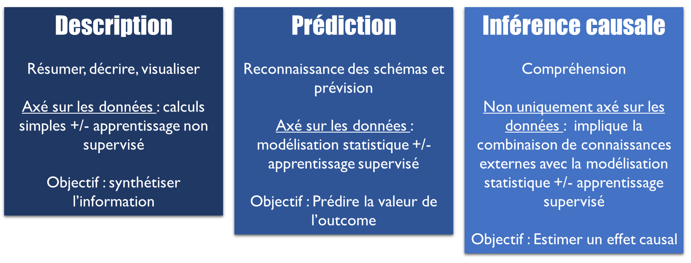

---
output:
  pdf_document: default
  html_document: default
---

# Introduction

Comment telle prédisposition génétique et telle exposition environnementale *inter-agissent*-elles ? L'effet de tel traitement varie-t-il selon les circonstances ? Selon les caractéristiques du patient ? Telle intervention peut-elle être bénéfique pour un groupe social et délétère pour un autre ? 

De nombreuses questions épidémiologiques impliquent des mécanismes d'interactions ou de modifications d'effet. Pourtant, étudier ces mécanismes restent encore complexe aujourd’hui sur le plan méthodologique : quelle démarche adopter ? sur quelle échelle mesurer cette interaction ? comment interpréter les coefficients ? et cetera.

Dans ce document, nous proposons une synthèse de la littérature et une démarche progressive et appliquée pour explorer ces questions.

## Quand étudier les interactions ?

### *Prediction* versus *causalité*

La science des données cherche à répondre à 3 types d'objectifs @hernan2019second :

{width=100%}

Selon le type d'objectif, la démarche d'analyse et les enjeux méthodologiques ne vont pas être les mêmes. Si l'objectif est prédictif, la démarche va être centrée sur la *prédiction de l'outcome*, à partir de covariables sélectionnées afin d'optimiser la précision de l'estimation, tout en prenant en compte leur disponibilité en pratique et la parcimonie du modèle. 

Dans une démarche explicative, ou *étiologique*, au contraire, la démarche va être centré sur l'*estimation d'un effet causal*, en prenant en compte les covariables en fonction de leur rôle vis-à-vis de l'effet d’intérêt (facteurs de confusion, colliders, médiateurs...). 

En épidémiologie, à l'exception des cas où l'on souhaite développer un test ou score diagnostic ou pronostic, les objectifs sont le plus souvent explicatifs. On cherche en effet, la plupart du temps, à identifier des liens de cause à effet, afin de pouvoir agir sur les causes pour modifier les effets.

Finalement, pour répondre à la question "quand doit-on prendre en compte les interactions ?", il est d'abord nécessaire d'identifier dans quel type de démarche l'on s’inscrit :

- **Démarche prédictive** : on ajoutera alors les interactions dans le modèle de prédiction, pour le rendre plus *flexible*, si cela améliore la précision de l'estimation @vanderweele_tutorial_2014.
- **Démarche explicative/étiologique** : on étudiera les interactions ou modifications d'effet, si cela répond directement à l'objectif. Par exemple :
  + Si l'objectif est du type "l'effet de X sur Y varie-t-il en fonction de V ?", on prendra en compte l'interactions entre X et V.
  + Les objectifs qui nécessitent la prise en compte de l'interaction peuvent aussi être du type : "Quel est l'effet conjoint de X et V sur Y ?" ou "Quel part de l'effet de X sur Y disparaît quand V est modifié ?", etc.
  + Par contre, si l'objectif est simplement d'estimer l'effet de X sur Y, ou l'effet médié par M, la prise en compte des interactions entre X et des covariables (facteurs de confusion ou médiateurs) n'est pas indispensable. C'est l'effet "moyen" qui sera estimé. Des termes d’interactions peuvent cependant être ajoutés (mais non interprétés), si cela améliore la précision de l'estimation (enjeu d'optimisation du modèle).

### Types d'objectifs

Dans ce document, nous nous intéresserons principalement aux interactions et modifications d'effet dans une démarche étiologique/ explicative. 

Les objectifs pouvant nécessiter l’étude de l’interaction/modification d’effet sont @vanderweele_tutorial_2014 : 

-	**Cibler des sous-groupes**. Par exemple, identifier des sous-groupes pour lesquels l’intervention aura le plus d’effet afin de pouvoir cibler l’intervention en cas de ressources limitées, ou s’assurer que l’intervention est bénéfice pour tous les groupes et pas délétères pour certains groupes.
-	**Explorer les mécanismes d’un effet**. Par exemple, en cas d’intervention qui n’a d’effet qu’en présence ou absence d’une caractéristiques particulière (définition mécanistique de l’interaction) ou seulement conjointement à une autre intervention. 
-	**Etudier l’effet d’une intervention pour éliminer une partie de l’effet d’une exposition non modifiable**. Par exemple, quelle part de l’effet du niveau d’éducation des parents sur la mortalité disparaîtrait si on intervenait sur le tabagisme à l’adolescence ? Ce type d'objectif est proche d'un objectif ciblant la *médiation* d'un effet, par exemple la médiation de l'effet du niveau d'éducation des parents *par* le tabagisme, mais les mécanismes envisagés et explorés ne sont pas exactement les mêmes. Explorer ces deux types de mécanismes peut nécessiter des approches spécifiques (voir chapitre \@ref(plusloin))

## Les points les plus importants 

La première étape importante consiste donc à **définir précisément l'objectif** : 

- L'objectif est-il de type descriptif, prédictif ou explicatif ? 
- Si l'on est dans une démarche explicative, d'inférence causale, est-ce que la mesure d'un effet d’interaction est nécessaire pour y répondre ? (identifier précisément l'effet que l'on cherche à estimer, ou *estimand*).

Ensuite, de **nombreuses questions** se posent pour réaliser une analyse d'interaction, auxquelles nous tentons de répondre dans ce document : 

- S'agit-il d'une interaction ou une modification d'effet ? (Chapitre \@ref(intmodif))
- Sur quelle échelle la mesure-t-on ? Un effet d'interaction peut en effet être défini sur une échelle multiplicative ou additive, et les résultats entre ces échelles peuvent être contradictoires. (Chapitre \@ref(echelle))
- Quels paramètres présenter et comment les interpréter ? (Chapitre \@ref(param))
- Comment estimer ces paramètres ? (Chapitre \@ref(regression) et Chapitre \@ref(conf))
- Comment représenter cette interaction graphiquement ? (Chapitre \@ref(graph))

