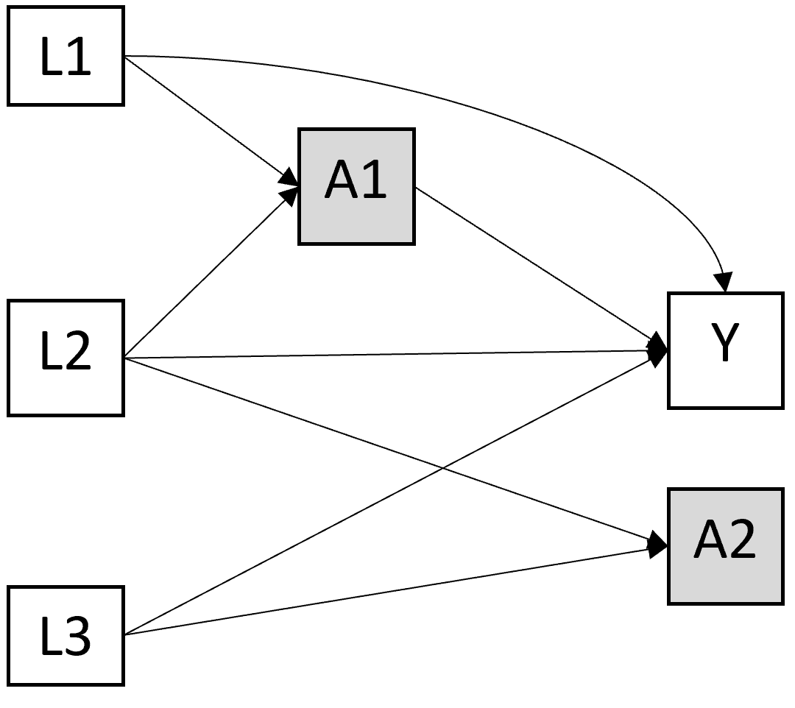

# Notations

## Variables et probabilités

On note : 

- un outcome :  $\small Y$, 
- deux expositions : $\small X$ et $\small V$

La probabilité de l’outcome Y dans chaque strate définie par les 2 expositions est notée :

- $\small p_{xv} = P(Y = 1|X = x,V = v)$

> <ins> Exemple  </ins>
On a deux exposition $\small X$, le tabagisme actif à 20 ans, et $\small V$, le fait d'avoir vécu un évènement traumatique pendant l'enfance. L'outcome $\small Y$ est binaire et représente le fait d'avoir au moins une pathologie chronique à 60 ans $\small Y=1$ ou aucune $\small Y=0$.
>
> On décrit (données complètement fictives) :
>
>{width=40%}
>
> Interprétation : La probabilité d'avoir au moins une pathologie chronique à 60 ans quand on n'a pas vécu d'événement traumatique pendant l'enfance et pas fumé à 20 ans est de 10%, tandis qu'elle est de 90% quand on a vécu un événement traumatique et fumé.

## Mesures d'effets

L'effet d'une variable $\small X$ sur $\small Y$ peut être mesuré sur deux échelles : additive (différence de risque/probabilité) ou multiplicative (rapport de risque/probabilité).

### Concernant les différences de risques (DR, effets additifs)

On a donc :

-	L'effet d'un X binaire sur Y est : $\small DR(X) = P(Y = 1|X = 1) - P(Y = 1|X = 0) = p_1-p_0$
-	L'effet conjoint de X et V est : $\small DR(X,V) = p11-p00$ 
- L'effet de X sur Y dans chaque strate de V est : $\small DR(X|V=0) = p10-p00$ et $\small DR(X|V=1) = p11-p01$

> <ins>Exemple</ins>
Différences de risques pour l'exemple 1
>
-	$\small DR(X \cap V) = p11-p00 = 0,9 - 0,1 = +0.8$
-	$\small DR (X | V=0) = p10-p00 = 0,2 - 0,1 = +0.1$
-	$\small DR (X | V=1)  = p11-p01 = 0,9 - 0,4 = +0,5$
>
> Le fait d'être doublement exposé par rapport à pas du tout augmente le risque de +80%. Parmi les personnes n'ayant pas vécu d'événement traumatique, le fait de fumer à 20 augmente le risque de +10%, alors que parmi les personnes ayant vécu un événement traumatique, il est augmenté de +50%.

### Concernant, les rapports de risque (effets multiplicatifs). 

on peut notamment utiliser les **risques relatifs** (RR). On  donc :

-	L'effet d'un X binaire sur Y est : $\small RR(X) = P(Y = 1|X = 1) / P(Y = 1|X = 0) = p_1 / p_0$
-	L'effet conjoint de X et V est : $\small RR(X,V) = p11/p00$ 
- L'effet de X sur Y dans chaque strate de V est : $\small RR(X|V=0) = p10/p00$ et $\small RR(X|V=1) = p11/p01$

> <ins> Exemple </ins> 
Risques relatifs pour l'exemple 1
>
-	$\small RR(X \cap V) = 0,9/0,1 = ×9$
-	$\small RR(X | V=0) = 0,2/0,1 = ×2$
-	$\small RR(X | V=1) = 0,9/0,4 =×2,25$
>
> Le risque quand on est doublement exposé par rapport à pas du tout est multiplié par 9. Parmi les personnes n'ayant pas vécu d'événement traumatique, le fait de fumer à 20 multiplie le risque par 2, alors que parmi les personnes ayant vécu un événement traumatique, il est multiplié par 2,25.

# Interaction vs modification d'effets

## Modification d'effets

La question de la modification d'effet consiste à d’identifier si l’effet du traitement ou de l’exposition est différent dans différents groupes de patients ayant des caractéristiques différentes (estimer l’effet d’une exposition séparément en fonction d’une autre variable) @corraini_effect_2017. 

Si l'on compare avec un essai d'intervention, c'est comme s'il y avait 1 seule intervention mais que l’analyse est stratifiée sur V. On analyse donc l'effet du scénario $\small do(X)$ dans chaque groupe de $\small V$. 

En observationnel, l'effet causal qui nous intéresse est donc celui de $\small X$ mais pas celui de $\small V$.
On ajustera sur les facteurs de confusion de $\small X \rightarrow Y$. 

On ne fait pas d'hypothèse sur les mécanismes de la modification d'effet, qui peut être causale, de façon directe ou indirecte, ou pas du tout (par proxy ou cause commune) @vanderweele_four_2007.

> Exemples d’objectifs : identifier des groupes pour lesquels le traitement ne serait pas utile, ou si l’effet du traitement est homogène/hétérogène en fonction de l’âge, du sexe, etc. 

On a une modification de l'effet de X par V si l'effet de X est différent dans chaque strate définie par V:

-	en additif : $\small DR(X | V=0) ≠ DR(X | V=1)$ 
	 - soit	$\small p10 -p00 ≠ p11- p01$  
-	en multiplicatif : $\small RR(X | V=0) ≠ RR(X | V=1)$ 
	 - soit $\small p10/p00 ≠ p11/p01$  
	
> <ins>Exemple</ins>
Modification d'effet dans l'exemple 1
>
> En additif : 
>
- effet quand V=0 : $\small DR (X | V=0) = 0,2 - 0,1 = +0,1$
- effet quand V=1 : $\small DR (X | V=1) = 0,9 - 0,4 = +0,5$
- donc $\small DR (X | V=0) ≠ DR (X | V=1)$
>
> En multiplicatif : 
>
- effet quand V=0 : $\small RR(X | V=0) = 0,2/0,1 = ×2$
- effet quand V=1 : $\small RR(X | V=1) = 0,9/0,4 =×2,25$
- donc $\small RR(X | V=0) ≠ RR(X | V=1)$ 
>
> Ici l'effet du tabagisme est différent selon que les personnes ont vécu un événement traumatique ou non, sur l'échelle additive et multiplicative. On peut donc dire que le fait d'avoir vécu un événement traumatique modifie l'effet du tabac. Attention, on fait l'hypothèse de l'absence de facteurs de confusion entre le tabagisme et l'outcome, ce qui est en réalité peu probable.

## Interaction

Quand on s’intéresse à l’interaction, on s’intéresse plutôt à l’effet conjoints de 2 expositions (ou plus) sur un outcome. Il y a une interaction synergique si l'effet conjoint est supérieur à l'effet de la somme des individuels. Il y a une interaction antagoniste lorsque l'effet conjoint est inférieur à la somme des effets individuels @corraini_effect_2017. 

Si l'on compare avec un essai d'intervention, c'est comme s'il y a plusieurs interventions selon le nombre de combinaison. On analyse donc l'effet du scénario $\small do(X1, X2)$. Ici l'effet causal d'interêt est vraiment l'effet conjoint des deux variables. 

Dans un schéma observationnel, l'effet causal qui nous intéresse est donc celui de $\small X*V$. On ajustera sur les facteurs de confusion de $\small X1.X2 \rightarrow Y$.
On fait l'hypothèse que les mécanismes de l'effet conjoint de X et V sont causaux.

On a une interaction si :

-	en additif : $\small DR(X \cap V) ≠ DR(X| V=0) + DR(V| X=0)$
	 + $\small p11-p00 ≠( p10- p00)+(p01- p00 )$
	 + $\small p11 ≠ (p10+p01)- p00$
- en multiplicatif	$\small 	RR(X \cap V) ≠ RR(X| V=0) + RR(V| X=0)$
	 + $\small p11/p00  ≠ p10/p00 + p01/p00$
	 + $\small p11 ≠ (p10*p01)/ p00$ 

> <ins>Exemple</ins>
Interaction dans l'exemple 1
>
> En additif : 
>
- effet joint : $\small DR(X \cap V) = 0,9 - 0,1 = +0.8$ 
- somme des effets individuel : $\small DR(X| V=0) + DR(V| X=0) = +0,1 +0,3 = +0,4$
- donc $\small DR(X \cap V) ≠ DR(X| V=0) + DR(V| X=0)$
>
> En multiplicatif : 
>
- effet joint : $\small RR(X \cap V) = 0,9/0,1 = \times 9$
- produit des effets individuel : $\small RR(X | V=0) \times RR(V | X=0) = 2 \times 4 = \times 8$
- donc $\small DR(X \cap V) ≠ DR(X| V=0) \times DR(V| X=0)$
>
> Ici l'effet joint des 2 expositions est supérieur à la somme ou au produit des effets individuels, il y a donc une interaction synergique entre les deux expositions.

## Synthèse

Mathématiquement, les formulations sont équivalentes :

-	échelle additive: $\small p10 -p00 ≠ p11- p01 ⇔ p11 ≠(p10+p01)- p00$
-	échelle multiplicative : $\small p10/p00 ≠ p11/p01⇔ p11 ≠(p1*p01)/ p00$

La différence se joue plutôt sur :

- la façon dont la question est posée (effet de X selon V ou effet conjoint de X et V), 
- sur les hypothèses causales formulées (scénarii $\small do(X)$ ou $\small do(X,V)$) 
- et donc sur les sets de facteurs de confusion à considérer (seulement sur $\small X \rightarrow Y$ ou $\small X.V \rightarrow Y$).

Il existe des cas où l'identification d'une interaction ou d'une modification d'effet ne conduira pas à la même démarche et donc au même résultat @vanderweele_distinction_2009. Prenons le DAG suivant : 

> {width=30%}

Dans ce cas, il n'y a pas d’interaction entre A1 et A2, car si on intervient sur les 2 ($\small do(A1, A2)$), il n'y a plus de chemin entre A2 et Y. Il peut par contre y avoir une modification de l'effet $\small A1 \rightarrow Y$ par A2 ($\small do(A1)$). Dans ce cas, pour estimer cet effet, L1 et L2 seront considérés comme des facteurs de confusion, mais pas L3.

