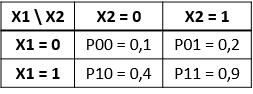

# Interaction vs modification d'effets

## Notations

On note : 

- 1 outcome :  $\small Y$, 
- 2 expositions : $\small X1$ et $\small X2$

La probabilité de l’outcome dans chaque strate définie par les 2 expositions :

- $\small pij = P(Y = 1|X1 = i,X2 = j)$

> <ins> Exemple  </ins>
On a deux exposition par exemple $\small X1$, le tabagisme actif à 20 ans, et $\small X2$, le fait d'avoir vécu un évènement traumatique pendant l'enfance. L'outcome $\small Y$ est binaire et représente le fait d'avoir au moins une pathologie chronique à 60 ans $\small Y=1$ ou aucune $\small Y=0$.
>
> On décrit (données fictives) :
>
>
>
> La probabilité d'avoir au moins une pathologie chronique à 60 ans quand on n'a pas vécu d'événement traumatique pendant l'enfance et pas fumé à 20 ans est de 10%, tandis qu'elle est de 90% quand on a vécu un événement traumatique et fumé.

## Mesures d'effets

Les **différences de risques** (effets additifs) :

-	de l’outcome de chaque strate : $\small DRij = pij-p00$
-	de l’outcome dans une strate : $\small DRi0 = pi0-p00$ et $\small DRi1 = pi1- p01$

> <ins>Exemple</ins>
Différences de risques pour l'exemple 1
>
-	$\small DR(X1=1 \cap X2=1) = 0,9 - 0,1 = +0.8$
-	$\small DR (X1=1 | X2=0) = 0,4 - 0,1 = +0.3$
-	$\small DR (X1=1 | X2=1) = 0,9 - 0,2 = +0,7$
>
> Le fait d'être doublement exposé par rapport à pas du tout augmente le risque de 80%. Parmi les personnes n'ayant pas vécu d'événement traumatique, le fait de fumer à 20 augmente le risque de 30%, alors que parmi les personnes ayant vécu un événement traumatique, il est augmenté de 70%.

Les **risques relatifs** (effets multiplicatifs) :

-	de l’outcome de chaque strate : $\small RRij = pij/p00$
-	de l’outcome dans une strate : $\small RRi0 = pi0/p00$ et $\small RRi1 = pi1/p01$
	

> <ins> Exemple </ins> 
Risques relatifs pour l'exemple 1
>
-	$\small RR(X1=1 \cap  X2=1) = 0,9/0,1 = ×9$
-	$\small RR(X1=1 | X2=0) = 0,4/0,1 = ×4$
-	$\small RR(X1=1 | X2=1) = 0,9/0,2 =×4,5$
>
> Le risque quand on est doublement exposé par rapport à pas du tout est multiplié par 9. Parmi les personnes n'ayant pas vécu d'événement traumatique, le fait de fumer à 20 multiplie le risque par 4, alors que parmi les personnes ayant vécu un événement traumatique, il est multiplié par 4,5.

## Modification d'effets

La question est d’identifier si l’effet du traitement ou de l’exposition est différent dans différents groupes de patients ayant des caractéristiques différentes (estimer l’effet d’une exposition séparément en fonction d’une autre variable) @corraini_effect_2017. 

En comparaison avec un essai d'intervention : il y a 1 seule intervention mais l’analyse est stratifiée = $\small do(X1)$ dans chaque groupe de $\small X2$. En observationnel, on ajustera sur les facteurs de confusion de $\small X1 \rightarrow Y$. L'effet causal qui nous intéresse est donc celui de $\small X1$ mais pas celui de $\small X2$. On ne fait pas d'hypothèse sur les mécanismes de la modification d'effet, qui peut être causale, de façon directe ou indirecte, ou pas du tout (par proxy ou cause commune) @vanderweele_four_2007.

Exemples d’objectifs : identifier des groupes pour lesquels le traitement ne serait pas utile, ou si l’effet du traitement est homogène/hétérogène en fonction de l’âge, du sexe, etc. 

On a une modification de l'effet de X1 par X2 si l'effet de X1 est différent dans chaque strate définie par X2:

-	en additif : $\small DR(X1=1 | X2=0) ≠ DR(X1=1 | X2=1)$ 
	 - soit	$\small p10 -p00 ≠ p11- p01$  
-	en multiplicatif : $\small RR(X1=1 | X2=0) ≠ RR(X1=1 | X2=1)$ 
	 - soit $\small p10/p00 ≠ p11/p01$  
	
> <ins>Exemple</ins>
Modification d'effet dans l'exemple 1
>
> En additif : 
>
- effet quand X2=0 : $\small DR (X1=1 | X2=0) = 0,4 - 0,1 = +0,3$
- effet quand X2=1 : $\small DR (X1=1 | X2=1) = 0,9 - 0,2 = +0,7$
>
> En multiplicatif : 
>
- effet quand X2=0 : $\small RR(X1=1 | X2=0) = 0,4/0,1 = ×4$
- effet quand X2=1 : $\small RR(X1=1 | X2=1) = 0,9/0,2 =×4,5$
>
> Ici l'effet du tabagisme est différent selon que les personnes ont vécu un événement traumatique ou non, sur l'échelle additive et multiplicative. On peut donc dire que le fait d'avoir vécu un événement traumatique modifie l'effet du tabac. Attention, on fait l'hypothèse de l'absence de facteurs de confusion entre le tabagisme et l'outcome, ce qui est en réalité peu probable.

## Interaction

Quand on s’intéresse à l’interaction, on s’intéresse plutôt à l’effet conjoints de 2 expositions (ou plus) sur un outcome. Il y a une interaction synergique si l'effet conjoint est supérieur à l'effet de la somme des individuels. Il y a une interaction antagoniste lorsque l'effet conjoint est inférieur à la somme des effets individuels @corraini_effect_2017. 

En comparaison avec un essai d'intervention : il y a plusieurs interventions selon le nombre de combinaison => $\small do(X1, X2)$. Ici l'effet causal d'interêt est vraiment l'effet conjoint des deux variables. En observationnel, on ajustera sur les facteurs de confusion de $\small X1.X2 \rightarrow Y$

On a une interaction si 

-	en additif : $\small DR(X1=1 \cap X2=1) ≠ DR(X1=1|X2=0)+DR(X2=1|X1=0)$
	 + $\small p11-p00 ≠( p10- p00)+(p01- p00 )$
	 + $\small p11 ≠ (p10+p01)- p00$
- en multiplicatif	$\small 	RR(X1=1 \cap X2=1)≠RR(X1=1 | X2=0)*RR(X2=1 | X1=0)$
	 + $\small p11/p00  ≠ p10/ p00+p01/p00$
	 + $\small p11 ≠ (p10*p01)/ p00$ 

> <ins>Exemple</ins>
Interaction dans l'exemple 1
>
> En additif : 
>
- effet joint : $\small DR(X1=1 \cap X2=1) = 0,9 - 0,1 = +0.8$ 
- somme des effets individuel : $\small DR(X1=1|X2=0) + DR(X2=1|X1=0) = +0,3 +0,1 = +0,4$
>
> En multiplicatif : 
>
- effet joint :    + $\small RR(X1=1 \cap X2=1) = 0,9/0,1 = \times 9$
- produit des effets individuel : $\small RR(X1=1 | X2=0)*RR(X2=1 | X1=0) = 4*2 = \times 8$
>
> Ici l'effet joint des 2 expositions est supérieur à la somme ou au produit des effets individuels, il y a donc une interaction synergique entre les deux expositions.

## Conséquences pour l'estimation

Il existe des cas où l'identification d'une intéraction ou d'une modification d'effet ne conduira pas à la même démarche et donc au même résultat @vanderweele_distinction_2009. Prenons le DAG suivant : 

> {width=30%}

Dans ce cas, il n'y a pas d'intéraction entre A1 et A2, car si on intervient sur les 2 ($\small do(A1, A2)$), il n'y a plus de chemin entre A2 et Y. Il peut par contre y avoir une modification de l'effet $\small A1 \rightarrow Y$ par A2 ($\small do(A1)$). Dans ce cas, pour estimer cet effet, L1 et L2 seront considérés comme des facteurs de confusion, mais pas L3.

## Synthèse

Mathématiquement, les formulations sont équivalentes :

-	échelle additive: $\small p10 -p00 ≠ p11- p01 ⇔ p11 ≠(p10+p01)- p00$
-	echelle multiplicative : $\small p10/p00 ≠ p11/p01⇔ p11 ≠(p1*p01)/ p00$

La différence se joue plutôt sur :

- la façon dont la question est posée, 
- sur les hypothèses causales formulées ($\small do(X1)$ ou $\small do(X1,X2)$) 
- et donc sur les sets de facteurs de confusion à considérer (seulement sur $\small X1 \rightarrow Y$ ou $\small X1.X2 \rightarrow Y$).

