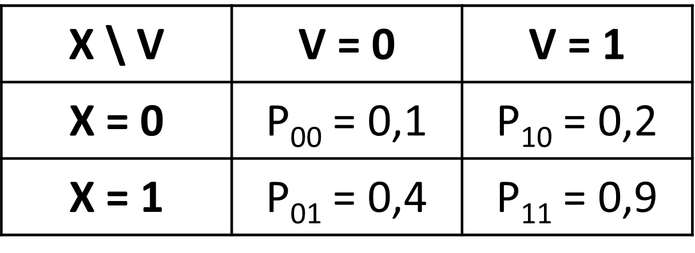

# (PART) Synthèse de la littérature {-}

# Notations

## Variables et probabilités

On note : 

- un outcome :  $\small Y$, 
- deux expositions : $\small X$ et $\small V$

La probabilité de l’outcome Y dans chaque strate définie par les 2 expositions est notée :

- $\small p_{xv} = P(Y = 1|X = x,V = v)$

> <ins> Exemple  </ins>
On a deux exposition $\small X$, le tabagisme actif à 20 ans, et $\small V$, le fait d'avoir vécu un évènement traumatique pendant l'enfance. L'outcome $\small Y$ est binaire et représente le fait d'avoir au moins une pathologie chronique à 60 ans $\small Y=1$ ou aucune $\small Y=0$.
>
> On décrit (données complètement fictives) :
>
>{width=40%}
>
> Interprétation : La probabilité d'avoir au moins une pathologie chronique à 60 ans quand on n'a pas vécu d'événement traumatique pendant l'enfance et pas fumé à 20 ans est de 10%, tandis qu'elle est de 90% quand on a vécu un événement traumatique et fumé.

## Mesures d'effets

L'effet d'une variable $\small X$ sur $\small Y$ peut être mesuré sur deux échelles : additive (différence de risque/probabilité) ou multiplicative (rapport de risque/probabilité).

### Concernant les différences de risques (DR, effets additifs) {-}

On a donc :

-	L'effet d'un X binaire sur Y est : $\small DR(X) = P(Y = 1|do(X = 1)) - P(Y = 1|do(X = 0))$ 
    + qu'on peut estimer, si les conditions d'identifiabilité sont réunies, 
    + par $\small  P(Y = 1|X = 1) - P(Y = 1|X = 0) = p_1-p_0$
-	L'effet conjoint de X et V est : $\small DR(X,V) = p_{11}-p_{00}$ 
- L'effet de X sur Y dans chaque strate de V est : $\small DR(X|V=0) = p_{10}-p_{00}$ et $\small DR(X|V=1) = p_{11}-p_{01}$

> <ins>Exemple</ins>
Différences de risques pour l'exemple 1
>
>{width=30%}
>
-	$\small DR(X \cap V) = p_{11}-p_{00} = 0,9 - 0,1 = +0,8$
-	$\small DR (X | V=0) = p_{10}-p_{00} = 0,4 - 0,1 = +0,3$
-	$\small DR (X | V=1) = p_{11}-p_{01} = 0,9 - 0,2 = +0,7$
>
> Le fait d'être doublement exposé par rapport à pas du tout augmente le risque de +80%. Parmi les personnes n'ayant pas vécu d'événement traumatique, le fait de fumer à 20 augmente le risque de +30%, alors que parmi les personnes ayant vécu un événement traumatique, il est augmenté de +70%.

### Concernant, les rapports de risque (effets multiplicatifs) {-}

on peut notamment utiliser les **risques relatifs** (RR). On  donc :

-	L'effet d'un X binaire sur Y est : $\small RR(X) = P(Y = 1| do(X = 1)) / P(Y = 1|do(X = 0))$ 
    + qu'on peut estimer, si les conditions d'identifiabilité sont réunies, 
    + par $\small P(Y = 1| do(X = 1)) / P(Y = 1|do(X = 0))= p_1 / p_0$
-	L'effet conjoint de X et V est : $\small RR(X,V) = p_{11}/p_{00}$ 
- L'effet de X sur Y dans chaque strate de V est : $\small RR(X|V=0) = p_{10}/p_{00}$ et $\small RR(X|V=1) =p_{11}/p_{01}$

> <ins> Exemple </ins> 
Risques relatifs pour l'exemple 1
>
>{width=30%}
>
-	$\small RR(X \cap V) = 0,9/0,1 = \times 9$
-	$\small RR(X | V=0) = 0,4/0,1 = \times 4$
-	$\small RR(X | V=1) = 0,9/0,2 = \times 4,5$
>
> Le risque quand on est doublement exposé par rapport à pas du tout est multiplié par 9. Parmi les personnes n'ayant pas vécu d'événement traumatique, le fait de fumer à 20 multiplie le risque par 4, alors que parmi les personnes ayant vécu un événement traumatique, il est multiplié par 4,5.

