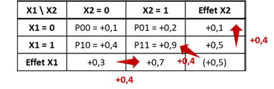
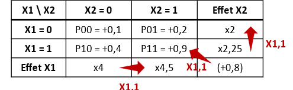
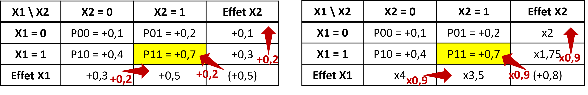
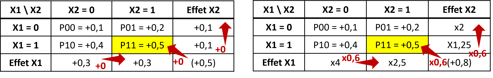
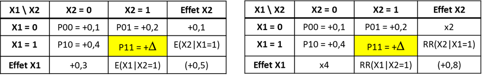
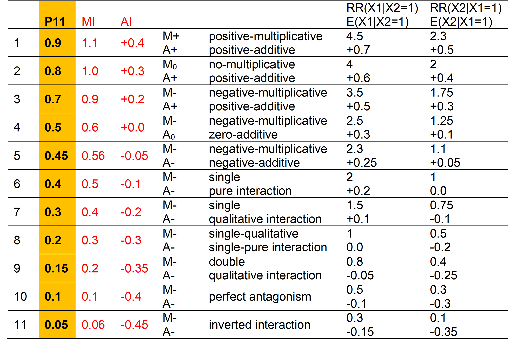
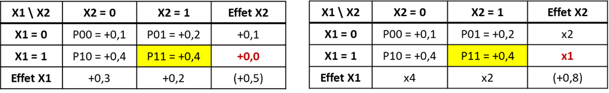

# La question des échelles

## Mesures des interactions

### Echelle additive {-}

Une façon simple de mesurer l'interaction est de mesurer à quel point l'effet conjoint de 2 facteurs est différents de la somme de leurs effets individuels @vanderweele_tutorial_2014 :

- $\small (p11 - p00) - [(p10 - p00) + (p01 - p00)]$
- soit $\small p11 - p10 - p01 + p00$

> <ins>Exemple</ins>
Mesure de l'nteraction dans l'exemple 1
>
$\small DR(X1=1 \cap X2=1) - DR(X1=1|X2=0) + DR(X2=1|X1=0) = 0.8 - 0,4 = +0,4$
>
> ou :
>
> {width=50%}

### Echelle multiplicative {-}

En cas d'outcome binaire, c'est souvent le RR ou l'OR qui est utilisé pour mesurer les effets. La mesure de l'interaction sur une échelle multiplicative serait donc  @vanderweele_tutorial_2014 :

- $\small RR11 / RR10.RR01$
- soit $\small (p11 / p00) / [(p10 / p00) + (p01 / p00)]$
- soit $\small p11.p00 / p10.p01$

> <ins>Exemple</ins>
Mesure de l'nteraction dans l'exemple 1
>
-	en multiplicatif : $\small RR(X1=1 \cap X2=1) /  RR(X1=1 | X2=0)*RR(X2=1|X1=0) = 9/8 = 1,1$
>
> ou :
>
> {width=50%}

## Cohérence entre les deux échelles

Mesurer l'interaction sur une seule échelle peut être trompeur @mathur2018r. On peut fréquemment observer une interaction positive dans une échelle (par exemple $\small p11 - p10 - p01 + p00 > 0$) et négative dans l'autre (par exemple $\small p11.p00 / p10.p01 <1$).

> <ins>Exemple</ins>
>
> {width=90%}

Il a même été démontré que si on n'observe pas d'interaction sur une échelle, alors on en observera obligatoirement sur l'autre échelle @vanderweele_tutorial_2014. 

> <ins>Exemple</ins>
>
> {width=90%}
>
> et 
>
> {width=90%}

## Le continuum

Dans un article de 2019 @vanderweele_interaction_2019, Vanderweele décrit le continuum existant entre les 2 échelles. Par exemple, avec deux expositions ayant un effet positif (augmente le risque) sur l'outcome en l'absence de l'autre exposition, lorsque l'effet joint est très important, l'interaction est positive sur les 2 échelles. Lorsque la taille de l'effet joint diminue, l'interaction multiplication devient négative alors que l'interaction additive reste positive. Puis l'interaction devient négative sur les deux échelles.

> {width=100%}
> {width=100%}

## Interaction pure et qualitative

Deux cas particuliers d'interaction peuvent être retrouvées :

-	**Interaction pure** de X1 en fonction de X2, si X1 n’a un effet que dans une strate de X2. Par exemple, $\small p10 = p00$ et $\small p11 ≠ p01$

> {width=100%}

-	**Interaction qualitative** de X1 en fonction de X2, , si l’effet de X1 dans une strate de X2 va dans la direction opposée de l’autre strate de X2 

> {width=100%}

## Synthèse
Quelle échelle choisir pour mesurer un effet d'interaction ?

Même si en pratique l’échelle multiplicative est plus utilisée en raison de l’utilisation des modèles logistiques @knol_recommendations_2012, il semble y avoir un consensus pour privilégier l’échelle additive, plus appropriée pour évaluer l’utilité en santé publique @vanderweele_tutorial_2014 @knol_recommendations_2012.  

En effet si on reprend l'exemple ci dessous :

> {width=90%}

Si X1 représente un traitement dont on ne dispose que de 100 doses et Y un outcome de santé favorable (guérison). Il faut choisir si on donne 100 doses au groupe X2 = 0 ou X2= 1. Si on donne 100 doses au groupe X2 = 0, on aura 30 personnes guéries grace au traitement (30 personnes de plus que l'évolution naturelle) contre 50 personnes si on les donne au groupe X2 = 1. Donc il est préférable d'allouer les doses au groupe X2=1. Pourtant si on avait réfléchi à partir de l'échelle multiplicative, effet du traitement aurait été de RR=4 dans le groupe X2 = 0 et RR=3,5 dans le groupe X2 = 1. 

On peut donc conclure à un effet multiplicatif plus fort d'un traitement dans un groupe alors qu'en terme d'utilité (nombre de personnes favorablement impactées), l'échelle additive nous conduira à choisir l'autre groupe.

Idéalement, les interactions devraient cependant être reportées sur les 2 échelles @knol_recommendations_2012 @vanderweele_tutorial_2014.

## Mesures alternatives

### Avec les OR {-}

### RERI {-}

### Autres {-}

