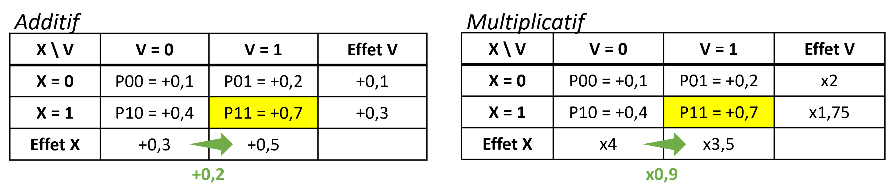
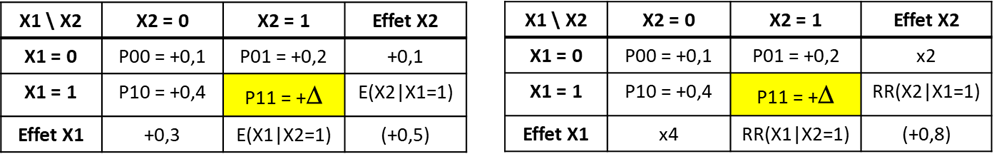
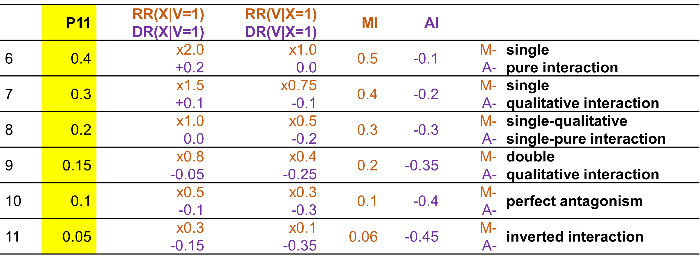

---
output:
  pdf_document: default
  html_document: default
---

# La question des échelles {#echelle}

## Mesures des interactions

### Echelle additive {-}

Une façon simple de mesurer l'interaction est de mesurer à quel point l'effet conjoint de deux facteurs est différents de la somme de leurs effets individuels @vanderweele_tutorial_2014 :

- $\small AI = DR(X,V) - [DR(X|V=0) + DR(V|X=0)]$
- $\small AI = (p_{11} - p_{00}) - [(p_{10} - p_{00}) + (p_{01} - p_{00})]$
- soit $\small AI =p_{11} - p_{10} - p_{01} + p_{00}$

> <ins>Exemple</ins>
Mesure de l'interaction dans l'exemple 1 
>
> {width=65%}
> 
> On retrouve l'effet d'interaction, calculé/exprimé de différentes façon, 
> 
> Soit : 
>
    + $\small DR(X, V) - [DR(X|V=0) + DR(V|X=0)] = 0.8 - (0,3 + 0,1)  = +0,4$
    + $\small p_{11} - p_{10} - p_{01} + p_{00} = 0,9 - 0,4 - 0,2 + 0,1 = +0,4$ 
    + la différence entre l'effet joint et la somme des effets individuels (flèche rouge)
>    
> Soit :
>
    + $\small (p_{11} - p_{01}) - (p_{10} - p_{00}) = (0,9 - 0,2) - (0,4 - 0,1) = 0,7 - 0,3 = +0,4$  
    + la différence entre l'effet de X quand V = 1 et quand V = 0 (flèche verte)
>    
> Soit : 
>
    + $\small (p_{11} - p_{10}) - (p_{01} - p_{00}) = (0,9 - 0,4) - (0,2 - 0,1) = 0,5 - 0,1 = +0,4$  
    + la différence entre l'effet de V quand X = 1 et quand X = 0 (flèche bleue)
>
>

### Echelle multiplicative {-}

En cas d'outcome binaire, c'est souvent le RR ou l'OR qui est utilisé pour mesurer les effets. La mesure de l'interaction sur une échelle multiplicative serait donc  @vanderweele_tutorial_2014 :

- $\small MI = \frac{RR_{11}}{RR_{10} \times RR_{01}}$
- soit $\small MI = \frac{p_{11} / p_{00}}{(p_{10} / p_{00}) \times (p_{01} / p_{00})}$
- soit $\small MI = \frac{p_{11} \times p_{00}}{p_{10} \times p_{01}}$

> <ins>Exemple</ins>
Mesure de l'nteraction dans l'exemple 1
>
> {width=65%}
>
> On retrouve l'effet d'interaction, calculé/exprimé de différentes façon, 
> 
> Soit : 
>
  -	$\small \frac{RR(X, V)}{RR(X| V=0)*RR(V|X=0)} = \frac{9}{4 \times 2} = \times 1,1$
  - $\small\frac{p_{11} / p_{00}}{(p_{10} + p_{01}) / p_{00}} = \frac{0,9 / 0,1}{(0,4 \times 0,2) / 0,1} = \times 1,1$
  - le rapport entre l'effet joint et le produit des effets individuels (flèche rouge)
> 
> Soit :
>
  - $\small \frac{p_{11} / p_{01}}{p_{10} / p_{00}} = \frac{0,9 / 0,2}{0,4 / 0,1} = \frac{\times 4,5 }{\times 4} = \times 1,1$
  - le produit de l'effet de X quand V = 1 et quand V = 0 (flèche verte)
>
> Soit :
>
- ou $\small \frac{p_{11} / p_{10}}{p_{01} / p_{00}} = \frac{0,9 / 0,4}{0,2 / 0,1} = \frac{\times 2,25}{\times 2} = \times 1,1$
  - le produit de l'effet de V quand X = 1 et quand X = 0 (flèche bleue)
> 

## Lien entre les deux échelles

### Un apparent paradoxe {-}

Mesurer l'interaction sur une seule échelle peut être trompeur @mathur2018r. On peut régulièrement observer une interaction positive dans une échelle (par exemple $\small p11 - p10 - p01 + p00 > 0$) et négative dans l'autre (par exemple $\small (p11 \times p00) / (p10 \times p01) <1$).

> <ins>Exemple</ins>
>
> Dans cet exemple (on modifie seulement la probabilité $\small p_{11}$, en jaune dans le tableau), on observe une interaction additive positive (l'effet de $\small X$ augmente de +20% quand $\small V=1$ par rapport à $\small V=0$) mais une interaction multiplicative négative (l'effet de $\small X$ est multiplié par 0,9 - donc diminue - quand $\small V=1$ par rapport à $\small V=0$).
>
> {width=90%}
>
> *Remarque : on retrouverait les mêmes résultats en comparant les effets de V dans les strates de X ou les effets conjoints et somme/produit des effets individuels.*
>

Il a même été démontré que si on n'observe pas d'interaction sur une échelle, alors on en observera obligatoirement sur l'autre échelle... @vanderweele_tutorial_2014. 

> <ins>Exemple</ins>
> 
> Dans cet exemple, il n'y a pas d'interaction multiplicative (effet de $\small X$ identique quelque soit $\small V$), mais sur l'echelle additive, on observe une interaction positive. 
>
> {width=90%}
>
> Dans cet autre exemple, il n'y a pas d'interaction additive (effet de $\small X$ identique quelque soit $\small V$), mais sur l'echelle multiplicative, on observe une interaction négative. 
>
> {width=90%}

### Le continuum {-}

Dans un article de 2019 @vanderweele_interaction_2019, Vanderweele décrit le continuum existant entre les 2 échelles. 

> Par exemple, dans l'exemple 1, l'interaction additive et multiplicative sont positives. Mais si l'on fait varier la probabilité $\small p_{11}$ en la diminuant, l'interaction multiplicative devient négative alors que l'interaction additive reste positive. Puis, lorsque la probabilité diminue encore, l'interaction devient négative sur les deux échelles :
> 
> {width=100%}
>

### Interactions pures et qualitatives, interactions inversées {-}

Dans ce continuum, si l'on continue à faire varier $\small p_{11}$,  des cas particuliers d'interaction peuvent être retrouvés :

> 
> {width=100%}
>

-	**Interaction pure** de $\small X$ en fonction de $\small V$, si $\small X$ n’a un effet que dans une seule strate de $\small V$. Par exemple, $\small p_{10} = p_{00}$ et $\small p_{11} \neq p_{01}$.

> Par exemple (ligne 6) ici, $\small V$ a un effet (sur les deux échelles) si $\small X=0$ mais pas si $\small X=1$ :
>
> {width=90%}
>

-	**Interaction qualitative** de $\small X$ en fonction de V, si l’effet de $\small X$ dans une strate de $\small V$ va dans la direction opposée de l’autre strate de $\small V$.

> Par exemple (ligne 7), $\small V$ a un effet positif si $\small X=0$ mais négatif si $\small X=1$ :
>
> {width=90%}
>

-	**Antagonisme parfait** : l'effet joint est nul $\small p_{11} - p_{00} = 0$, alors que les effets individuels sont positifs.

> Par exemple (ligne 10), $\small p_{11} - p_{00} = 0$ alors que $\small p_{01} - p_{00} > 0$ et $\small p_{10} - p_{00} > 0$
>
> {width=90%}
>

-	**Interaction inversée** (ligne 11): l'effet joint est négatif, alors que les effets individuels sont positifs.

> Par exemple (ligne 10), $\small p_{11} - p_{00} < 0$ alors que $\small p_{01} - p_{00} > 0$ et $\small p_{10} - p_{00} > 0$
>
> {width=90%}
>

## Synthèse
Quelle échelle choisir pour mesurer un effet d'interaction ?

Même si en pratique l’échelle multiplicative est plus utilisée, car les outcomes sont souvent binaires en épidémiologie et donc les modèles logistiques sont souvent utilisés @knol_recommendations_2012, il semble y avoir un consensus pour privilégier plutôt l’échelle additive, plus appropriée pour évaluer l’utilité en santé publique @vanderweele_tutorial_2014 @knol_recommendations_2012.  

> Si on reprend l'exemple ci dessous :
>
> {width=90%}
>
> $\small X$ représente un traitement dont on ne dispose que de 100 doses et $\small Y$ un outcome de santé favorable (guérison). 
> Il faut choisir si on donne 100 doses au groupe $\small V = 0$ ou au groupe $\small V = 1$. 
>
> Si on donne 100 doses :
>
- au groupe $\small V = 0$, 40 personnes seront guéries, soit 30 personnes de plus que l'évolution naturelle (40 - 10) 
- au groupe $\small V = 1$, 70 personnes seront guéries,  soit 50 personnes de plus que l'évolution naturelle (70 - 20). 
>
> Il semble donc préférable d'allouer les doses au groupe $\small V=1$, car on guéri 20 personnes de plus (50 - 30).
>
> {width=40%}
>
> Pourtant si on avait réfléchi à partir de l'échelle multiplicative, on aurait choisi le groupe $\small V=0$ car :
>
- l'effet du traitement est de RR=4 dans le groupe $\small V = 0$ ($\small \frac{40}{10} =4$x plus de personnes guéries par rapport à l'évolution naturelle) 
- et de RR=3,5 dans le groupe $\small V = 1$ ($\small \frac{70}{20}) =3.5$x plus de personnes guéries par rapport à l'évolution naturelle.
>
> On peut donc conclure à un effet multiplicatif plus fort d'un traitement dans un groupe alors qu'en terme d'utilité (nombre de personnes favorablement impactées), l'échelle additive nous conduirait à choisir l'autre groupe...
>

Idéalement, les interactions devraient cependant être reportées sur les 2 échelles @knol_recommendations_2012 @vanderweele_tutorial_2014.
