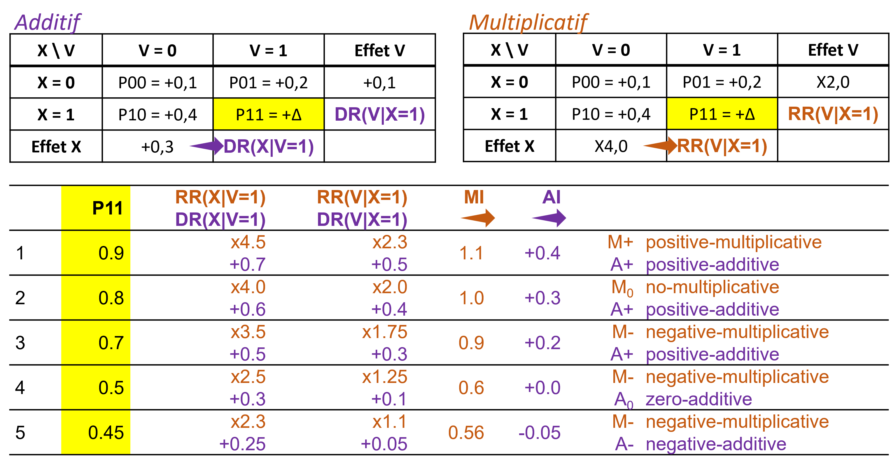

---
output:
  pdf_document: default
  html_document: default
---

# La question des échelles {#echelle}

## Mesures des interactions

### Echelle additive {-}

Une façon simple de mesurer l'interaction est de mesurer à quel point l'effet conjoint de deux facteurs est différents de la somme de leurs effets individuels @vanderweele_tutorial_2014 :

- $\small AI = DR(X,V) - [DR(X|V=0) + DR(V|X=0)]$
- $\small AI = (p_{11} - p_{00}) - [(p_{10} - p_{00}) + (p_{01} - p_{00})]$
- soit $\small AI =p_{11} - p_{10} - p_{01} + p_{00}$

> <ins>Exemple</ins>
Mesure de l'interaction dans l'exemple 1
>
- $\small DR(X, V) - [DR(X|V=0) + DR(V|X=0)] = 0.8 - (0,3 + 0,1)  = +0,4$
- soit $\small p_{11} - p_{10} - p_{01} + p_{00} = 0,9 - 0,4 - 0,2 + 0,1 = +0,4$
- ou $\small (p_{11} - p_{01}) - (p_{10} - p_{00}) = (0,9 - 0,2) - (0,4 - 0,1) = 0,7 - 0,3 = +0,4$
- ou $\small (p_{11} - p_{10}) - (p_{01} - p_{00}) = (0,9 - 0,4) - (0,2 - 0,1) = 0,5 - 0,1 = +0,4$
>
> soit :
>
> {width=65%}

**Remarques : la mesure de l'effet joint est donnée dans la dernière ligne et la dernière colonne (entre parenthèse). L'effet d'interaction (flèche) est identifié soit comme l'ecart entre l'effet joint et **

### Echelle multiplicative {-}

En cas d'outcome binaire, c'est souvent le RR ou l'OR qui est utilisé pour mesurer les effets. La mesure de l'interaction sur une échelle multiplicative serait donc  @vanderweele_tutorial_2014 :

- $\small MI = \frac{RR_{11}}{RR_{10} \times RR_{01}}$
- soit $\small MI = \frac{p_{11} / p_{00}}{(p_{10} / p_{00}) \times (p_{01} / p_{00})}$
- soit $\small MI = \frac{p_{11} \times p_{00}}{p_{10} \times p_{01}}$

> <ins>Exemple</ins>
Mesure de l'nteraction dans l'exemple 1
>
-	$\small \frac{RR(X, V)}{RR(X| V=0)*RR(V|X=0)} = 9/(4 \times 2) = \times 1,1$
- soit $\small\frac{p_{11} / p_{00}}{(p_{10} + p_{01}) / p_{00}} = \frac{0,9 / 0,1}{(0,4 \times 0,2) / 0,1} = \times 1,1$
- ou $\small \frac{p_{11} / p_{01}}{p_{10} / p_{00}} = \frac{0,9 / 0,2}{0,4 / 0,1} = \times 4,5 / \times 4 = \times 1,1$
- ou $\small \frac{p_{11} / p_{10}}{p_{01} / p_{00}} = \frac{0,9 / 0,4}{0,2 / 0,1} = \times 2,25 - \times 2 = \times 1,1$

> ou :
>
> {width=65%}

## Lien entre les deux échelles

### Un apparent paradoxe {-}

Mesurer l'interaction sur une seule échelle peut être trompeur @mathur2018r. On peut régulièrement observer une interaction positive dans une échelle (par exemple $\small p11 - p10 - p01 + p00 > 0$) et négative dans l'autre (par exemple $\small (p11 \times p00) / (p10 \times p01) <1$).

> <ins>Exemple</ins>
>
> Dans cet exemple (on a juste modifié la probabilité $p_{11}$, on observe une interaction additive positive (l'effet de $X$ augmente de +20% quand $V=1$ par rapport à $V=0$) mais une interaction multiplicative négative (l'effet de $X$ est multiplié par 0,9 - donc diminue - quand $V=1$ par rapport à $V=0$).
>
> {width=90%}

Il a même été démontré que si on n'observe pas d'interaction sur une échelle, alors on en observera obligatoirement sur l'autre échelle... @vanderweele_tutorial_2014. 

> <ins>Exemple</ins>
> 
> Dans cet exemple, il n'y a pas d'interaction multiplicative (effet de $X$ identique quelque soit $V$), mais sur l'echelle additive, on observe une interaction positive. 
>
> {width=90%}
>
> et dans cet autre exemple, il n'y a pas d'interaction additive (effet de $X$ identique quelque soit $V$), mais sur l'echelle multiplicative, on observe une interaction négative. 
>
> {width=90%}

### Le continuum {-}

Dans un article de 2019 @vanderweele_interaction_2019, Vanderweele décrit le continuum existant entre les 2 échelles. 

Par exemple, avec deux expositions ayant un effet positif (qui augmentent le risque) sur l'outcome en l'absence de l'autre exposition, lorsque l'effet joint est très important, l'interaction est positive sur les 2 échelles. Mais lorsque la taille de l'effet joint diminue, l'interaction multiplicative devient négative alors que l'interaction additive reste positive. Puis, lorsque la taille de l'effet joint diminue encore, l'interaction devient négative sur les deux échelles.

> {width=100%}
> {width=100%}

### Interaction pure et qualitative {-}

Dans ce continuum, deux cas particuliers d'interaction peuvent être retrouvées :

-	**Interaction pure** de $X$ en fonction de $V$, si $X$ n’a un effet que dans une seule strate de $V$. Par exemple, $\small p_{10} = p_{00}$ et $\small p_{11} \neq p_{01}$.

> Par exemple ici, V a un effet si X=0 mais pas si X=1 :
>
> {width=90%}

-	**Interaction qualitative** de $X$ en fonction de V, si l’effet de $X$ dans une strate de $V$ va dans la direction opposée de l’autre strate de $V$.

> Par exemple ici, V a un effet positif si X=0 mais négatif si X=1 :
>
> {width=90%}

## Synthèse
Quelle échelle choisir pour mesurer un effet d'interaction ?

Même si en pratique l’échelle multiplicative est plus utilisée, car les outcomes sont souvent binaires en épidémiologie et donc les modèles logistiques sont souvent utilisés @knol_recommendations_2012, il semble y avoir un consensus pour privilégier plutôt l’échelle additive, plus appropriée pour évaluer l’utilité en santé publique @vanderweele_tutorial_2014 @knol_recommendations_2012.  

> Si on reprend l'exemple ci dessous :
>
> {width=90%}
>
> $X$ représente un traitement dont on ne dispose que de 100 doses et $Y$ un outcome de santé favorable (guérison). 
> Il faut choisir si on donne 100 doses au groupe $V = 0$ ou au groupe $V = 1$. 
>
> Si on donne 100 doses au groupe $V = 0$, 30 personnes seront guéries grace au traitement (30 personnes de plus que l'évolution naturelle, $X=0$) contre 50 personnes si on les donne au groupe $V = 1$. 
> Donc il est préférable d'allouer les doses au groupe $V=1$. 
>
> Pourtant si on avait réfléchi à partir de l'échelle multiplicative, on aurait choisi le groupe $V=0$ car l'effet du traitement est de RR=4 dans le groupe $V = 0$ et RR=3,5 dans le groupe $V = 1$...

On peut donc conclure à un effet multiplicatif plus fort d'un traitement dans un groupe alors qu'en terme d'utilité (nombre de personnes favorablement impactées), l'échelle additive nous conduirait à choisir l'autre groupe...

Idéalement, les interactions devraient cependant être reportées sur les 2 échelles @knol_recommendations_2012 @vanderweele_tutorial_2014.
