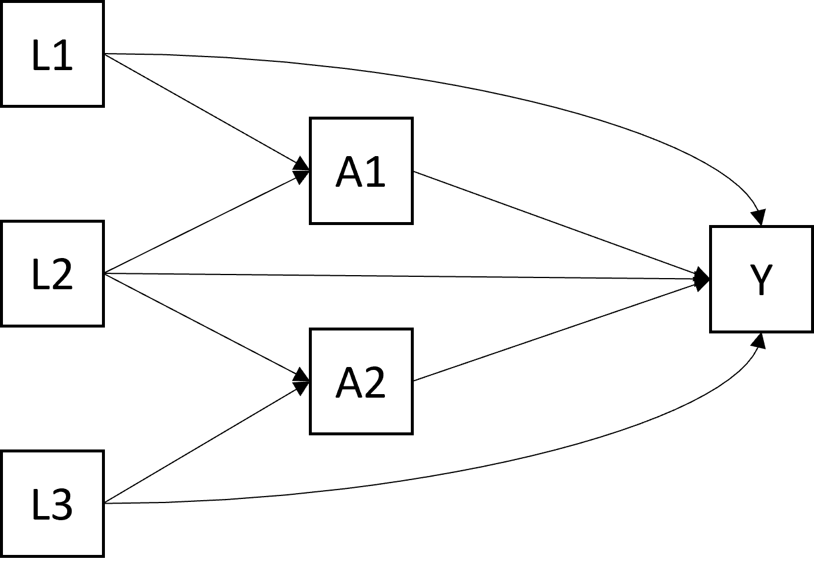

# (PART) Estimations, Interprétations, Présentations {-}

# Simulations

Pour la description des différents types d'estimation, on a simulé des données selon le DAG suivant (toutes les variables sont binaires):

> {width=50%}


Le code ayant permis de simuler les données est le suivant :

<script type="text/javascript">

// toggle visibility of R source blocks in R Markdown output
function toggle_R() {
  var x = document.getElementsByClassName('r');
  if (x.length == 0) return;
  function toggle_vis(o) {
    var d = o.style.display;
    o.style.display = (d == 'block' || d == '') ? 'none':'block';
  }

  for (i = 0; i < x.length; i++) {
    var y = x[i];
    if (y.tagName.toLowerCase() === 'pre') toggle_vis(y);
  }

    var elem = document.getElementById("myButton1");
    if (elem.value === "Hide Code") elem.value = "Show Code";
    else elem.value = "Hide Code";
}

document.write('<input onclick="toggle_R();" type="button" value="Hide Code" id="myButton1" style="position: static; top: 1%; left: 2%; z-index: 200"></input>')

</script>

<<<<<<< HEAD
## Simulations

On simule des données selon le DAG suivant (toutes les variables sont binaires):

> {width=50%}
=======
>>>>>>> e225b751959377b69a975cacad5b91fa4793254f


```{r simul, results ='hide'}
  rm(list=ls())

  param.causal.model <- function(p_L1 = 0.50, 
                                 p_L2 = 0.20, 
                                 p_L3 = 0.70,       # baseline confounders
                                 b_A1 = 0.10, 
                                 b_L1_A1 = 0.15, 
                                 b_L2_A1 = 0.25, # modèle de A1
                                 b_A2 = 0.15, 
                                 b_L1_A2 = 0.20, 
                                 b_L3_A2 = 0.20, # modèle de A2
                                 b_Y = 0.10,      # modèle de Y
                                 b_L1_Y = 0.02,
                                 b_L2_Y = 0.02,
                                 b_L3_Y = -0.02,
                                 b_A1_Y = 0.3,
                                 b_A2_Y = 0.1,
                                 b_A1A2_Y = 0.4 ) { # <- effet d'interaction Delta)

  # coefficients pour simuler l'exposition
  # exposition A1  # vérif
  try(if(b_A1 + b_L1_A1 + b_L1_A1 > 1) 
    stop("la somme des coefficient du modèle A1 dépasse 100%"))
  
  # exposition A2  # vérif
  try(if(b_A2 + b_L1_A2 + b_L3_A2 > 1) 
    stop("la somme des coefficients du modèle A2 dépasse 100%"))
  
  # coefficients pour simuler l'outcome, vérif
  try(if(b_Y + b_L1_Y + b_L2_Y + b_L3_Y + b_A1_Y + b_A2_Y + b_A1A2_Y > 1) 
    stop("la somme des coefficients du modèle Y dépasse 100%"))
  try(if(b_Y + b_L1_Y + b_L2_Y + b_L3_Y + b_A1_Y + b_A2_Y + b_A1A2_Y < 0) 
    stop("la somme des coefficients du modèle Y est inférieure à 0%"))
  
  coef <- list(c(p_L1 = p_L1, p_L2 = p_L2, p_L3 = p_L3),
               c(b_A1 = b_A1, b_L1_A1 = b_L1_A1, b_L2_A1 = b_L2_A1),
               c(b_A2 = b_A2, b_L1_A2 = b_L1_A2, b_L3_A2 = b_L3_A2),
               c(b_Y = b_Y, b_L1_Y = b_L1_Y, b_L2_Y = b_L2_Y, b_L3_Y = b_L3_Y,
                 b_A1_Y = b_A1_Y, b_A2_Y = b_A2_Y, b_A1A2_Y = b_A1A2_Y))
  return(coef)
}

generate.data <- function(N, b =  param.causal.model()) {
  
  L1 <- rbinom(N, size = 1, prob = b[[1]]["p_L1"]) 
  L2 <- rbinom(N, size = 1, prob = b[[1]]["p_L2"])
  L3 <- rbinom(N, size = 1, prob = b[[1]]["p_L3"])
  A1 <- rbinom(N, size = 1, prob = b[[2]]["b_A1"] + 
                 (b[[2]]["b_L1_A1"] * L1) + (b[[2]]["b_L2_A1"] * L2))
  A2 <- rbinom(N, size = 1, prob = b[[3]]["b_A2"] + 
                 (b[[3]]["b_L1_A2"] * L1) + (b[[3]]["b_L3_A2"] * L3))
  Y <- rbinom(N, size = 1, prob = (b[[4]]["b_Y"] + 
                                     (b[[4]]["b_L1_Y"] * L1) + 
                                     (b[[4]]["b_L2_Y"] * L2) +
                                     (b[[4]]["b_L3_Y"] * L3) +  
                                     (b[[4]]["b_A1_Y"] * A1) + 
                                     (b[[4]]["b_A2_Y"] * A2) + 
                                     (b[[4]]["b_A1A2_Y"] * A1 * A2)) )
  data.sim <- data.frame(L1, L2, L3, A1, A2, Y)
  return(data.sim)
}

#### On simule une base de données
  set.seed(12345)
  # b =  param.causal.model(b_A1A2_Y = -0.45)
  b = param.causal.model()
  df <- generate.data(N = 10000, b = b)
  summary(df)
  prop.table(table(df$Y, df$A1, df$A2, deparse.level = 2))


```


Au final, les probabilités de l'outcome P(Y=1), dans chaque catégorie sont : 


```{r pop, echo=FALSE, warning=FALSE, message=FALSE}
library(kableExtra)
library(finalfit)
library(dplyr)
#explanatory = c("age.factor*sex.factor", "obstruct.factor", "perfor.factor")
explanatory = c("A1")
dependent = "Y"
df %>%
  group_by(!!! syms("A2")) %>% 
  group_modify(~ summary_factorlist(.x, dependent, explanatory, digits = c(2,2,2,2,2))) %>%
  ff_stratify_helper(df) -> t

t %>%  
  select(-4) %>% 
   kable(row.names=FALSE,
       booktabs = T,
       linesep = "",
       align=c("l", "r", "l", "r", "r")) -> t9

  kable_styling(t9, font_size = 9, 
                latex_options = "hold_position") 


```

# A partir de modèles de régression

Dans une première étape exploratoire, on peut simplement utiliser les modèles de régression habituels.


## Régression logistique

Lorsque l'on étudie un outcome binaire, on utilise souvent les modèles de régression logistique.  


```{r reg_log_sum, echo = FALSE, warning=FALSE, message=FALSE}

df_f <- df %>%  mutate(Y = factor(Y))


summary(glm(data = df_f,
        Y ~ as.factor(A1)+
                as.factor(A2)+
                as.factor(A1)*as.factor(A2)+ 
                as.factor(L1)+
                as.factor(L2)+ 
                as.factor(L3), family = binomial))

```
Le coefficient `as.factor(A1)1` correspond à l'effet de A1 dans la catégorie de référence de A2, soit $\small OR = exp(1.756) =$ `r round(exp(1.756),3)`.

Le coefficient `as.factor(A1)1:as.factor(A2)1` correspond à la différence d'effet de A1 quand on passe dans l'autre catégorie de A2. L'effet de A1 dans la catégorie A2=1 est donc $\small OR = exp(1.756+1.786) =$ `r round(exp(1.756+1.786),3)`.

L'interaction multiplicative peut donc être estimée par $\small IM = exp(1.786) =$ `r round(exp(1.786),3)`, soit $\small OR(A1|A2=0) - OR(A1|A2=1)$. Ici l'interaction est significative. 

On aurait aussi pu décrire cette interaction à partir de l'effet d'A2 dans chaque strate de A1.

On peut explorer l'interaction sur l'échelle additive en estimant le RERI par $\small RERI \approx OR_{11} - OR_{10} - OR_{01} + 1 =$ `r round(exp(1.786+1.786) - exp(1.786) - exp(0.753) + 1,3)`, soit $\small OR(A1|A2=0) - OR(A1|A2=1)$. Ici l'interaction est significative. 


En résumé (le package `finalfit` permet de sortir les résultats proprement) : 

```{r reg_log, echo = TRUE, warning=FALSE, message=FALSE}

explanatory = c("as.factor(A1)",
                "as.factor(A2)",
                "as.factor(A1)*as.factor(A2)", 
                "as.factor(L1)",
                "as.factor(L2)", 
                "as.factor(L3)")
dependent = "Y"

df_f %>%
  finalfit(dependent, explanatory)-> t

cbind(names = c("A1|A2=0", "A2|A1=0", "Interaction"), 
      OR = t[c(12,14,13),6]) %>%
  as.data.frame %>% 
      kbl() %>%
      kable_classic() 

```


Attention, les modèles de régressions logistiques sont biaisés car les données sont générées à partir de modèles additifs.

## Régression lineaire

Même si l'outcome binaire, on peut en théorie utiliser un modèle de régression linéaire et explorer les effets sur une échelle additive. Si l'outcome est quantitatif, on utilise aussi, en général, les modèles de régression linéaire.  


```{r reg_lm_sum, echo = FALSE, warning=FALSE, message=FALSE}

summary(lm(data = df,
        Y ~ as.factor(A1)+
                as.factor(A2)+
                as.factor(A1)*as.factor(A2)+ 
                as.factor(L1)+
                as.factor(L2)+ 
                as.factor(L3)))

```


<span style="color: red;">partie à compléter </span>

```{r reg_lm, echo=FALSE, warning=FALSE, message=FALSE}

explanatory = c("as.factor(A1)",
                "as.factor(A2)",
                "as.factor(A1)*as.factor(A2)", 
                "as.factor(L1)",
                "as.factor(L2)", 
                "as.factor(L3)")
dependent = "Y"
df %>%
  finalfit(dependent, explanatory)-> t

cbind(names = c("A1|A2=0", "A2|A1=0", "Interaction"), OR = t[c(12,14,13),6]) %>%
  as.data.frame %>% 
      kbl() %>%
      kable_classic() 


```


# Analyses confirmatoires

<script type="text/javascript">

// toggle visibility of R source blocks in R Markdown output
function toggle_R() {
  var x = document.getElementsByClassName('r');
  if (x.length == 0) return;
  function toggle_vis(o) {
    var d = o.style.display;
    o.style.display = (d == 'block' || d == '') ? 'none':'block';
  }

  for (i = 0; i < x.length; i++) {
    var y = x[i];
    if (y.tagName.toLowerCase() === 'pre') toggle_vis(y);
  }

    var elem = document.getElementById("myButton1");
    if (elem.value === "Hide Code") elem.value = "Show Code";
    else elem.value = "Hide Code";
}

document.write('<input onclick="toggle_R();" type="button" value="Hide Code" id="myButton1" style="position: static; top: 1%; left: 2%; z-index: 200"></input>')

</script>

## Estimation par G-computation

Il s'agit d'une "G-methods" aussi appelée "standardisation" par Hernàn.

```{r gcomp, results ='hide', cache=TRUE}


## 1.a) on crée 4 tables correspondant aux 4 interventions contrefactuelles
    df.A1_0.A2_0 <- df.A1_1.A2_0 <- df.A1_0.A2_1 <- df.A1_1.A2_1 <- df
    
    df.A1_0.A2_0$A1 <- df.A1_0.A2_0$A2 <- rep(0, nrow(df))
    df.A1_1.A2_0$A1 <- rep(1, nrow(df))
    df.A1_1.A2_0$A2 <- rep(0, nrow(df))
    
    df.A1_0.A2_1$A1 <- rep(0, nrow(df))
    df.A1_0.A2_1$A2 <- rep(1, nrow(df))
    
    df.A1_1.A2_1$A1 <- df.A1_1.A2_1$A2 <- rep(1, nrow(df))

## 1.b) on modélise le critère de jugement
    # model.Y <- glm(Y ~ L1 + L2 + L3 + A1 + A2 + A1:A2, data = df, family = "binomial") 
    # modèle logistique biaisé (il y a des interactions avec les baseline)
    model.Y <- glm(Y ~ L1 + L2 + L3 + A1 + A2 + A1:A2, data = df,
                   family = "gaussian") # modèle non biaisé
    # en pratique la régression logistique n'est pas tellement biaisée, 
    # mais peut être car il n'y a pas la place de mettre beaucoup de confusion
    # par rapport aux effets importants de A1 et A2 ? (10 fois plus grands)

## 1.c) on prédit le critère de jugement sous les interventions contrefactuelles
    Y.A1_0.A2_0 <- predict(model.Y, newdata = df.A1_0.A2_0, type = "response")
    Y.A1_1.A2_0 <- predict(model.Y, newdata = df.A1_1.A2_0, type = "response")
    Y.A1_0.A2_1 <- predict(model.Y, newdata = df.A1_0.A2_1, type = "response")
    Y.A1_1.A2_1 <- predict(model.Y, newdata = df.A1_1.A2_1, type = "response")

## 1.d) on va enregistrer l'ensemble des résultats pertinents dans une table de longueur k1 x k2
    int.r <- matrix(NA, 
                    ncol = 26, 
                    nrow = nlevels(as.factor(df$A1)) * nlevels(as.factor(df$A2)))
    int.r <- as.data.frame(int.r)
    names(int.r) <- c("A1","A2","p","p.lo","p.up",
                      "RD.A1","RD.A1.lo","RD.A1.up","RD.A2","RD.A2.lo","RD.A2.up",
                      "RR.A1","RR.A1.lo","RR.A1.up","RR.A2","RR.A2.lo","RR.A2.up",
                      "a.INT", "a.INT.lo", "a.INT.up","RERI","RERI.lo","RERI.up",
                      "m.INT", "m.INT.lo", "m.INT.up" )
    int.r[,c("A1","A2")] <- expand.grid(c(0,1), c(0,1))

# marginal effects in the k1 x k2 table
    # A1 = 0 et A2 = 0
    int.r$p[int.r$A1 == 0 & int.r$A2 == 0] <- mean(Y.A1_0.A2_0)
    # A1 = 1 et A2 = 0
    int.r$p[int.r$A1 == 1 & int.r$A2 == 0] <- mean(Y.A1_1.A2_0)
    # A1 = 0 et A2 = 1
    int.r$p[int.r$A1 == 0 & int.r$A2 == 1] <- mean(Y.A1_0.A2_1)
    # A1 = 1 et A2 = 1
    int.r$p[int.r$A1 == 1 & int.r$A2 == 1] <- mean(Y.A1_1.A2_1)

# risk difference
    # RD.A1.A2is0
    int.r$RD.A1[int.r$A1 == 1 & int.r$A2 == 0] <- mean(Y.A1_1.A2_0) - mean(Y.A1_0.A2_0)
    # RD.A1.A2is1
    int.r$RD.A1[int.r$A1 == 1 & int.r$A2 == 1] <- mean(Y.A1_1.A2_1) - mean(Y.A1_0.A2_1)
    # RD.A2.A1is0
    int.r$RD.A2[int.r$A1 == 0 & int.r$A2 == 1] <- mean(Y.A1_0.A2_1) - mean(Y.A1_0.A2_0)
    # RD.A2.A1is1
    int.r$RD.A2[int.r$A1 == 1 & int.r$A2 == 1] <- mean(Y.A1_1.A2_1) - mean(Y.A1_1.A2_0)

# relative risk
    # RR.A1.A2is0
    int.r$RR.A1[int.r$A1 == 1 & int.r$A2 == 0] <- mean(Y.A1_1.A2_0) / mean(Y.A1_0.A2_0)
    # RR.A1.A2is1
    int.r$RR.A1[int.r$A1 == 1 & int.r$A2 == 1] <- mean(Y.A1_1.A2_1) / mean(Y.A1_0.A2_1)
    # RR.A2.A1is0
    int.r$RR.A2[int.r$A1 == 0 & int.r$A2 == 1] <- mean(Y.A1_0.A2_1) / mean(Y.A1_0.A2_0)
    # RR.A2.A1is1
    int.r$RR.A2[int.r$A1 == 1 & int.r$A2 == 1] <- mean(Y.A1_1.A2_1) / mean(Y.A1_1.A2_0)

# additive interaction
    int.r$a.INT[int.r$A1 == 1 & int.r$A2 == 1] <- mean(Y.A1_1.A2_1) - 
                                                  mean(Y.A1_1.A2_0) - 
                                                  mean(Y.A1_0.A2_1) + 
      mean(Y.A1_0.A2_0)
    # RERI
    int.r$RERI[int.r$A1 == 1 & int.r$A2 == 1] <- (mean(Y.A1_1.A2_1) - 
                                                    mean(Y.A1_1.A2_0) - 
                                                    mean(Y.A1_0.A2_1) + 
                                                    mean(Y.A1_0.A2_0)) / 
                                                    mean(Y.A1_0.A2_0)
    # multiplicative interaction
    int.r$m.INT[int.r$A1 == 1 & int.r$A2 == 1] <- (mean(Y.A1_1.A2_1) * 
                                                     mean(Y.A1_0.A2_0)) / 
                                                      (mean(Y.A1_1.A2_0) * 
                                                         mean(Y.A1_0.A2_1))
 
                                                    
## 1.e) Intervalles de confiance par bootstrap
    set.seed(5678)
    B <- 2000
    bootstrap.est <- data.frame(matrix(NA, nrow = B, ncol = 15))
    colnames(bootstrap.est) <- c("p.A1is0.A2is0", "p.A1is1.A2is0", "p.A1is0.A2is1", "p.A1is1.A2is1", 
                                 "RD.A1.A2is0", "RD.A1.A2is1", "RD.A2.A1is0", "RD.A2.A1is1",
                                 "lnRR.A1.A2is0", "lnRR.A1.A2is1", "lnRR.A2.A1is0", "lnRR.A2.A1is1",
                                 "INT.a", "lnRERI", "lnINT.m")

    for (b in 1:B){
      # sample the indices 1 to n with replacement
      bootIndices <- sample(1:nrow(df), replace=T)
      bootData <- df[bootIndices,]
      
      if ( round(b/100, 0) == b/100 ) print(paste0("bootstrap number ",b))
      
      # model (unbiased in this case)
      model.Y <- glm(Y ~ L1 + L2 + L3 + A1 + A2 + A1:A2, 
                     data = bootData,                    # use BootData here +++
                     family = "gaussian") 
      
      # conterfactual data sets
      boot.A1_0.A2_0 <- boot.A1_1.A2_0 <- boot.A1_0.A2_1 <- boot.A1_1.A2_1 <- bootData
      boot.A1_0.A2_0$A1 <- boot.A1_0.A2_0$A2 <- rep(0, nrow(df))
      boot.A1_1.A2_0$A1 <- rep(1, nrow(df))
      boot.A1_1.A2_0$A2 <- rep(0, nrow(df))
      boot.A1_0.A2_1$A1 <- rep(0, nrow(df))
      boot.A1_0.A2_1$A2 <- rep(1, nrow(df))
      boot.A1_1.A2_1$A1 <- boot.A1_1.A2_1$A2 <- rep(1, nrow(df))
      
      # predict potential outcomes under counterfactual scenarios
      Y.A1_0.A2_0 <- predict(model.Y, newdata = boot.A1_0.A2_0, type = "response")
      Y.A1_1.A2_0 <- predict(model.Y, newdata = boot.A1_1.A2_0, type = "response")
      Y.A1_0.A2_1 <- predict(model.Y, newdata = boot.A1_0.A2_1, type = "response")
      Y.A1_1.A2_1 <- predict(model.Y, newdata = boot.A1_1.A2_1, type = "response")
  
      # save results in the bootstrap table
      bootstrap.est[b,"p.A1is0.A2is0"] <- mean(Y.A1_0.A2_0)
      bootstrap.est[b,"p.A1is1.A2is0"] <- mean(Y.A1_1.A2_0)
      bootstrap.est[b,"p.A1is0.A2is1"] <- mean(Y.A1_0.A2_1)
      bootstrap.est[b,"p.A1is1.A2is1"] <- mean(Y.A1_1.A2_1)
      
      bootstrap.est[b,"RD.A1.A2is0"] <- mean(Y.A1_1.A2_0) - mean(Y.A1_0.A2_0)
      bootstrap.est[b,"RD.A1.A2is1"] <- mean(Y.A1_1.A2_1) - mean(Y.A1_0.A2_1)
      bootstrap.est[b,"RD.A2.A1is0"] <- mean(Y.A1_0.A2_1) - mean(Y.A1_0.A2_0)
      bootstrap.est[b,"RD.A2.A1is1"] <- mean(Y.A1_1.A2_1) - mean(Y.A1_1.A2_0)
      
      bootstrap.est[b,"lnRR.A1.A2is0"] <- log(mean(Y.A1_1.A2_0) / mean(Y.A1_0.A2_0))
      bootstrap.est[b,"lnRR.A1.A2is1"] <- log(mean(Y.A1_1.A2_1) / mean(Y.A1_0.A2_1))
      bootstrap.est[b,"lnRR.A2.A1is0"] <- log(mean(Y.A1_0.A2_1) / mean(Y.A1_0.A2_0))
      bootstrap.est[b,"lnRR.A2.A1is1"] <- log(mean(Y.A1_1.A2_1) / mean(Y.A1_1.A2_0))
  
      bootstrap.est[b,"INT.a"] <- mean(Y.A1_1.A2_1) - 
        mean(Y.A1_1.A2_0) - mean(Y.A1_0.A2_1) + mean(Y.A1_0.A2_0)
      bootstrap.est[b,"lnRERI"] <- log((mean(Y.A1_1.A2_1) - 
        mean(Y.A1_1.A2_0) - mean(Y.A1_0.A2_1) + mean(Y.A1_0.A2_0)) / mean(Y.A1_0.A2_0))
      bootstrap.est[b,"lnINT.m"] <- log( (mean(Y.A1_1.A2_1) * 
        mean(Y.A1_0.A2_0)) / (mean(Y.A1_1.A2_0) * mean(Y.A1_0.A2_1)))
    }

    # head(bootstrap.est)
    # summary(bootstrap.est)
    # par(mfrow = c(4,4))
    # for(c in 1:ncol(bootstrap.est)) {
    #   hist(bootstrap.est[,c], freq = FALSE, main = names(bootstrap.est)[c])
    #   lines(density(bootstrap.est[,c]), col = 2, lwd = 3)
    #   curve(1/sqrt(var(bootstrap.est[,c]) * 2 * pi) * 
    #           exp(-1/2 * ((x-mean(bootstrap.est[,c])) / sd(bootstrap.est[,c]))^2),
    #         col = 1, lwd = 2, lty = 2, add = TRUE)
    # par(mfrow = c(1,1))
    # ok, on a des belles lois normales dans les distributions bootstrap, tout va bien !
    # pour les IC95%, je peux utiliser la déviation standard des distributions
    # pour des distributions plus asymétriques, on utiliserait plutôt les percentiles 2.5% et 97.5%
    # }

# marginal effects in the k1 x k2 table
    # A1 = 0 et A2 = 0
    int.r$p.lo[int.r$A1 == 0 & int.r$A2 == 0] <- int.r$p[int.r$A1 == 0 & int.r$A2 == 0] - 
      qnorm(0.975) * sd(bootstrap.est$p.A1is0.A2is0)
    int.r$p.up[int.r$A1 == 0 & int.r$A2 == 0] <- int.r$p[int.r$A1 == 0 & int.r$A2 == 0] + 
      qnorm(0.975) * sd(bootstrap.est$p.A1is0.A2is0)
    # A1 = 1 et A2 = 0
    int.r$p.lo[int.r$A1 == 1 & int.r$A2 == 0] <- int.r$p[int.r$A1 == 1 & int.r$A2 == 0] - 
      qnorm(0.975) * sd(bootstrap.est$p.A1is1.A2is0)
    int.r$p.up[int.r$A1 == 1 & int.r$A2 == 0] <- int.r$p[int.r$A1 == 1 & int.r$A2 == 0] + 
      qnorm(0.975) * sd(bootstrap.est$p.A1is1.A2is0)
    # A1 = 0 et A2 = 1
    int.r$p.lo[int.r$A1 == 0 & int.r$A2 == 1] <- int.r$p[int.r$A1 == 0 & int.r$A2 == 1] - 
      qnorm(0.975) * sd(bootstrap.est$p.A1is0.A2is1)
    int.r$p.up[int.r$A1 == 0 & int.r$A2 == 1] <- int.r$p[int.r$A1 == 0 & int.r$A2 == 1] + 
      qnorm(0.975) * sd(bootstrap.est$p.A1is0.A2is1)
    # A1 = 1 et A2 = 1
    int.r$p.lo[int.r$A1 == 1 & int.r$A2 == 1] <- int.r$p[int.r$A1 == 1 & int.r$A2 == 1] - 
      qnorm(0.975) * sd(bootstrap.est$p.A1is1.A2is1)
    int.r$p.up[int.r$A1 == 1 & int.r$A2 == 1] <- int.r$p[int.r$A1 == 1 & int.r$A2 == 1] + 
      qnorm(0.975) * sd(bootstrap.est$p.A1is1.A2is1)

# risk difference
    # RD.A1.A2is0
    int.r$RD.A1.lo[int.r$A1 == 1 & int.r$A2 == 0] <- int.r$RD.A1[int.r$A1 == 1 & int.r$A2 == 0] - 
      qnorm(0.975) * sd(bootstrap.est$RD.A1.A2is0)
    int.r$RD.A1.up[int.r$A1 == 1 & int.r$A2 == 0] <- int.r$RD.A1[int.r$A1 == 1 & int.r$A2 == 0] + 
      qnorm(0.975) * sd(bootstrap.est$RD.A1.A2is0)
    # RD.A1.A2is1
    int.r$RD.A1.lo[int.r$A1 == 1 & int.r$A2 == 1] <- int.r$RD.A1[int.r$A1 == 1 & int.r$A2 == 1] - 
      qnorm(0.975) * sd(bootstrap.est$RD.A1.A2is1)
    int.r$RD.A1.up[int.r$A1 == 1 & int.r$A2 == 1] <- int.r$RD.A1[int.r$A1 == 1 & int.r$A2 == 1] + 
      qnorm(0.975) * sd(bootstrap.est$RD.A1.A2is1)
    # RD.A2.A1is0
    int.r$RD.A2.lo[int.r$A1 == 0 & int.r$A2 == 1] <- int.r$RD.A2[int.r$A1 == 0 & int.r$A2 == 1] - 
      qnorm(0.975) * sd(bootstrap.est$RD.A2.A1is0)
    int.r$RD.A2.up[int.r$A1 == 0 & int.r$A2 == 1] <- int.r$RD.A2[int.r$A1 == 0 & int.r$A2 == 1] + 
      qnorm(0.975) * sd(bootstrap.est$RD.A2.A1is0)
    # RD.A2.A1is1
    int.r$RD.A2.lo[int.r$A1 == 1 & int.r$A2 == 1] <- int.r$RD.A2[int.r$A1 == 1 & int.r$A2 == 1] - 
      qnorm(0.975) * sd(bootstrap.est$RD.A2.A1is1)
    int.r$RD.A2.up[int.r$A1 == 1 & int.r$A2 == 1] <- int.r$RD.A2[int.r$A1 == 1 & int.r$A2 == 1] + 
      qnorm(0.975) * sd(bootstrap.est$RD.A2.A1is1)

# relative risk
    # RR.A1.A2is0
    int.r$RR.A1.lo[int.r$A1 == 1 & int.r$A2 == 0] <- exp(log(int.r$RR.A1[int.r$A1 == 1 & int.r$A2 == 0]) - 
                                                           qnorm(0.975) * sd(bootstrap.est$lnRR.A1.A2is0))
    int.r$RR.A1.up[int.r$A1 == 1 & int.r$A2 == 0] <- exp(log(int.r$RR.A1[int.r$A1 == 1 & int.r$A2 == 0]) + 
                                                           qnorm(0.975) * sd(bootstrap.est$lnRR.A1.A2is0))
    # RR.A1.A2is1
    int.r$RR.A1.lo[int.r$A1 == 1 & int.r$A2 == 1] <- exp(log(int.r$RR.A1[int.r$A1 == 1 & int.r$A2 == 1]) - 
                                                           qnorm(0.975) * sd(bootstrap.est$lnRR.A1.A2is1))
    int.r$RR.A1.up[int.r$A1 == 1 & int.r$A2 == 1] <- exp(log(int.r$RR.A1[int.r$A1 == 1 & int.r$A2 == 1]) + 
                                                           qnorm(0.975) * sd(bootstrap.est$lnRR.A1.A2is1))
    # RR.A2.A1is0
    int.r$RR.A2.lo[int.r$A1 == 0 & int.r$A2 == 1] <- exp(log(int.r$RR.A2[int.r$A1 == 0 & int.r$A2 == 1]) - 
                                                           qnorm(0.975) * sd(bootstrap.est$lnRR.A2.A1is0))
    int.r$RR.A2.up[int.r$A1 == 0 & int.r$A2 == 1] <- exp(log(int.r$RR.A2[int.r$A1 == 0 & int.r$A2 == 1]) + 
                                                           qnorm(0.975) * sd(bootstrap.est$lnRR.A2.A1is0))
    # RR.A2.A1is1
    int.r$RR.A2.lo[int.r$A1 == 1 & int.r$A2 == 1] <- exp(log(int.r$RR.A2[int.r$A1 == 1 & int.r$A2 == 1]) - 
                                                           qnorm(0.975) * sd(bootstrap.est$lnRR.A2.A1is1))
    int.r$RR.A2.up[int.r$A1 == 1 & int.r$A2 == 1] <- exp(log(int.r$RR.A2[int.r$A1 == 1 & int.r$A2 == 1]) + 
                                                           qnorm(0.975) * sd(bootstrap.est$lnRR.A2.A1is1))

# additive interaction
    int.r$a.INT.lo[int.r$A1 == 1 & int.r$A2 == 1] <- int.r$a.INT[int.r$A1 == 1 & int.r$A2 == 1] - 
      qnorm(0.975) * sd(bootstrap.est$INT.a)
    int.r$a.INT.up[int.r$A1 == 1 & int.r$A2 == 1] <- int.r$a.INT[int.r$A1 == 1 & int.r$A2 == 1] + 
      qnorm(0.975) * sd(bootstrap.est$INT.a)
    # RERI
    int.r$RERI.lo[int.r$A1 == 1 & int.r$A2 == 1] <- exp(log(int.r$RERI[int.r$A1 == 1 & int.r$A2 == 1]) - 
                                                          qnorm(0.975) * sd(bootstrap.est$lnRERI))
    int.r$RERI.up[int.r$A1 == 1 & int.r$A2 == 1] <- exp(log(int.r$RERI[int.r$A1 == 1 & int.r$A2 == 1]) + 
                                                          qnorm(0.975) * sd(bootstrap.est$lnRERI))
    # multiplicative interaction
    int.r$m.INT.lo[int.r$A1 == 1 & int.r$A2 == 1] <- exp(log(int.r$m.INT[int.r$A1 == 1 & int.r$A2 == 1]) -
                                                           qnorm(0.975) * sd(bootstrap.est$lnINT.m))
    int.r$m.INT.up[int.r$A1 == 1 & int.r$A2 == 1] <- exp(log(int.r$m.INT[int.r$A1 == 1 & int.r$A2 == 1]) +
                                                           qnorm(0.975) * sd(bootstrap.est$lnINT.m))
```

Au final, on a :

```{r t_gcomp, echo=FALSE, warning=FALSE, message=FALSE}


## 1.d) tableau des effets marginaux
    out.table <- data.frame(c1 = rep("",4), c2 = rep("",4), c3 = rep("",4), c4 = rep("",4))
    names(out.table) <- c("A2=0", "A2=1", "RD.A2|A1", "RR.A2|A1")
    rownames(out.table) <- c("A1=0", "A1=1", "RD.A1|A2", "RR.A1|A2")
# p
    out.table["A1=0","A2=0"] <- paste0("$p_{00}$=",round(int.r$p[which(int.r$A1==0 & int.r$A2==0)], digits = 3),
                                       " [",
                                       round(int.r$p.lo[which(int.r$A1==0 & int.r$A2==0)], digits = 3),
                                       ",",
                                       round(int.r$p.up[which(int.r$A1==0 & int.r$A2==0)], digits = 3),
                                       "]")
    out.table["A1=0","A2=1"] <- paste0("$p_{01}$=",round(int.r$p[which(int.r$A1==0 & int.r$A2==1)], digits = 3),
                                       " [",
                                       round(int.r$p.lo[which(int.r$A1==0 & int.r$A2==1)], digits = 3),
                                       ",",
                                       round(int.r$p.up[which(int.r$A1==0 & int.r$A2==1)], digits = 3),
                                       "]")
    out.table["A1=1","A2=0"] <- paste0("$p_{10}$=",round(int.r$p[which(int.r$A1==1 & int.r$A2==0)], digits = 3),
                                       " [",
                                       round(int.r$p.lo[which(int.r$A1==1 & int.r$A2==0)], digits = 3),
                                       ",",
                                       round(int.r$p.up[which(int.r$A1==1 & int.r$A2==0)], digits = 3),
                                       "]")     
    out.table["A1=1","A2=1"] <- paste0("$p_{11}$=",round(int.r$p[which(int.r$A1==1 & int.r$A2==1)], digits = 3),
                                       " [",
                                       round(int.r$p.lo[which(int.r$A1==1 & int.r$A2==1)], digits = 3),
                                       ",",
                                       round(int.r$p.up[which(int.r$A1==1 & int.r$A2==1)], digits = 3),
                                       "]")    
# RD
    out.table["A1=0","RD.A2|A1"] <- paste0(round(int.r$RD.A2[which(int.r$A1==0 & int.r$A2==1)], digits = 3),
                                           " [",
                                           round(int.r$RD.A2.lo[which(int.r$A1==0 & int.r$A2==1)], digits = 3),
                                           ",",
                                           round(int.r$RD.A2.up[which(int.r$A1==0 & int.r$A2==1)], digits = 3),
                                           "]")
    out.table["A1=1","RD.A2|A1"] <- paste0(round(int.r$RD.A2[which(int.r$A1==1 & int.r$A2==1)], digits = 3),
                                           " [",
                                           round(int.r$RD.A2.lo[which(int.r$A1==1 & int.r$A2==1)], digits = 3),
                                           ",",
                                           round(int.r$RD.A2.up[which(int.r$A1==1 & int.r$A2==1)], digits = 3),
                                           "]")   
    out.table["RD.A1|A2","A2=0"] <- paste0(round(int.r$RD.A1[which(int.r$A1==1 & int.r$A2==0)],digits = 3),
                                           " [",
                                           round(int.r$RD.A1.lo[which(int.r$A1==1 & int.r$A2==0)],digits = 3),
                                           ",",
                                           round(int.r$RD.A1.up[which(int.r$A1==1 & int.r$A2==0)],digits = 3),
                                           "]") 
    out.table["RD.A1|A2","A2=1"] <- paste0(round(int.r$RD.A1[which(int.r$A1==1 & int.r$A2==1)],digits = 3),
                                           " [",
                                           round(int.r$RD.A1.lo[which(int.r$A1==1 & int.r$A2==1)],digits = 3),
                                           ",",
                                           round(int.r$RD.A1.up[which(int.r$A1==1 & int.r$A2==1)],digits = 3),
                                           "]") 

# RR
    out.table["A1=0","RR.A2|A1"] <- paste0(round(int.r$RR.A2[which(int.r$A1==0 & int.r$A2==1)], digits = 2),
                                           " [",
                                           round(int.r$RR.A2.lo[which(int.r$A1==0 & int.r$A2==1)], digits = 2),
                                           ",",
                                           round(int.r$RR.A2.up[which(int.r$A1==0 & int.r$A2==1)], digits = 2),
                                           "]")
    out.table["A1=1","RR.A2|A1"] <- paste0(round(int.r$RR.A2[which(int.r$A1==1 & int.r$A2==1)], digits = 2),
                                           " [",
                                           round(int.r$RR.A2.lo[which(int.r$A1==1 & int.r$A2==1)], digits = 2),
                                           ",",
                                           round(int.r$RR.A2.up[which(int.r$A1==1 & int.r$A2==1)], digits = 2),
                                           "]")   
    out.table["RR.A1|A2","A2=0"] <- paste0(round(int.r$RR.A1[which(int.r$A1==1 & int.r$A2==0)],digits = 2),
                                           " [",
                                           round(int.r$RR.A1.lo[which(int.r$A1==1 & int.r$A2==0)],digits = 2),
                                           ",",
                                           round(int.r$RR.A1.up[which(int.r$A1==1 & int.r$A2==0)],digits = 2),
                                           "]") 
    out.table["RR.A1|A2","A2=1"] <- paste0(round(int.r$RR.A1[which(int.r$A1==1 & int.r$A2==1)],digits = 2),
                                           " [",
                                           round(int.r$RR.A1.lo[which(int.r$A1==1 & int.r$A2==1)],digits = 2),
                                           ",",
                                           round(int.r$RR.A1.up[which(int.r$A1==1 & int.r$A2==1)],digits = 2),
                                           "]") 
    interaction.effects <- c(paste0("additive Interaction = ", 
                                   round(int.r$a.INT[which(int.r$A1==1 & int.r$A2==1)], digits = 3), 
                                   " [", 
                                   round(int.r$a.INT.lo[which(int.r$A1==1 & int.r$A2==1)], digits = 3), 
                                   ";", 
                                   round(int.r$a.INT.up[which(int.r$A1==1 & int.r$A2==1)], digits = 3),
                                   "]"),
                              paste0("RERI = ",
                                     round(int.r$RERI[which(int.r$A1==1 & int.r$A2==1)], digits = 2),
                                     " [",
                                     round(int.r$RERI.lo[which(int.r$A1==1 & int.r$A2==1)], digits = 2),
                                     ";",
                                     round(int.r$RERI.up[which(int.r$A1==1 & int.r$A2==1)], digits = 2),
                                     "]"),
                              paste0("multiplicative Interaction = ",
                                     round(int.r$m.INT[which(int.r$A1==1 & int.r$A2==1)], digits = 2),
                                     " [",
                                     round(int.r$m.INT.lo[which(int.r$A1==1 & int.r$A2==1)], digits = 2),
                                     ";",
                                     round(int.r$m.INT.up[which(int.r$A1==1 & int.r$A2==1)], digits = 2),
                                     "]"))

    library(kableExtra)
    kbl(out.table) %>%
      kable_classic() %>%
      footnote(general = interaction.effects)
      
```

## Estimation par Modèle Structurel Marginal


```{r msm, results ='hide', cache=TRUE}

# On récupère les Y prédit précédents, que l'on fusionne
    Y <- c(Y.A1_0.A2_0, Y.A1_1.A2_0, Y.A1_0.A2_1, Y.A1_1.A2_1)
    length(Y)
    # on aura une base de données de 40000 lignes
    
# On récupère les valeurs d'exposition qui ont servi dans les scénarios contrefactuels
    # (garder le même ordre que pour les Y.A1.A2)
    X <- rbind(subset(df.A1_0.A2_0, select = c("A1", "A2")),
               subset(df.A1_1.A2_0, select = c("A1", "A2")),
               subset(df.A1_0.A2_1, select = c("A1", "A2")),
               subset(df.A1_1.A2_1, select = c("A1", "A2")))
   #  dim(X)

## Modèle structurel marginal
    msm.RD <- glm(Y ~ A1 + A2 + A1:A2, 
                  data = data.frame(Y,X), 
                  family = "gaussian") # ne pas ajuster sur les facteurs de confusion
    msm.RD

## tableau des effets marignaux
    results.MSM <- matrix(NA, ncol = 4, nrow = 4)
    colnames(results.MSM) <- c("A2 = 0", "A2 = 1",
                               "RD within strata of A1",
                               "RR within strata of A1")
    rownames(results.MSM) <- c("A1 = 0", "A1 = 1",
                               "RD within strata of A2",
                               "RR within strata of A2")

# 4 risques marginaux
    results.MSM["A1 = 0","A2 = 0"] <- msm.RD$coefficients["(Intercept)"]
    results.MSM["A1 = 0","A2 = 1"] <- msm.RD$coefficients["(Intercept)"] + 
      msm.RD$coefficients["A2"]
    results.MSM["A1 = 1","A2 = 0"] <- msm.RD$coefficients["(Intercept)"] + 
      msm.RD$coefficients["A1"]
    results.MSM["A1 = 1","A2 = 1"] <- msm.RD$coefficients["(Intercept)"] + 
      msm.RD$coefficients["A2"] + msm.RD$coefficients["A1"] + msm.RD$coefficients["A1:A2"]

# within strata of A2
    results.MSM["RR within strata of A2", "A2 = 0"] <- results.MSM["A1 = 1","A2 = 0"] / 
      results.MSM["A1 = 0","A2 = 0"]
    results.MSM["RD within strata of A2", "A2 = 0"] <- results.MSM["A1 = 1","A2 = 0"] - 
      results.MSM["A1 = 0","A2 = 0"]
    results.MSM["RR within strata of A2", "A2 = 1"] <- results.MSM["A1 = 1","A2 = 1"] / 
      results.MSM["A1 = 0","A2 = 1"]
    results.MSM["RD within strata of A2", "A2 = 1"] <- results.MSM["A1 = 1","A2 = 1"] - 
      results.MSM["A1 = 0","A2 = 1"]

# within strata of A1
    results.MSM["A1 = 0", "RR within strata of A1"] <- results.MSM["A1 = 0","A2 = 1"] / 
      results.MSM["A1 = 0","A2 = 0"]
    results.MSM["A1 = 0", "RD within strata of A1"] <- results.MSM["A1 = 0","A2 = 1"] - 
      results.MSM["A1 = 0","A2 = 0"]
    results.MSM["A1 = 1", "RR within strata of A1"] <- results.MSM["A1 = 1","A2 = 1"] /
      results.MSM["A1 = 1","A2 = 0"]
    results.MSM["A1 = 1", "RD within strata of A1"] <- results.MSM["A1 = 1","A2 = 1"] - 
      results.MSM["A1 = 1","A2 = 0"]

    results.MSM <- round(results.MSM,3)
    RD.interaction <- msm.RD$coefficients["A1:A2"]
    RR.interaction <- (results.MSM["A1 = 1","A2 = 1"] *
                         results.MSM["A1 = 0","A2 = 0"]) / 
                      ( results.MSM["A1 = 0","A2 = 1"] *
                          results.MSM["A1 = 1","A2 = 0"] )

```

Au final, on a (sans les IC):

```{r t_msm, echo=FALSE, warning=FALSE, message=FALSE}
 

interaction.effects <- c(paste0("additive Interaction = ", 
                                   round(RD.interaction, digits = 3)),
                              paste0("multiplicative Interaction = ",
                                     round(RR.interaction, digits = 2)))

   kbl(results.MSM) %>%
      kable_classic() %>%
      footnote(general = interaction.effects)
    

```


## Estimation avec TMLE

```{r tmle, results ='hide', cache=TRUE, warning=FALSE, message=FALSE}
## 3- int.ltmleMSM()          pour estimer les différentes quantités d'intérêt, 
###                           par gcomputation, IPTW ou tmle

int.ltmleMSM <- function(data = data,
                         Q_formulas = Q_formulas,
                         g_formulas = g_formulas,
                         Anodes = Anodes,
                         Lnodes = Lnodes,
                         Ynodes = Ynodes,
                         final.Ynodes = final.Ynodes,
                         SL.library = list(Q="SL.glm",
                                           g="SL.glm"),
                         gcomp = gcomp, 
                         iptw.only = iptw.only,
                         survivalOutcome = FALSE,
                         variance.method = "ic",
                         B = 2000, 
                         boot.seed = 12345) {
  # regime=
  # binary array: n x numAnodes x numRegimes of counterfactual treatment or a list of 'rule' functions
  regimes.MSM <- array(NA, dim = c(nrow(data), 2, 4)) # 2 variables d'exposition (A1, A2), 4 régimes d'exposition (0,0) (1,0) (0,1) (1,1)
  regimes.MSM[,,1] <- matrix(c(0,0), ncol = 2, nrow = nrow(data), byrow = TRUE) # exposé ni à A1, ni à A2
  regimes.MSM[,,2] <- matrix(c(1,0), ncol = 2, nrow = nrow(data), byrow = TRUE) # exposé à A1 uniquement
  regimes.MSM[,,3] <- matrix(c(0,1), ncol = 2, nrow = nrow(data), byrow = TRUE) # exposé à A2 uniquement
  regimes.MSM[,,4] <- matrix(c(1,1), ncol = 2, nrow = nrow(data), byrow = TRUE) # exposé à A1 et à A2

  # summary.measures = valeurs des coefficients du MSM associés à chaque régime
  # array: num.regimes x num.summary.measures x num.final.Ynodes - 
  # measures summarizing the regimes that will be used on the right hand side of working.msm 
  # (baseline covariates may also be used in the right hand side of working.msm and do not need to be included in summary.measures)
  summary.measures.reg <- array(NA, dim = c(4, 3, 1))
  summary.measures.reg[,,1] <- matrix(c(0, 0, 0, # aucun effet ni de A1, ni de A2
                                        1, 0, 0, # effet de A1 isolé
                                        0, 1, 0, # effet de A2 isolé
                                        1, 1, 1), # effet de A1 + A2 + A1:A2 
                                      ncol = 3, nrow = 4, byrow = TRUE)
  colnames(summary.measures.reg) <- c("A1", "A2", "A1:A2")
  
  if(gcomp == TRUE) {
    # test length SL.library$Q
    SL.library$Q <- ifelse(length(SL.library$Q) > 1, "SL.glm", SL.library$Q)
    
    # simplify SL.library$g because g functions are useless with g-computation
    SL.library$g <- "SL.mean"
    
    iptw.only <- FALSE
  }
  
  
  ltmle_MSM <- ltmleMSM(data = data, 
                        Anodes = Anodes,
                        Lnodes = Lnodes,
                        Ynodes = Ynodes, 
                        Qform = Q_formulas, 
                        gform = g_formulas,
                        #deterministic.g.function = det.g,
                        regimes = regimes.MSM, # à la place de abar
                        working.msm= "Y ~ A1 + A2 + A1:A2", 
                        summary.measures = summary.measures.reg,
                        final.Ynodes = final.Ynodes,
                        msm.weights = NULL, 
                        SL.library = SL.library,
                        gcomp = gcomp,
                        iptw.only = iptw.only,
                        survivalOutcome = survivalOutcome,
                        estimate.time = FALSE, 
                        variance.method = variance.method) 
  
  bootstrap.res <- data.frame("beta.Intercept" = rep(NA, B),
                              "beta.A1" = rep(NA, B),
                              "beta.A2" = rep(NA, B),
                              "beta.A1A2" = rep(NA, B))
  
  if(gcomp == TRUE) {
    set.seed <- boot.seed

    for (b in 1:B){
      # sample the indices 1 to n with replacement
      bootIndices <- sample(1:nrow(data), replace=T)
      bootData <- data[bootIndices,]
      
      if ( round(b/100, 0) == b/100 ) print(paste0("bootstrap number ",b))
      
      boot_ltmle_MSM <- ltmleMSM(data = bootData, 
                                 Anodes = Anodes,
                                 Lnodes = Lnodes,
                                 Ynodes = Ynodes, 
                                 Qform = Q_formulas, 
                                 gform = g_formulas,
                                 #deterministic.g.function = det.g,
                                 regimes = regimes.MSM, # à la place de abar
                                 working.msm= "Y ~ A1 + A2 + A1:A2", 
                                 summary.measures = summary.measures.reg,
                                 final.Ynodes = final.Ynodes,
                                 msm.weights = NULL, 
                                 SL.library = SL.library,
                                 gcomp = gcomp,
                                 iptw.only = iptw.only,
                                 survivalOutcome = survivalOutcome,
                                 estimate.time = FALSE, 
                                 variance.method = variance.method) 
        
      bootstrap.res$beta.Intercept[b] <- boot_ltmle_MSM$beta["(Intercept)"]
      bootstrap.res$beta.A1[b] <- boot_ltmle_MSM$beta["A1"]
      bootstrap.res$beta.A2[b] <- boot_ltmle_MSM$beta["A2"]
      bootstrap.res$beta.A1A2[b] <- boot_ltmle_MSM$beta["A1:A2"]
    }
  }
  
  return(list(ltmle_MSM = ltmle_MSM, 
              bootstrap.res = bootstrap.res))
}


### 4- summary.int()    pour enregistrer l'ensemble des estimations

summary.int <- function(data = data,
                        ltmle_MSM = ltmle_MSM, 
                        estimator = c("gcomp", "iptw", "tmle")) {
  
  if(estimator == "gcomp") {
    try(if(ltmle_MSM$ltmle_MSM$gcomp == FALSE)
      stop("The ltmle function did not use the gcomp estimator, but the iptw +/- tmle estimator"))
    
    beta <- ltmle_MSM$ltmle_MSM$beta
  }
  
  if(estimator == "iptw") {
    try(if(ltmle_MSM$ltmle_MSM$gcomp == TRUE)
      stop("The ltmle function used the gcomp estimator, iptw is not available"))
    
    beta <- ltmle_MSM$ltmle_MSM$beta.iptw
    IC <- ltmle_MSM$ltmle_MSM$IC.iptw
  }
    
  if(estimator == "tmle") {
    try(if(ltmle_MSM$ltmle_MSM$gcomp == TRUE) stop("The ltmle function used the gcomp estimator, tmle is not available"))
    
    beta <- ltmle_MSM$ltmle_MSM$beta
    IC <- ltmle_MSM$ltmle_MSM$IC
  }
    
  # on va enregitrer l'ensemble des résultats pertinent dans une table de longueur k1 x k2
  int.r <- matrix(NA, 
                  ncol = 34, 
                  nrow = nlevels(as.factor(data$A1)) * nlevels(as.factor(data$A2)))
  int.r <- as.data.frame(int.r)
  names(int.r) <- c("A1","A2","p","sd.p","p.lo","p.up",
                    "RD.A1","sd.RD.A1","RD.A1.lo","RD.A1.up",
                    "RD.A2","sd.RD.A2","RD.A2.lo","RD.A2.up",
                    "RR.A1","sd.lnRR.A1","RR.A1.lo","RR.A1.up",
                    "RR.A2","sd.lnRR.A2","RR.A2.lo","RR.A2.up",
                    "a.INT", "sd.a.INT", "a.INT.lo", "a.INT.up","RERI","sd.lnRERI","RERI.lo","RERI.up",
                    "m.INT", "sd.ln.m.INT", "m.INT.lo", "m.INT.up" )
  int.r[,c("A1","A2")] <- expand.grid(c(0,1), c(0,1))
  
  # on peut retrouver les IC95% par delta method
  # A1 = 0 et A2 = 0
  int.r$p[int.r$A1 == 0 & int.r$A2 == 0] <- plogis(beta["(Intercept)"])
  
  # A1 = 1 et A2 = 0
  int.r$p[int.r$A1 == 1 & int.r$A2 == 0] <- plogis(beta["(Intercept)"] + 
                                                     beta["A1"])

  # A1 = 0 et A2 = 1
  int.r$p[int.r$A1 == 0 & int.r$A2 == 1] <- plogis(beta["(Intercept)"] + 
                                                     beta["A2"])
  
  # A1 = 1 et A2 = 1
  int.r$p[int.r$A1 == 1 & int.r$A2 == 1] <- plogis(beta["(Intercept)"] + 
                                                     beta["A1"] + 
                                                     beta["A2"] +
                                                     beta["A1:A2"])
  
  # RD.A1.A2is0
  int.r$RD.A1[int.r$A1 == 1 & int.r$A2 == 0] <- int.r$p[int.r$A1 == 1 & int.r$A2 == 0] - int.r$p[int.r$A1 == 0 & int.r$A2 == 0]

  # RD.A1.A2is1
  int.r$RD.A1[int.r$A1 == 1 & int.r$A2 == 1] <- int.r$p[int.r$A1 == 1 & int.r$A2 == 1] - int.r$p[int.r$A1 == 0 & int.r$A2 == 1]
  
  # RD.A2.A1is0
  int.r$RD.A2[int.r$A1 == 0 & int.r$A2 == 1] <- int.r$p[int.r$A1 == 0 & int.r$A2 == 1] - int.r$p[int.r$A1 == 0 & int.r$A2 == 0]
  
  # RD.A2.A1is1
  int.r$RD.A2[int.r$A1 == 1 & int.r$A2 == 1] <- int.r$p[int.r$A1 == 1 & int.r$A2 == 1] - int.r$p[int.r$A1 == 1 & int.r$A2 == 0]
  
  # RR.A1.A2is0
  int.r$RR.A1[int.r$A1 == 1 & int.r$A2 == 0] <- exp(log(int.r$p[int.r$A1 == 1 & int.r$A2 == 0]) - log(int.r$p[int.r$A1 == 0 & int.r$A2 == 0]))
  
  # RR.A1.A2is1
  int.r$RR.A1[int.r$A1 == 1 & int.r$A2 == 1] <- exp(log(int.r$p[int.r$A1 == 1 & int.r$A2 == 1]) - log(int.r$p[int.r$A1 == 0 & int.r$A2 == 1]))
  
  # RR.A2.A1is0
  int.r$RR.A2[int.r$A1 == 0 & int.r$A2 == 1] <- exp(log(int.r$p[int.r$A1 == 0 & int.r$A2 == 1]) - log(int.r$p[int.r$A1 == 0 & int.r$A2 == 0]))
  
  # RR.A2.A1is1
  int.r$RR.A2[int.r$A1 == 1 & int.r$A2 == 1] <- exp(log(int.r$p[int.r$A1 == 1 & int.r$A2 == 1]) - log(int.r$p[int.r$A1 == 1 & int.r$A2 == 0]))

  # additive interaction
  int.r$a.INT[int.r$A1 == 1 & int.r$A2 == 1] <- int.r$p[int.r$A1 == 1 & int.r$A2 == 1] - int.r$p[int.r$A1 == 1 & int.r$A2 == 0] - 
    int.r$p[int.r$A1 == 0 & int.r$A2 == 1] + int.r$p[int.r$A1 == 0 & int.r$A2 == 0]
  
  # RERI
  int.r$RERI[int.r$A1 == 1 & int.r$A2 == 1] <- exp(log(int.r$p[int.r$A1 == 1 & int.r$A2 == 1] - int.r$p[int.r$A1 == 1 & int.r$A2 == 0] - 
                                                         int.r$p[int.r$A1 == 0 & int.r$A2 == 1] + int.r$p[int.r$A1 == 0 & int.r$A2 == 0]) - 
                                                     log(int.r$p[int.r$A1 == 0 & int.r$A2 == 0]))

  # multiplicative interaction
  int.r$m.INT[int.r$A1 == 1 & int.r$A2 == 1] <- exp(log(int.r$p[int.r$A1 == 1 & int.r$A2 == 1]) - log(int.r$p[int.r$A1 == 1 & int.r$A2 == 0]) - 
                                                      log(int.r$p[int.r$A1 == 0 & int.r$A2 == 1]) + log(int.r$p[int.r$A1 == 0 & int.r$A2 == 0]))

  ## IC95%
  if(estimator == "iptw" | estimator == "tmle") {
    # A1 = 0 et A2 = 0
    grad <- c(int.r$p[int.r$A1 == 0 & int.r$A2 == 0] * (1 - int.r$p[int.r$A1 == 0 & int.r$A2 == 0]),0,0,0)
    v <- t(grad) %*% var(IC) %*% grad
    int.r$sd.p[int.r$A1 == 0 & int.r$A2 == 0] <- sqrt(v / nrow(data))
    
    int.r$p.lo[int.r$A1 == 0 & int.r$A2 == 0] <- int.r$p[int.r$A1 == 0 & int.r$A2 == 0] - 
      qnorm(0.975) * int.r$sd.p[int.r$A1 == 0 & int.r$A2 == 0]
    int.r$p.up[int.r$A1 == 0 & int.r$A2 == 0] <- int.r$p[int.r$A1 == 0 & int.r$A2 == 0] + 
      qnorm(0.975) * int.r$sd.p[int.r$A1 == 0 & int.r$A2 == 0]
    
    # A1 = 1 et A2 = 0
    grad <- c(int.r$p[int.r$A1 == 1 & int.r$A2 == 0] * (1 - int.r$p[int.r$A1 == 1 & int.r$A2 == 0]),
              int.r$p[int.r$A1 == 1 & int.r$A2 == 0] * (1 - int.r$p[int.r$A1 == 1 & int.r$A2 == 0]),0,0)
    v <- t(grad) %*% var(IC) %*% grad
    int.r$sd.p[int.r$A1 == 1 & int.r$A2 == 0] <- sqrt(v / nrow(data))
    
    int.r$p.lo[int.r$A1 == 1 & int.r$A2 == 0] <- int.r$p[int.r$A1 == 1 & int.r$A2 == 0] - 
      qnorm(0.975) * int.r$sd.p[int.r$A1 == 1 & int.r$A2 == 0]
    int.r$p.up[int.r$A1 == 1 & int.r$A2 == 0] <- int.r$p[int.r$A1 == 1 & int.r$A2 == 0] + 
      qnorm(0.975) * int.r$sd.p[int.r$A1 == 1 & int.r$A2 == 0]
    
    # A1 = 0 et A2 = 1
    grad <- c(int.r$p[int.r$A1 == 0 & int.r$A2 == 1] * (1 - int.r$p[int.r$A1 == 0 & int.r$A2 == 1]), 0,
              int.r$p[int.r$A1 == 0 & int.r$A2 == 1] * (1 - int.r$p[int.r$A1 == 0 & int.r$A2 == 1]), 0)
    v <- t(grad) %*% var(IC) %*% grad
    int.r$sd.p[int.r$A1 == 0 & int.r$A2 == 1] <- sqrt(v / nrow(data))
    
    int.r$p.lo[int.r$A1 == 0 & int.r$A2 == 1] <- int.r$p[int.r$A1 == 0 & int.r$A2 == 1] - 
      qnorm(0.975) * int.r$sd.p[int.r$A1 == 0 & int.r$A2 == 1]
    int.r$p.up[int.r$A1 == 0 & int.r$A2 == 1] <- int.r$p[int.r$A1 == 0 & int.r$A2 == 1] + 
      qnorm(0.975) * int.r$sd.p[int.r$A1 == 0 & int.r$A2 == 1]
    
    # A1 = 1 et A2 = 1
    grad <- rep(int.r$p[int.r$A1 == 1 & int.r$A2 == 1] * (1 - int.r$p[int.r$A1 == 1 & int.r$A2 == 1]), 4)
    v <- t(grad) %*% var(IC) %*% grad
    int.r$sd.p[int.r$A1 == 1 & int.r$A2 == 1] <- sqrt(v / nrow(data))  
    
    int.r$p.lo[int.r$A1 == 1 & int.r$A2 == 1] <- int.r$p[int.r$A1 == 1 & int.r$A2 == 1] - 
      qnorm(0.975) * int.r$sd.p[int.r$A1 == 1 & int.r$A2 == 1]
    int.r$p.up[int.r$A1 == 1 & int.r$A2 == 1] <- int.r$p[int.r$A1 == 1 & int.r$A2 == 1] + 
      qnorm(0.975) * int.r$sd.p[int.r$A1 == 1 & int.r$A2 == 1]
    
    # RD.A1.A2is0
    grad <- c(int.r$p[int.r$A1 == 1 & int.r$A2 == 0] * (1 - int.r$p[int.r$A1 == 1 & int.r$A2 == 0]) - 
                int.r$p[int.r$A1 == 0 & int.r$A2 == 0] * (1 - int.r$p[int.r$A1 == 0 & int.r$A2 == 0]),
              int.r$p[int.r$A1 == 1 & int.r$A2 == 0] * (1 - int.r$p[int.r$A1 == 1 & int.r$A2 == 0]), 0, 0)
    v <- t(grad) %*% var(IC) %*% grad
    int.r$sd.RD.A1[int.r$A1 == 1 & int.r$A2 == 0] <- sqrt(v / nrow(data)) 
    
    int.r$RD.A1.lo[int.r$A1 == 1 & int.r$A2 == 0] <- int.r$RD.A1[int.r$A1 == 1 & int.r$A2 == 0] - 
      qnorm(0.975) * int.r$sd.RD.A1[int.r$A1 == 1 & int.r$A2 == 0]
    int.r$RD.A1.up[int.r$A1 == 1 & int.r$A2 == 0] <- int.r$RD.A1[int.r$A1 == 1 & int.r$A2 == 0] + 
      qnorm(0.975) * int.r$sd.RD.A1[int.r$A1 == 1 & int.r$A2 == 0]
    
    # RD.A1.A2is1
    grad <- c(int.r$p[int.r$A1 == 1 & int.r$A2 == 1] * (1 - int.r$p[int.r$A1 == 1 & int.r$A2 == 1]) - 
                int.r$p[int.r$A1 == 0 & int.r$A2 == 1] * (1 - int.r$p[int.r$A1 == 0 & int.r$A2 == 1]),
              int.r$p[int.r$A1 == 1 & int.r$A2 == 1] * (1 - int.r$p[int.r$A1 == 1 & int.r$A2 == 1]),
              int.r$p[int.r$A1 == 1 & int.r$A2 == 1] * (1 - int.r$p[int.r$A1 == 1 & int.r$A2 == 1]) - 
                int.r$p[int.r$A1 == 0 & int.r$A2 == 1] * (1 - int.r$p[int.r$A1 == 0 & int.r$A2 == 1]),
              int.r$p[int.r$A1 == 1 & int.r$A2 == 1] * (1 - int.r$p[int.r$A1 == 1 & int.r$A2 == 1]) )
    v <- t(grad) %*% var(IC) %*% grad
    int.r$sd.RD.A1[int.r$A1 == 1 & int.r$A2 == 1] <- sqrt(v / nrow(data)) 
    
    int.r$RD.A1.lo[int.r$A1 == 1 & int.r$A2 == 1] <- int.r$RD.A1[int.r$A1 == 1 & int.r$A2 == 1] - 
      qnorm(0.975) * int.r$sd.RD.A1[int.r$A1 == 1 & int.r$A2 == 1]
    int.r$RD.A1.up[int.r$A1 == 1 & int.r$A2 == 1] <- int.r$RD.A1[int.r$A1 == 1 & int.r$A2 == 1] + 
      qnorm(0.975) * int.r$sd.RD.A1[int.r$A1 == 1 & int.r$A2 == 1]
    
    # RD.A2.A1is0
    grad <- c(int.r$p[int.r$A1 == 0 & int.r$A2 == 1] * (1 - int.r$p[int.r$A1 == 0 & int.r$A2 == 1]) - 
                int.r$p[int.r$A1 == 0 & int.r$A2 == 0] * (1 - int.r$p[int.r$A1 == 0 & int.r$A2 == 0]), 0,
              int.r$p[int.r$A1 == 0 & int.r$A2 == 1] * (1 - int.r$p[int.r$A1 == 0 & int.r$A2 == 1]), 0 )
    v <- t(grad) %*% var(IC) %*% grad
    int.r$sd.RD.A2[int.r$A1 == 0 & int.r$A2 == 1] <- sqrt(v / nrow(data)) 
    
    int.r$RD.A2.lo[int.r$A1 == 0 & int.r$A2 == 1] <- int.r$RD.A2[int.r$A1 == 0 & int.r$A2 == 1] - 
      qnorm(0.975) * int.r$sd.RD.A2[int.r$A1 == 0 & int.r$A2 == 1]
    int.r$RD.A2.up[int.r$A1 == 0 & int.r$A2 == 1] <- int.r$RD.A2[int.r$A1 == 0 & int.r$A2 == 1] + 
      qnorm(0.975) * int.r$sd.RD.A2[int.r$A1 == 0 & int.r$A2 == 1]
    
    # RD.A2.A1is1
    grad <- c(int.r$p[int.r$A1 == 1 & int.r$A2 == 1] * (1 - int.r$p[int.r$A1 == 1 & int.r$A2 == 1]) - 
                int.r$p[int.r$A1 == 1 & int.r$A2 == 0] * (1 - int.r$p[int.r$A1 == 1 & int.r$A2 == 0]), 
              int.r$p[int.r$A1 == 1 & int.r$A2 == 1] * (1 - int.r$p[int.r$A1 == 1 & int.r$A2 == 1]) - 
                int.r$p[int.r$A1 == 1 & int.r$A2 == 0] * (1 - int.r$p[int.r$A1 == 1 & int.r$A2 == 0]),
              int.r$p[int.r$A1 == 1 & int.r$A2 == 1] * (1 - int.r$p[int.r$A1 == 1 & int.r$A2 == 1]), 
              int.r$p[int.r$A1 == 1 & int.r$A2 == 1] * (1 - int.r$p[int.r$A1 == 1 & int.r$A2 == 1]))
    v <- t(grad) %*% var(IC) %*% grad
    int.r$sd.RD.A2[int.r$A1 == 1 & int.r$A2 == 1] <- sqrt(v / nrow(data)) 
    
    int.r$RD.A2.lo[int.r$A1 == 1 & int.r$A2 == 1] <- int.r$RD.A2[int.r$A1 == 1 & int.r$A2 == 1] - 
      qnorm(0.975) * int.r$sd.RD.A2[int.r$A1 == 1 & int.r$A2 == 1]
    int.r$RD.A2.up[int.r$A1 == 1 & int.r$A2 == 1] <- int.r$RD.A2[int.r$A1 == 1 & int.r$A2 == 1] + 
      qnorm(0.975) * int.r$sd.RD.A2[int.r$A1 == 1 & int.r$A2 == 1]
    
    # RR.A1.A2is0
    grad <- c(int.r$p[int.r$A1 == 0 & int.r$A2 == 0] - int.r$p[int.r$A1 == 1 & int.r$A2 == 0],
              1 - int.r$p[int.r$A1 == 1 & int.r$A2 == 0], 0, 0)
    v <- t(grad) %*% var(IC) %*% grad
    int.r$sd.lnRR.A1[int.r$A1 == 1 & int.r$A2 == 0] <- sqrt(v / nrow(data)) 
    
    int.r$RR.A1.lo[int.r$A1 == 1 & int.r$A2 == 0] <- exp(log(int.r$RR.A1[int.r$A1 == 1 & int.r$A2 == 0]) - 
                                                           qnorm(0.975) * int.r$sd.lnRR.A1[int.r$A1 == 1 & int.r$A2 == 0])
    int.r$RR.A1.up[int.r$A1 == 1 & int.r$A2 == 0] <- exp(log(int.r$RR.A1[int.r$A1 == 1 & int.r$A2 == 0]) + 
                                                           qnorm(0.975) * int.r$sd.lnRR.A1[int.r$A1 == 1 & int.r$A2 == 0])
    
    # RR.A1.A2is1
    grad <- c(int.r$p[int.r$A1 == 0 & int.r$A2 == 1] - int.r$p[int.r$A1 == 1 & int.r$A2 == 1],
              1 - int.r$p[int.r$A1 == 1 & int.r$A2 == 1],
              int.r$p[int.r$A1 == 0 & int.r$A2 == 1] - int.r$p[int.r$A1 == 1 & int.r$A2 == 1],
              1 - int.r$p[int.r$A1 == 1 & int.r$A2 == 1] )
    v <- t(grad) %*% var(IC) %*% grad
    int.r$sd.lnRR.A1[int.r$A1 == 1 & int.r$A2 == 1] <- sqrt(v / nrow(data)) 
    
    int.r$RR.A1.lo[int.r$A1 == 1 & int.r$A2 == 1] <- exp(log(int.r$RR.A1[int.r$A1 == 1 & int.r$A2 == 1] - 
                                                               qnorm(0.975) * int.r$sd.lnRR.A1[int.r$A1 == 1 & int.r$A2 == 1]))
    int.r$RR.A1.up[int.r$A1 == 1 & int.r$A2 == 1] <- exp(log(int.r$RR.A1[int.r$A1 == 1 & int.r$A2 == 1] + 
                                                               qnorm(0.975) * int.r$sd.lnRR.A1[int.r$A1 == 1 & int.r$A2 == 1]))
    
    # RR.A2.A1is0
    grad <- c(int.r$p[int.r$A1 == 0 & int.r$A2 == 0] - int.r$p[int.r$A1 == 0 & int.r$A2 == 1], 0,
              1 - int.r$p[int.r$A1 == 0 & int.r$A2 == 1], 0 )
    v <- t(grad) %*% var(IC) %*% grad
    int.r$sd.lnRR.A2[int.r$A1 == 0 & int.r$A2 == 1] <- sqrt(v / nrow(data)) 
    
    int.r$RR.A2.lo[int.r$A1 == 0 & int.r$A2 == 1] <- exp(log(int.r$RR.A2[int.r$A1 == 0 & int.r$A2 == 1]) - 
                                                           qnorm(0.975) * int.r$sd.lnRR.A2[int.r$A1 == 0 & int.r$A2 == 1])
    int.r$RR.A2.up[int.r$A1 == 0 & int.r$A2 == 1] <- exp(log(int.r$RR.A2[int.r$A1 == 0 & int.r$A2 == 1]) + 
                                                           qnorm(0.975) * int.r$sd.lnRR.A2[int.r$A1 == 0 & int.r$A2 == 1])
    
    # RR.A2.A1is1
    grad <- c(int.r$p[int.r$A1 == 1 & int.r$A2 == 0] - int.r$p[int.r$A1 == 1 & int.r$A2 == 1], 
              int.r$p[int.r$A1 == 1 & int.r$A2 == 0] - int.r$p[int.r$A1 == 1 & int.r$A2 == 1], 
              1 - int.r$p[int.r$A1 == 1 & int.r$A2 == 1], 
              1 - int.r$p[int.r$A1 == 1 & int.r$A2 == 1])
    v <- t(grad) %*% var(IC) %*% grad
    int.r$sd.lnRR.A2[int.r$A1 == 1 & int.r$A2 == 1] <- sqrt(v / nrow(data)) 
    
    int.r$RR.A2.lo[int.r$A1 == 1 & int.r$A2 == 1] <- exp(log(int.r$RR.A2[int.r$A1 == 1 & int.r$A2 == 1]) - 
                                                           qnorm(0.975) * int.r$sd.lnRR.A2[int.r$A1 == 1 & int.r$A2 == 1])
    int.r$RR.A2.up[int.r$A1 == 1 & int.r$A2 == 1] <- exp(log(int.r$RR.A2[int.r$A1 == 1 & int.r$A2 == 1]) + 
                                                           qnorm(0.975) * int.r$sd.lnRR.A2[int.r$A1 == 1 & int.r$A2 == 1])
    
    # additive interaction
    grad <- c(int.r$p[int.r$A1 == 1 & int.r$A2 == 1] * (1 - int.r$p[int.r$A1 == 1 & int.r$A2 == 1]) - 
                int.r$p[int.r$A1 == 1 & int.r$A2 == 0] * (1 - int.r$p[int.r$A1 == 1 & int.r$A2 == 0]) - 
                int.r$p[int.r$A1 == 0 & int.r$A2 == 1] * (1 - int.r$p[int.r$A1 == 0 & int.r$A2 == 1]) + 
                int.r$p[int.r$A1 == 0 & int.r$A2 == 0] * (1 - int.r$p[int.r$A1 == 0 & int.r$A2 == 0]), 
              int.r$p[int.r$A1 == 1 & int.r$A2 == 1] * (1 - int.r$p[int.r$A1 == 1 & int.r$A2 == 1]) - 
                int.r$p[int.r$A1 == 1 & int.r$A2 == 0] * (1 - int.r$p[int.r$A1 == 1 & int.r$A2 == 0]),
              int.r$p[int.r$A1 == 1 & int.r$A2 == 1] * (1 - int.r$p[int.r$A1 == 1 & int.r$A2 == 1]) - 
                int.r$p[int.r$A1 == 0 & int.r$A2 == 1] * (1 - int.r$p[int.r$A1 == 0 & int.r$A2 == 1]),
              int.r$p[int.r$A1 == 1 & int.r$A2 == 1] * (1 - int.r$p[int.r$A1 == 1 & int.r$A2 == 1]) )
    v <- t(grad) %*% var(IC) %*% grad
    int.r$sd.a.INT[int.r$A1 == 1 & int.r$A2 == 1] <- sqrt(v / nrow(data)) 
    
    int.r$a.INT.lo[int.r$A1 == 1 & int.r$A2 == 1] <- int.r$a.INT[int.r$A1 == 1 & int.r$A2 == 1] - 
      qnorm(0.975) * int.r$sd.a.INT[int.r$A1 == 1 & int.r$A2 == 1]
    int.r$a.INT.up[int.r$A1 == 1 & int.r$A2 == 1] <- int.r$a.INT[int.r$A1 == 1 & int.r$A2 == 1] + 
      qnorm(0.975) * int.r$sd.a.INT[int.r$A1 == 1 & int.r$A2 == 1]
    
    # RERI
    grad <- c((int.r$p[int.r$A1 == 1 & int.r$A2 == 1] * (1 - int.r$p[int.r$A1 == 1 & int.r$A2 == 1]) - 
                 int.r$p[int.r$A1 == 1 & int.r$A2 == 0] * (1 - int.r$p[int.r$A1 == 1 & int.r$A2 == 0]) - 
                 int.r$p[int.r$A1 == 0 & int.r$A2 == 1] * (1 - int.r$p[int.r$A1 == 0 & int.r$A2 == 1]) + 
                 int.r$p[int.r$A1 == 0 & int.r$A2 == 0] * (1 - int.r$p[int.r$A1 == 0 & int.r$A2 == 0])) /
                (int.r$p[int.r$A1 == 1 & int.r$A2 == 1] - int.r$p[int.r$A1 == 1 & int.r$A2 == 0] - 
                   int.r$p[int.r$A1 == 0 & int.r$A2 == 1] + int.r$p[int.r$A1 == 0 & int.r$A2 == 0]) - 
                (1 - int.r$p[int.r$A1 == 0 & int.r$A2 == 0]), 
              (int.r$p[int.r$A1 == 1 & int.r$A2 == 1] * (1 - int.r$p[int.r$A1 == 1 & int.r$A2 == 1]) - 
                 int.r$p[int.r$A1 == 1 & int.r$A2 == 0] * (1 - int.r$p[int.r$A1 == 1 & int.r$A2 == 0])) /
                (int.r$p[int.r$A1 == 1 & int.r$A2 == 1] - int.r$p[int.r$A1 == 1 & int.r$A2 == 0] - 
                   int.r$p[int.r$A1 == 0 & int.r$A2 == 1] + int.r$p[int.r$A1 == 0 & int.r$A2 == 0]),
              (int.r$p[int.r$A1 == 1 & int.r$A2 == 1] * (1 - int.r$p[int.r$A1 == 1 & int.r$A2 == 1]) - 
                 int.r$p[int.r$A1 == 0 & int.r$A2 == 1] * (1 - int.r$p[int.r$A1 == 0 & int.r$A2 == 1])) /
                (int.r$p[int.r$A1 == 1 & int.r$A2 == 1] - int.r$p[int.r$A1 == 1 & int.r$A2 == 0] - 
                   int.r$p[int.r$A1 == 0 & int.r$A2 == 1] + int.r$p[int.r$A1 == 0 & int.r$A2 == 0]),
              (int.r$p[int.r$A1 == 1 & int.r$A2 == 1] * (1 - int.r$p[int.r$A1 == 1 & int.r$A2 == 1])) /
                (int.r$p[int.r$A1 == 1 & int.r$A2 == 1] - int.r$p[int.r$A1 == 1 & int.r$A2 == 0] - 
                   int.r$p[int.r$A1 == 0 & int.r$A2 == 1] + int.r$p[int.r$A1 == 0 & int.r$A2 == 0]) )
    v <- t(grad) %*% var(IC) %*% grad
    int.r$sd.lnRERI[int.r$A1 == 1 & int.r$A2 == 1] <- sqrt(v / nrow(data)) 
    
    int.r$RERI.lo[int.r$A1 == 1 & int.r$A2 == 1] <- exp(log(int.r$RERI[int.r$A1 == 1 & int.r$A2 == 1]) - 
                                                          qnorm(0.975) * int.r$sd.lnRERI[int.r$A1 == 1 & int.r$A2 == 1])
    int.r$RERI.up[int.r$A1 == 1 & int.r$A2 == 1] <- exp(log(int.r$RERI[int.r$A1 == 1 & int.r$A2 == 1]) + 
                                                          qnorm(0.975) * int.r$sd.lnRERI[int.r$A1 == 1 & int.r$A2 == 1])
    
    # multiplicative interaction
    grad <- c(int.r$p[int.r$A1 == 1 & int.r$A2 == 0] + int.r$p[int.r$A1 == 0 & int.r$A2 == 1] - 
                int.r$p[int.r$A1 == 1 & int.r$A2 == 1] - int.r$p[int.r$A1 == 0 & int.r$A2 == 0], 
              int.r$p[int.r$A1 == 1 & int.r$A2 == 0] - int.r$p[int.r$A1 == 1 & int.r$A2 == 1],
              int.r$p[int.r$A1 == 0 & int.r$A2 == 1] - int.r$p[int.r$A1 == 1 & int.r$A2 == 1],
              1 - int.r$p[int.r$A1 == 1 & int.r$A2 == 1])
    v <- t(grad) %*% var(IC) %*% grad
    int.r$sd.ln.m.INT[int.r$A1 == 1 & int.r$A2 == 1] <- sqrt(v / nrow(data)) 
    
    int.r$m.INT.lo[int.r$A1 == 1 & int.r$A2 == 1] <- exp(log(int.r$m.INT[int.r$A1 == 1 & int.r$A2 == 1]) - 
                                                           qnorm(0.975) * int.r$sd.ln.m.INT[int.r$A1 == 1 & int.r$A2 == 1])
    int.r$m.INT.up[int.r$A1 == 1 & int.r$A2 == 1] <- exp(log(int.r$m.INT[int.r$A1 == 1 & int.r$A2 == 1]) + 
                                                           qnorm(0.975) * int.r$sd.ln.m.INT[int.r$A1 == 1 & int.r$A2 == 1])
    
    bootstrap.res <- ltmle_MSM$bootstrap.res
  }
  
  if(estimator == "gcomp") {
    ltmle_MSM$bootstrap.res$p.A1_0.A2_0 <- plogis(ltmle_MSM$bootstrap.res$beta.Intercept)
    ltmle_MSM$bootstrap.res$p.A1_1.A2_0 <- plogis(ltmle_MSM$bootstrap.res$beta.Intercept + 
                                              ltmle_MSM$bootstrap.res$beta.A1)
    ltmle_MSM$bootstrap.res$p.A1_0.A2_1 <- plogis(ltmle_MSM$bootstrap.res$beta.Intercept + 
                                              ltmle_MSM$bootstrap.res$beta.A2)
    ltmle_MSM$bootstrap.res$p.A1_1.A2_1 <- plogis(ltmle_MSM$bootstrap.res$beta.Intercept + 
                                              ltmle_MSM$bootstrap.res$beta.A1 + 
                                              ltmle_MSM$bootstrap.res$beta.A2 + 
                                              ltmle_MSM$bootstrap.res$beta.A1A2)
    
    ltmle_MSM$bootstrap.res$RD.A1.A2_0 <- ltmle_MSM$bootstrap.res$p.A1_1.A2_0 - ltmle_MSM$bootstrap.res$p.A1_0.A2_0
    ltmle_MSM$bootstrap.res$RD.A1.A2_1 <- ltmle_MSM$bootstrap.res$p.A1_1.A2_1 - ltmle_MSM$bootstrap.res$p.A1_0.A2_1
    ltmle_MSM$bootstrap.res$RD.A2.A1_0 <- ltmle_MSM$bootstrap.res$p.A1_0.A2_1 - ltmle_MSM$bootstrap.res$p.A1_0.A2_0
    ltmle_MSM$bootstrap.res$RD.A2.A1_1 <- ltmle_MSM$bootstrap.res$p.A1_1.A2_1 - ltmle_MSM$bootstrap.res$p.A1_1.A2_0
    
    ltmle_MSM$bootstrap.res$lnRR.A1.A2_0 <- log(ltmle_MSM$bootstrap.res$p.A1_1.A2_0 / ltmle_MSM$bootstrap.res$p.A1_0.A2_0)
    ltmle_MSM$bootstrap.res$lnRR.A1.A2_1 <- log(ltmle_MSM$bootstrap.res$p.A1_1.A2_1 / ltmle_MSM$bootstrap.res$p.A1_0.A2_1)
    ltmle_MSM$bootstrap.res$lnRR.A2.A1_0 <- log(ltmle_MSM$bootstrap.res$p.A1_0.A2_1 / ltmle_MSM$bootstrap.res$p.A1_0.A2_0)
    ltmle_MSM$bootstrap.res$lnRR.A2.A1_1 <- log(ltmle_MSM$bootstrap.res$p.A1_1.A2_1 / ltmle_MSM$bootstrap.res$p.A1_1.A2_0)
    
    ltmle_MSM$bootstrap.res$a.INT <- ltmle_MSM$bootstrap.res$p.A1_1.A2_1 - 
                                        ltmle_MSM$bootstrap.res$p.A1_1.A2_0 -
                                        ltmle_MSM$bootstrap.res$p.A1_0.A2_1 +
                                        ltmle_MSM$bootstrap.res$p.A1_0.A2_0
    
    ltmle_MSM$bootstrap.res$lnRERI <- log((ltmle_MSM$bootstrap.res$p.A1_1.A2_1 - 
                                             ltmle_MSM$bootstrap.res$p.A1_1.A2_0 -
                                             ltmle_MSM$bootstrap.res$p.A1_0.A2_1 +
                                             ltmle_MSM$bootstrap.res$p.A1_0.A2_0) / ltmle_MSM$bootstrap.res$p.A1_0.A2_0)
    
    ltmle_MSM$bootstrap.res$ln.m.INT <- log((ltmle_MSM$bootstrap.res$p.A1_1.A2_1 * ltmle_MSM$bootstrap.res$p.A1_0.A2_0) /
                                              (ltmle_MSM$bootstrap.res$p.A1_1.A2_0 * ltmle_MSM$bootstrap.res$p.A1_0.A2_1))
    
    # A1 = 0 et A2 = 0
    int.r$sd.p[int.r$A1 == 0 & int.r$A2 == 0] <- sd(ltmle_MSM$bootstrap.res$p.A1_0.A2_0)
    int.r$p.lo[int.r$A1 == 0 & int.r$A2 == 0] <- int.r$p[int.r$A1 == 0 & int.r$A2 == 0] - 
      qnorm(0.975) * int.r$sd.p[int.r$A1 == 0 & int.r$A2 == 0]
    int.r$p.up[int.r$A1 == 0 & int.r$A2 == 0] <- int.r$p[int.r$A1 == 0 & int.r$A2 == 0] + 
      qnorm(0.975) * int.r$sd.p[int.r$A1 == 0 & int.r$A2 == 0]
    
    # A1 = 1 et A2 = 0
    int.r$sd.p[int.r$A1 == 1 & int.r$A2 == 0] <- sd(ltmle_MSM$bootstrap.res$p.A1_1.A2_0)
    int.r$p.lo[int.r$A1 == 1 & int.r$A2 == 0] <- int.r$p[int.r$A1 == 1 & int.r$A2 == 0] - 
      qnorm(0.975) * int.r$sd.p[int.r$A1 == 1 & int.r$A2 == 0]
    int.r$p.up[int.r$A1 == 1 & int.r$A2 == 0] <- int.r$p[int.r$A1 == 1 & int.r$A2 == 0] + 
      qnorm(0.975) * int.r$sd.p[int.r$A1 == 1 & int.r$A2 == 0]
    
    # A1 = 0 et A2 = 1
    int.r$sd.p[int.r$A1 == 0 & int.r$A2 == 1] <- sd(ltmle_MSM$bootstrap.res$p.A1_0.A2_1)
    int.r$p.lo[int.r$A1 == 0 & int.r$A2 == 1] <- int.r$p[int.r$A1 == 0 & int.r$A2 == 1] - 
      qnorm(0.975) * int.r$sd.p[int.r$A1 == 0 & int.r$A2 == 1]
    int.r$p.up[int.r$A1 == 0 & int.r$A2 == 1] <- int.r$p[int.r$A1 == 0 & int.r$A2 == 1] + 
      qnorm(0.975) * int.r$sd.p[int.r$A1 == 0 & int.r$A2 == 1]
    
    # A1 = 1 et A2 = 1
    int.r$sd.p[int.r$A1 == 1 & int.r$A2 == 1] <- sd(ltmle_MSM$bootstrap.res$p.A1_1.A2_1)
    int.r$p.lo[int.r$A1 == 1 & int.r$A2 == 1] <- int.r$p[int.r$A1 == 1 & int.r$A2 == 1] - 
      qnorm(0.975) * int.r$sd.p[int.r$A1 == 1 & int.r$A2 == 1]
    int.r$p.up[int.r$A1 == 1 & int.r$A2 == 1] <- int.r$p[int.r$A1 == 1 & int.r$A2 == 1] + 
      qnorm(0.975) * int.r$sd.p[int.r$A1 == 1 & int.r$A2 == 1]
    
    # RD.A1.A2is0
    int.r$sd.RD.A1[int.r$A1 == 1 & int.r$A2 == 0] <- sd(ltmle_MSM$bootstrap.res$RD.A1.A2_0)
    int.r$RD.A1.lo[int.r$A1 == 1 & int.r$A2 == 0] <- int.r$RD.A1[int.r$A1 == 1 & int.r$A2 == 0] - 
      qnorm(0.975) * int.r$sd.RD.A1[int.r$A1 == 1 & int.r$A2 == 0]
    int.r$RD.A1.up[int.r$A1 == 1 & int.r$A2 == 0] <- int.r$RD.A1[int.r$A1 == 1 & int.r$A2 == 0] + 
      qnorm(0.975) * int.r$sd.RD.A1[int.r$A1 == 1 & int.r$A2 == 0]
    
    # RD.A1.A2is1
    int.r$sd.RD.A1[int.r$A1 == 1 & int.r$A2 == 1] <- sd(ltmle_MSM$bootstrap.res$RD.A1.A2_1)
    int.r$RD.A1.lo[int.r$A1 == 1 & int.r$A2 == 1] <- int.r$RD.A1[int.r$A1 == 1 & int.r$A2 == 1] - 
      qnorm(0.975) * int.r$sd.RD.A1[int.r$A1 == 1 & int.r$A2 == 1]
    int.r$RD.A1.up[int.r$A1 == 1 & int.r$A2 == 1] <- int.r$RD.A1[int.r$A1 == 1 & int.r$A2 == 1] + 
      qnorm(0.975) * int.r$sd.RD.A1[int.r$A1 == 1 & int.r$A2 == 1]
    
    # RD.A2.A1is0
    int.r$sd.RD.A2[int.r$A1 == 0 & int.r$A2 == 1] <- sd(ltmle_MSM$bootstrap.res$RD.A2.A1_0)
    int.r$RD.A2.lo[int.r$A1 == 0 & int.r$A2 == 1] <- int.r$RD.A2[int.r$A1 == 0 & int.r$A2 == 1] - 
      qnorm(0.975) * int.r$sd.RD.A2[int.r$A1 == 0 & int.r$A2 == 1]
    int.r$RD.A2.up[int.r$A1 == 0 & int.r$A2 == 1] <- int.r$RD.A2[int.r$A1 == 0 & int.r$A2 == 1] + 
      qnorm(0.975) * int.r$sd.RD.A2[int.r$A1 == 0 & int.r$A2 == 1]
    
    # RD.A2.A1is1
    int.r$sd.RD.A2[int.r$A1 == 1 & int.r$A2 == 1] <- sd(ltmle_MSM$bootstrap.res$RD.A2.A1_1)
    int.r$RD.A2.lo[int.r$A1 == 1 & int.r$A2 == 1] <- int.r$RD.A2[int.r$A1 == 1 & int.r$A2 == 1] - 
      qnorm(0.975) * int.r$sd.RD.A2[int.r$A1 == 1 & int.r$A2 == 1]
    int.r$RD.A2.up[int.r$A1 == 1 & int.r$A2 == 1] <- int.r$RD.A2[int.r$A1 == 1 & int.r$A2 == 1] + 
      qnorm(0.975) * int.r$sd.RD.A2[int.r$A1 == 1 & int.r$A2 == 1]
    
    # RR.A1.A2is0
    int.r$sd.lnRR.A1[int.r$A1 == 1 & int.r$A2 == 0] <- sd(ltmle_MSM$bootstrap.res$lnRR.A1.A2_0)
    int.r$RR.A1.lo[int.r$A1 == 1 & int.r$A2 == 0] <- exp(log(int.r$RR.A1[int.r$A1 == 1 & int.r$A2 == 0]) - 
                                                           qnorm(0.975) * int.r$sd.lnRR.A1[int.r$A1 == 1 & int.r$A2 == 0])
    int.r$RR.A1.up[int.r$A1 == 1 & int.r$A2 == 0] <- exp(log(int.r$RR.A1[int.r$A1 == 1 & int.r$A2 == 0]) + 
                                                           qnorm(0.975) * int.r$sd.lnRR.A1[int.r$A1 == 1 & int.r$A2 == 0])
    
    # RR.A1.A2is1
    int.r$sd.lnRR.A1[int.r$A1 == 1 & int.r$A2 == 1] <- sd(ltmle_MSM$bootstrap.res$lnRR.A1.A2_1)
    int.r$RR.A1.lo[int.r$A1 == 1 & int.r$A2 == 1] <- exp(log(int.r$RR.A1[int.r$A1 == 1 & int.r$A2 == 1] - 
                                                               qnorm(0.975) * int.r$sd.lnRR.A1[int.r$A1 == 1 & int.r$A2 == 1]))
    int.r$RR.A1.up[int.r$A1 == 1 & int.r$A2 == 1] <- exp(log(int.r$RR.A1[int.r$A1 == 1 & int.r$A2 == 1] + 
                                                               qnorm(0.975) * int.r$sd.lnRR.A1[int.r$A1 == 1 & int.r$A2 == 1]))
    
    # RR.A2.A1is0
    int.r$sd.lnRR.A2[int.r$A1 == 0 & int.r$A2 == 1] <- sd(ltmle_MSM$bootstrap.res$lnRR.A2.A1_0)
    int.r$RR.A2.lo[int.r$A1 == 0 & int.r$A2 == 1] <- exp(log(int.r$RR.A2[int.r$A1 == 0 & int.r$A2 == 1]) - 
                                                           qnorm(0.975) * int.r$sd.lnRR.A2[int.r$A1 == 0 & int.r$A2 == 1])
    int.r$RR.A2.up[int.r$A1 == 0 & int.r$A2 == 1] <- exp(log(int.r$RR.A2[int.r$A1 == 0 & int.r$A2 == 1]) + 
                                                           qnorm(0.975) * int.r$sd.lnRR.A2[int.r$A1 == 0 & int.r$A2 == 1])
    
    # RR.A2.A1is1
    int.r$sd.lnRR.A2[int.r$A1 == 1 & int.r$A2 == 1] <- sd(ltmle_MSM$bootstrap.res$lnRR.A2.A1_1)
    int.r$RR.A2.lo[int.r$A1 == 1 & int.r$A2 == 1] <- exp(log(int.r$RR.A2[int.r$A1 == 1 & int.r$A2 == 1]) - 
                                                           qnorm(0.975) * int.r$sd.lnRR.A2[int.r$A1 == 1 & int.r$A2 == 1])
    int.r$RR.A2.up[int.r$A1 == 1 & int.r$A2 == 1] <- exp(log(int.r$RR.A2[int.r$A1 == 1 & int.r$A2 == 1]) + 
                                                           qnorm(0.975) * int.r$sd.lnRR.A2[int.r$A1 == 1 & int.r$A2 == 1])
    
    # additive interaction
    int.r$sd.a.INT[int.r$A1 == 1 & int.r$A2 == 1] <- sd(ltmle_MSM$bootstrap.res$a.INT)
    int.r$a.INT.lo[int.r$A1 == 1 & int.r$A2 == 1] <- int.r$a.INT[int.r$A1 == 1 & int.r$A2 == 1] - 
      qnorm(0.975) * int.r$sd.a.INT[int.r$A1 == 1 & int.r$A2 == 1]
    int.r$a.INT.up[int.r$A1 == 1 & int.r$A2 == 1] <- int.r$a.INT[int.r$A1 == 1 & int.r$A2 == 1] + 
      qnorm(0.975) * int.r$sd.a.INT[int.r$A1 == 1 & int.r$A2 == 1]
    
    # RERI
    int.r$sd.lnRERI[int.r$A1 == 1 & int.r$A2 == 1] <- sd(ltmle_MSM$bootstrap.res$lnRERI)
    int.r$RERI.lo[int.r$A1 == 1 & int.r$A2 == 1] <- exp(log(int.r$RERI[int.r$A1 == 1 & int.r$A2 == 1]) - 
                                                          qnorm(0.975) * int.r$sd.lnRERI[int.r$A1 == 1 & int.r$A2 == 1])
    int.r$RERI.up[int.r$A1 == 1 & int.r$A2 == 1] <- exp(log(int.r$RERI[int.r$A1 == 1 & int.r$A2 == 1]) + 
                                                          qnorm(0.975) * int.r$sd.lnRERI[int.r$A1 == 1 & int.r$A2 == 1])
    
    # multiplicative interaction
    int.r$sd.ln.m.INT[int.r$A1 == 1 & int.r$A2 == 1] <- sd(ltmle_MSM$bootstrap.res$ln.m.INT) 
    int.r$m.INT.lo[int.r$A1 == 1 & int.r$A2 == 1] <- exp(log(int.r$m.INT[int.r$A1 == 1 & int.r$A2 == 1]) - 
                                                           qnorm(0.975) * int.r$sd.ln.m.INT[int.r$A1 == 1 & int.r$A2 == 1])
    int.r$m.INT.up[int.r$A1 == 1 & int.r$A2 == 1] <- exp(log(int.r$m.INT[int.r$A1 == 1 & int.r$A2 == 1]) + 
                                                           qnorm(0.975) * int.r$sd.ln.m.INT[int.r$A1 == 1 & int.r$A2 == 1])
    
    bootstrap.res <- ltmle_MSM$bootstrap.res
  }
  
  return(list(int.r = int.r, 
              bootstrap.res = bootstrap.res))
}
### Obtention du MSM par la fonction ltmle, estimation par gcomp, iptw ou tmle
# avec la fonction int.ltmleMSM()

# on définit les arguments de la fonction ltmleMSM du package ltmle
library(ltmle)
library(SuperLearner)

## arguments à renseigner
Q_formulas = c(Y="Q.kplus1 ~ L1 + L2 + L3 + A1 * A2") # useful to add A1 * A2 interaction here
g_formulas = c("A1 ~ L1 + L2",
               "A2 ~ L1 + L3")

SL.library = list(Q=list("SL.glm", c("SL.glm", "screen.corP"),
                         "SL.xgboost", "SL.rpartPrune", #"SL.randomForest",
                         "SL.step.interaction", c("SL.step.interaction","screen.corP"),
                         "SL.glmnet", "SL.stepAIC",
                         "SL.mean"),
                  g=list("SL.glm",  c("SL.glm", "screen.corP"),
                         "SL.xgboost", "SL.rpartPrune", #"SL.randomForest",
                         "SL.step.interaction", c("SL.step.interaction","screen.corP"),
                         "SL.glmnet", "SL.stepAIC",
                         "SL.mean"))

### estimation par IPTW et TMLE
  interaction.ltmle <- int.ltmleMSM(data = df,
                                  Q_formulas = Q_formulas,
                                  g_formulas = g_formulas,
                                  Anodes = c("A1", "A2"),
                                  Lnodes = c("L1", "L2", "L3"),
                                  Ynodes = c("Y"),
                                  final.Ynodes = "Y",
                                  SL.library = SL.library,
                                  gcomp = FALSE,            # si FALSE, fait tmle + IPTW
                                  iptw.only = FALSE,        
                                  # si (gcomp = FALSE et iptw.only = TRUE), fait uniquement iptw
                                  survivalOutcome = FALSE,
                                  variance.method = "ic")

### estimation par g-computation
  # par défaut, il fait une régression logistique à partir de la formule Q_formulas 
  # si on veut faire un régression linéaire pour le modèle additif, on peut créer une fonction de SuperLearner
  # à partir de la fonction SL.glm
  SL.glm.gaussian <- function (Y, X, newX, 
                               family = "gaussian",  
                               # tout est comme SL.glm, sauf cette famille "gaussian"
                               obsWeights, model = TRUE, ...) {
  if (is.matrix(X)) {
    X = as.data.frame(X)
  }
  fit.glm <- glm(Y ~ ., data = X, family = family, weights = obsWeights, 
                 model = model)
  if (is.matrix(newX)) {
    newX = as.data.frame(newX)
  }
  pred <- predict(fit.glm, newdata = newX, type = "response")
  fit <- list(object = fit.glm)
  class(fit) <- "SL.glm"
  out <- list(pred = pred, fit = fit)
  return(out)
}
environment(SL.glm.gaussian) <-asNamespace("SuperLearner")

interaction.gcomp <- int.ltmleMSM(data = df,
                                  Q_formulas = Q_formulas,
                                  g_formulas = g_formulas,
                                  Anodes = c("A1", "A2"),
                                  Lnodes = c("L1", "L2", "L3"),
                                  Ynodes = c("Y"),
                                  final.Ynodes = "Y",
                                  # SL.library = SL.library,
                                  SL.library = list(Q="SL.glm.gaussian", # 
                                                    g="SL.mean"),
                                  gcomp = TRUE,            # si FALSE, fait tmle + IPTW
                                  iptw.only = FALSE,       
                                  # si (gcomp = FALSE et iptw.only = TRUE), fait uniquement iptw
                                  survivalOutcome = FALSE,
                                  variance.method = "ic", 
                                  B = 1000, # nombre d'échantillons bootstrap
                                  boot.seed = 54321) # seed pour l'échantillonnage bootstrap


### 3) Calcul des paramètres utiles pour l'analyse de l'interaction
    # avec la fonction summary.int()
    
    ### récupération des résultats tmle
    summary.tmle <- summary.int(data = df,
                                ltmle_MSM = interaction.ltmle, 
                                estimator = c("tmle"))
    # summary.tmle$int.r
    
    ### récupération des résultats iptw
    summary.iptw <- summary.int(data = df,
                                ltmle_MSM = interaction.ltmle, 
                                estimator = c("iptw"))
    # summary.iptw$int.r
    
    ### récupération des résultats gcomputation
    summary.gcomp <- summary.int(data = df,
                                ltmle_MSM = interaction.gcomp, 
                                estimator = c("gcomp"))
    # summary.gcomp$int.r
    # head(summary.gcomp$bootstrap.res)
    # # vérifier la normalité des estimations bootstrap
    #     bootstrap.est <- subset(summary.gcomp$bootstrap.res, 
    #                             select =
    #                               c("p.A1_0.A2_0", 
    #                                 "p.A1_1.A2_0",
    #                                 "p.A1_0.A2_1",
    #                                 "p.A1_1.A2_1",
    #                                 "RD.A1.A2_0",
    #                                 "RD.A1.A2_1",
    #                                 "RD.A2.A1_0",
    #                                 "RD.A2.A1_1", 
    #                                 "lnRR.A1.A2_0",
    #                                 "lnRR.A1.A2_1",
    #                                 "lnRR.A2.A1_0",
    #                                 "lnRR.A2.A1_1",
    #                                 "a.INT",
    #                                 "lnRERI",
    #                                 "ln.m.INT"))
    # par(mfrow = c(4,4))
    # for(c in 1:ncol(bootstrap.est)) {
    #   hist(bootstrap.est[,c], freq = FALSE, main = names(bootstrap.est)[c])
    #   lines(density(bootstrap.est[,c]), col = 2, lwd = 3)
    #   curve(1/sqrt(var(bootstrap.est[,c]) * 2 * pi) *  exp(-1/2*((x-mean(bootstrap.est[,c]))/sd(bootstrap.est[,c]))^2),
    #         col = 1, lwd = 2, lty = 2, add = TRUE)
    # par(mfrow = c(1,1))
    # }


```


Au final, on a (présentation selon recommandation Knol et al. @knol_recommendations_2012):

```{r t_tab, echo=FALSE, warning=FALSE, message=FALSE}
### 4) Mise en forme sous forme de table, selon les recommandations Knol et al.
# avec la fonction out.int.table()
################################################################################
### 5- out.int.table()           pour obtenir une table présentant les résultats

out.int.table <- function(int.r = int.r) {
  ##  tableau des effets marginaux
  out.table <- data.frame(c1 = rep("",4), c2 = rep("",4), c3 = rep("",4), c4 = rep("",4))
  names(out.table) <- c("A2=0", "A2=1", "RD.A2|A1", "RR.A2|A1")
  rownames(out.table) <- c("A1=0", "A1=1", "RD.A1|A2", "RR.A1|A2")
  # p
  out.table["A1=0","A2=0"] <- paste0("$p_{00}$=",round(int.r$p[which(int.r$A1==0 & int.r$A2==0)],
                                                       digits = 3),
                                     " [",
                                     round(int.r$p.lo[which(int.r$A1==0 & int.r$A2==0)], 
                                           digits = 3),
                                     ",",
                                     round(int.r$p.up[which(int.r$A1==0 & int.r$A2==0)],
                                           digits = 3),
                                     "]")
  out.table["A1=0","A2=1"] <- paste0("$p_{01}$=",round(int.r$p[which(int.r$A1==0 & int.r$A2==1)],
                                                       digits = 3),
                                     " [",
                                     round(int.r$p.lo[which(int.r$A1==0 & int.r$A2==1)], 
                                           digits = 3),
                                     ",",
                                     round(int.r$p.up[which(int.r$A1==0 & int.r$A2==1)], 
                                           digits = 3),
                                     "]")
  out.table["A1=1","A2=0"] <- paste0("$p_{10}$=",round(int.r$p[which(int.r$A1==1 & int.r$A2==0)],
                                                       digits = 3),
                                     " [",
                                     round(int.r$p.lo[which(int.r$A1==1 & int.r$A2==0)], 
                                           digits = 3),
                                     ",",
                                     round(int.r$p.up[which(int.r$A1==1 & int.r$A2==0)], 
                                           digits = 3),
                                     "]")     
  out.table["A1=1","A2=1"] <- paste0("$p_{11}$=",round(int.r$p[which(int.r$A1==1 & int.r$A2==1)],
                                                       digits = 3),
                                     " [",
                                     round(int.r$p.lo[which(int.r$A1==1 & int.r$A2==1)], 
                                           digits = 3),
                                     ",",
                                     round(int.r$p.up[which(int.r$A1==1 & int.r$A2==1)], 
                                           digits = 3),
                                     "]")    
  # RD
  out.table["A1=0","RD.A2|A1"] <- paste0(round(int.r$RD.A2[which(int.r$A1==0 & int.r$A2==1)],
                                               digits = 3),
                                         " [",
                                         round(int.r$RD.A2.lo[which(int.r$A1==0 & int.r$A2==1)],
                                               digits = 3),
                                         ",",
                                         round(int.r$RD.A2.up[which(int.r$A1==0 & int.r$A2==1)],
                                               digits = 3),
                                         "]")
  out.table["A1=1","RD.A2|A1"] <- paste0(round(int.r$RD.A2[which(int.r$A1==1 & int.r$A2==1)],
                                               digits = 3),
                                         " [",
                                         round(int.r$RD.A2.lo[which(int.r$A1==1 & int.r$A2==1)],
                                               digits = 3),
                                         ",",
                                         round(int.r$RD.A2.up[which(int.r$A1==1 & int.r$A2==1)],
                                               digits = 3),
                                         "]")   
  out.table["RD.A1|A2","A2=0"] <- paste0(round(int.r$RD.A1[which(int.r$A1==1 & int.r$A2==0)],
                                               digits = 3),
                                         " [",
                                         round(int.r$RD.A1.lo[which(int.r$A1==1 & int.r$A2==0)],
                                               digits = 3),
                                         ",",
                                         round(int.r$RD.A1.up[which(int.r$A1==1 & int.r$A2==0)],
                                               digits = 3),
                                         "]") 
  out.table["RD.A1|A2","A2=1"] <- paste0(round(int.r$RD.A1[which(int.r$A1==1 & int.r$A2==1)],
                                               digits = 3),
                                         " [",
                                         round(int.r$RD.A1.lo[which(int.r$A1==1 & int.r$A2==1)],
                                               digits = 3),
                                         ",",
                                         round(int.r$RD.A1.up[which(int.r$A1==1 & int.r$A2==1)],
                                               digits = 3),
                                         "]") 
  
  # RR
  out.table["A1=0","RR.A2|A1"] <- paste0(round(int.r$RR.A2[which(int.r$A1==0 & int.r$A2==1)],
                                               digits = 2),
                                         " [",
                                         round(int.r$RR.A2.lo[which(int.r$A1==0 & int.r$A2==1)],
                                               digits = 2),
                                         ",",
                                         round(int.r$RR.A2.up[which(int.r$A1==0 & int.r$A2==1)],
                                               digits = 2),
                                         "]")
  out.table["A1=1","RR.A2|A1"] <- paste0(round(int.r$RR.A2[which(int.r$A1==1 & int.r$A2==1)],
                                               digits = 2),
                                         " [",
                                         round(int.r$RR.A2.lo[which(int.r$A1==1 & int.r$A2==1)],
                                               digits = 2),
                                         ",",
                                         round(int.r$RR.A2.up[which(int.r$A1==1 & int.r$A2==1)],
                                               digits = 2),
                                         "]")   
  out.table["RR.A1|A2","A2=0"] <- paste0(round(int.r$RR.A1[which(int.r$A1==1 & int.r$A2==0)],
                                               digits = 2),
                                         " [",
                                         round(int.r$RR.A1.lo[which(int.r$A1==1 & int.r$A2==0)],
                                               digits = 2),
                                         ",",
                                         round(int.r$RR.A1.up[which(int.r$A1==1 & int.r$A2==0)],
                                               digits = 2),
                                         "]") 
  out.table["RR.A1|A2","A2=1"] <- paste0(round(int.r$RR.A1[which(int.r$A1==1 & int.r$A2==1)],
                                               digits = 2),
                                         " [",
                                         round(int.r$RR.A1.lo[which(int.r$A1==1 & int.r$A2==1)],
                                               digits = 2),
                                         ",",
                                         round(int.r$RR.A1.up[which(int.r$A1==1 & int.r$A2==1)],
                                               digits = 2),
                                         "]") 
  interaction.effects <- c(paste0("additive Interaction = ", 
                                  round(int.r$a.INT[which(int.r$A1==1 & int.r$A2==1)],
                                        digits = 3), 
                                  " [", 
                                  round(int.r$a.INT.lo[which(int.r$A1==1 & int.r$A2==1)], 
                                        digits = 3), 
                                  ";", 
                                  round(int.r$a.INT.up[which(int.r$A1==1 & int.r$A2==1)], 
                                        digits = 3),
                                  "]"),
                           paste0("RERI = ",
                                  round(int.r$RERI[which(int.r$A1==1 & int.r$A2==1)], 
                                        digits = 2),
                                  " [",
                                  round(int.r$RERI.lo[which(int.r$A1==1 & int.r$A2==1)], 
                                        digits = 2),
                                  ";",
                                  round(int.r$RERI.up[which(int.r$A1==1 & int.r$A2==1)], 
                                        digits = 2),
                                  "]"),
                           paste0("multiplicative Interaction = ",
                                  round(int.r$m.INT[which(int.r$A1==1 & int.r$A2==1)], 
                                        digits = 2),
                                  " [",
                                  round(int.r$m.INT.lo[which(int.r$A1==1 & int.r$A2==1)], 
                                        digits = 2),
                                  ";",
                                  round(int.r$m.INT.up[which(int.r$A1==1 & int.r$A2==1)], 
                                        digits = 2),
                                  "]"))
  
  return(list(out.table = out.table, 
              interaction.effects = interaction.effects))
}
```


### TMLE

```{r t_tmle, echo=FALSE, warning=FALSE, message=FALSE}
### TMLE
table.tmle <- out.int.table(summary.tmle$int.r)
table.tmle
# library(kableExtra)
# kbl(table.tmle$out.table,
#     caption = "Interaction effects estimated by TMLE") %>%
#   kable_classic() %>%
#   footnote(general = table.tmle$interaction.effects)
```


### IPTW

```{r t_iptw, echo=FALSE, warning=FALSE, message=FALSE}

### IPTW
table.iptw <- out.int.table(summary.iptw$int.r)
table.iptw
# kbl(table.iptw$out.table,
#     caption = "Interaction effects estimated by IPTW") %>%
#   kable_classic() %>%
#   footnote(general = table.iptw$interaction.effects)

```


### G-computation

```{r t_ggcomp, echo=FALSE, warning=FALSE, message=FALSE}
### G-COMP
table.gcomp <- out.int.table(summary.gcomp$int.r)
table.gcomp
# kbl(table.gcomp$out.table,
#     caption = "Interaction effects estimated by G-computation") %>%
#   kable_classic() %>%
#   footnote(general = table.gcomp$interaction.effects)

```


