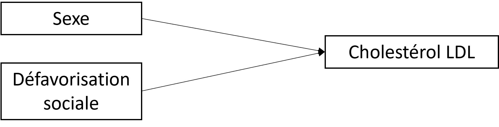

# (PART) En pratique {-}

# Steps

1. formuler l'objectif
    - predictif ou explicatif
    - interaction ou modification d'effet?
2. DAG, estimand, estimateur 
3. Description 
    - tableau croisé
4. Analyses exploratoires
    - régressions avec terme d'interaction
    - analyses stratifiées
    - marge
5. Analyses confirmatoire
    - g computation
    - MSM

# Exemple 1 - Y binaire

# Exemple 2 - Y quantitatif

**1. Objectifs**

Dans cette étude [ref], on s'est intéressé, de façon explicative, à l'effet de la défavorisation sociale précoce sur le taux de cholestérol LDL vers 45 ans; mais aussi à l'effet du sexe sur ce taux de cholestérol en fonction de la défavorisation sociale précoce. 

Ici on s'intéresse donc à deux modifications d'effet. 

**2. DAG, estimand, estimateur**

Le DAG (sans les médiateurs) était : 

> {width=30%}

Les estimands étaient définis sur l'échelle additive par : 

- $\small (Y_{s=1|d=0} - Y_{s=0|d=0}) - (Y_{s=1|d=1} - Y_{s=0|d=1})$
- $\small (Y_{d=1|s=0} - Y_{d=0|s=0}) - (Y_{d=1|s=1} - Y_{d=0|s=1})$

Ils sont ici équivalents car il n'y pas de facteurs de confusion, donc, par exemple, $\small Y_{d=1|s=0} = Y_{s=0|d=1} = Y_{d=1,s=0}$

Les effets ont été estimés par g-computation (*standardisation*).

**3. Résultats**

