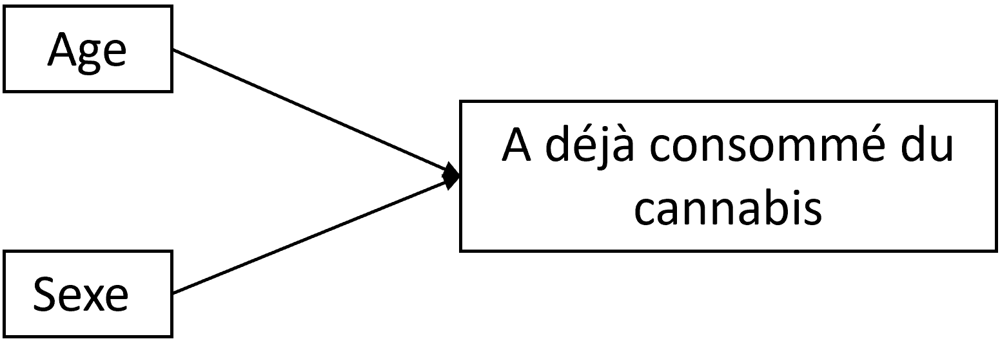
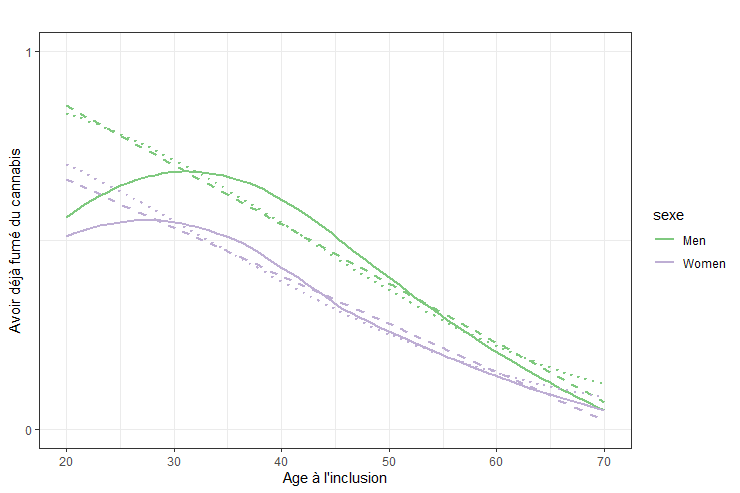
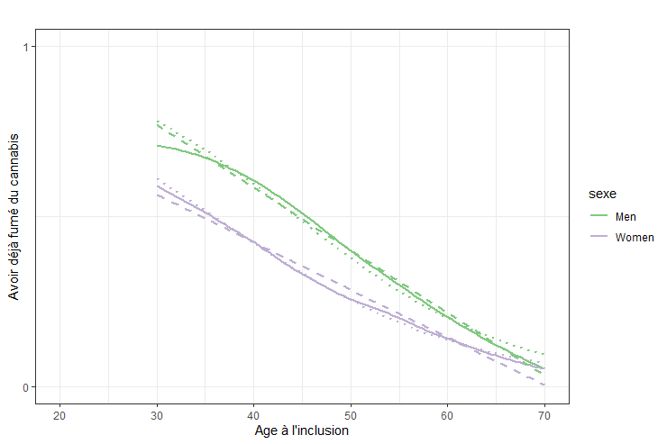

---
output:
  pdf_document: default
  html_document: default
---

# (PART) En pratique {-}


# Proposition d'étapes

1. **Formuler l'objectif**
    - Est-ce un objectif prédictif ou explicatif ?
    - Si démarche explicative, s'agit-il plutot d'une analyse d'interaction ou de modification d'effet?
2. **Stratégies et méthodes** 
    - Poser les hypothèses sur un DAG ou schéma conceptuel
    - Identifier le ou les estimand(s), c'est-à-dire l'effet ou le paramètre que l'on va chercher à estimer pour répondre à l'objectif, par exemple : 
        + effet conjoint de X et V sur Y, sur l'échelle multiplicative = $\small OR_{X,V}$
        + effet de X sur Y dans chaque strate de Y, sur l'échelle additive = $\small DR_{X|V=0}$ et $\small DR_{X|V=1}$
        + effet d'interaction sur l'échelle additive et multiplicative AI et MI 
    - Elaborer l'estimateur, notamment : 
        + quelles est(sont) l'exposition(s) d'intérêt ? 
        + quels sont les facteurs de confusion +/- les médiateurs si besoin ?
        + quels types de modèlisation va être utilisée ?
3. **Analyses descriptives** 
    - Description habituelle de la population
    - Décrire, dans un tableau croisé, 
        + le Y moyen ou la proportion de Y = 1
        + pour chaque catégorie de X et V
4. **Analyses exploratoires**
    - Analyses stratifiées 
        + pour une analyse de modification d'effet, 
        + il est possible en exploratoire, d'estimer l'effet de X sur Y
        + de façon stratifiée sur V (on découpe la population)
        + les effets ne seront directement pas comparables
    - Régressions avec terme d'interaction
        + un modèle dans la population totale peut être utilisé
        + avec un terme d'interaction entre X et V
        + les différents paramètres peuvent être déduits des résultats du modèle
        + voir Chapitre \@ref(regression)
    - Marges/ Effets prédits
        + .
5. **Analyses confirmatoires**, voir Chapitre \@ref(conf)
    - G-computation
    - MSM
    - TMLE


# Exemple 1 - Y binaire


# Exemple 2 - Y quantitatif

## Formuler les objectifs 

Dans cette étude @colineaux2023explaining, on s'est intéressé à :

- comment l'effet du sexe sur le taux de cholestérol LDL vers 45 ans varie en fonction de la défavorisation sociale précoce,
- comment l'effet de la défavorisation sociale précoce sur le taux de cholestérol LDL varie en fonction du sexe.

La démarche ici est explicative : on cherche à comprendre des mécanismes causaux.
 
A partir de la formulation des objectifs, on pourrait dire qu'on s'intéresse ici plutot à deux modifications d'effet. 
On va donc devoir à la fois agir sur le sexe $\small do(S)$ et sur la défavorisation sociale $\small do(D)$.
Donc la démarche, en fait, sera plutôt une analyse d'interaction $\small do(S,D)$

## Stratégies et méthodes 

**Le DAG** (sans les médiateurs) était : 

> {width=50%}

**Les estimands** étaient définis sur l'échelle additive par : 

- La modification de l'effet du sexe en fonction par la défavorisation sociale précoce :
    + $\small (Y_{s=1|d=0} - Y_{s=0|d=0}) - (Y_{s=1|d=1} - Y_{s=0|d=1})$
    + ou $\small (Y_{s=1,d=0} - Y_{s=0,d=0}) - (Y_{s=1,d=1} - Y_{s=0,d=1})$
- La modification de l'effet de la défavorisation sociale précoce par la sexe 
    + $\small (Y_{d=1|s=0} - Y_{d=0|s=0}) - (Y_{d=1|s=1} - Y_{d=0|s=1})$
    + ou $\small (Y_{d=1,s=0} - Y_{d=0,s=0}) - (Y_{d=1,s=1} - Y_{d=0,s=1})$

Les deux formulations sont ici équivalentes car il n'y pas de facteurs de confusion, donc, par exemple, $\small Y_{d=1|s=0} = Y_{s=0|d=1} = Y_{d=1,s=0}$

**L'estimateur** :
Les effets ont été estimés par g-computation (*standardisation par régression*) @hernan2020causal. 
Des régressions linéaires ont été utilisées pour estimer les *potential outcomes* pour chaque scénario, désignées par $\small \overline{Q}(S, D) = E(Y|S, D)$. 
A partir des fonctions $\small \overline{Q}(S, D)$ estimées, nous avons prédit la valeur de l’outcome Y pour chaque individu i pour chaque scénario. Les valeurs moyennes de Y dans chaque scénario vont ensuite nous permettre d'estimer les estimands selon leurs définitions précisées ci-dessus.
Ces modèles$\small \overline{Q}(S, D)$ vont comprendre 2 variables : le sexe et la défavorisation sociale précoce (il n'y a pas ici de facteurs de confusion). 

## Analyse descriptive

Dans cette population (N=17 272), il y avait 51,4% d'hommes et 60,5% de personnes ayant été précocement défavorisées.

On peut commencer par décrire les moyennes de cholestérol dans chaque catégorie de sexe et de défavorisation sociale :

```{r ex_quant_desc, echo=FALSE, warning=FALSE, message=FALSE}
library(tidyverse)
library(kableExtra)

cbind(Sexe = c("Male", "Male", "Female", "Female"), 
      "Défavorisation" = c("Non", "Oui", "Non", "Oui"), 
      "Mean(Chol LDL)" = c("3.57","3.60","3.24","3.37")) %>%
  as.data.frame %>% 
      kbl() %>%
      kable_classic() 

```

## Analyse exploratoire

La sortie d'une modèle linéaire simple serait :

```{r ex_quant_expl, eval=FALSE, message=FALSE, warning=FALSE, echo=TRUE}

# Call:
# lm(formula = t8_ldl ~ as.factor(sex) + as.factor(soc_group) + 
#     as.factor(sex) * as.factor(soc_group), data = ba_1)
# 
# Coefficients:
#                                             Estimate Std. Error t value Pr(>|t|)    
# (Intercept)                                  3.24270    0.01594 203.475  < 2e-16 ***
# as.factor(sex)1                              0.32553    0.02227  14.616  < 2e-16 ***
# as.factor(soc_group)2.Défav                  0.12614    0.02052   6.148 8.02e-10 ***
# as.factor(sex)1:as.factor(soc_group)2.Défav -0.09473    0.02863  -3.308 0.000941 ***
# ---
# Signif. codes:  0 ‘***’ 0.001 ‘**’ 0.01 ‘*’ 0.05 ‘.’ 0.1 ‘ ’ 1
# 
```


On peut en déduire (échelle additive) que : 

- L'effet du sexe (d'être homme plutot que femme) est : 
    + Quand on est favorisé : $\small DR(S|D=0) = +0.326$ mmol/L
    + Quand on est défavorisé : $\small DR(S|D=1) = 0.326 - 0.095 =$ +`r round(0.326 - 0.095,3)` mmol/L
- L'effet de la défavorisation est : 
    + Quand on est une femme : $\small DR(D|S=0) = +0.126$ mmol/L
    + Quand on est un homme : $\small DR(D|S=1) = 0.126 - 0.095 =$ +`r round(0.126 - 0.095,3)` mmol/L
- L'effet d'être un homme et défavorisé 
    + plutot que femme et favorisé est 
    + $\small DR(D,S) = 0.326 + 0.126 - 0.095 =$ +`r round(0.326 + 0.126 - 0.095,3)` mmol/L
- **L'effet d'interaction/modification d'effet** est :  $\small AI = -0.095$ mmol/L

On pourrait aussi déduire :

  - $\small Y_{00} = 3.24$ mmol/L
  - $\small Y_{10} = 3.243 + 0.326 =$ `r round(3.243 + 0.326, 2)` mmol/L
  - $\small Y_{01} = 3.243 + 0.126 =$ `r round(3.243 + 0.126, 2)` mmol/L
  - $\small Y_{11} = 3.243 + 0.326 + 0.126 - 0.095 =$ `r round(3.243 + 0.326 + 0.126 - 0.095,2)` mmol/L
  

## Analyse confirmatoire 

Si l'on utilise le [package proposé par B Lepage](https://github.com/benoitlepage/MargIntTmle) pour réaliser cet analyse avec la TMLE (effets d'intéraction calculés à partir des paramètres d'une modèle structurel marginal estimé à l'aide du package R ltmle), les résultats sont : 

```{r ex_quant_conf, echo=FALSE, message=FALSE, warning=FALSE}

load("img/yahoo.RData")
library(knitr)
#library(kableExtra)
knitr::kable(table_inter$out.table2,
    #caption = "Interaction effects estimated by TMLE"
    ) %>%
  kable_classic()  %>%
  add_footnote(table_inter$interaction.effects[1],
               escape = TRUE)


```

On retrouve des résulats qui peuvent être intérprétés ainsi : 

- l'effet d'être un homme (ou "la différence H-F) est moins fort de `r table_inter$interaction.effects[1]` mmol/L lorsqu'on est défavorisé précocement
- l'effet de la défavorisation est moins fort de `r table_inter$interaction.effects[1]` mmol/L chez les hommes


****

En réalité, on a réalisé cette analyse par g-computation (voir chapitre \@ref(conf)) sur des données imputées et boostrappées (l'exemple ci-dessus a été réalisé sur une seule des bases bootstrappées, ce qui explique les différences), et les résultats, présentées selon les recommandations modifiées de Knol et VanderWeele, étaient: 

 {width=100%}


# Exemple 3 - Y multinomial

# Exemple 4 - X quantitatif


## Formuler les objectifs 

Dans cette étude fictive, on s'est intéressé à la consommation de cannabis et comment le fait d'avoir déjà fumer du cannabis varie avec l'âge A et le sexe S. 

La démarche est explicative : on cherche à comprendre des mécanismes causaux.

Ici, on adoptera une démarche d'analyse d'interaction $\small do(S,A)$

## Stratégies et méthodes 

**Le DAG** (sans les médiateurs) était : 

> {width=50%}


**Les estimands** était définis par : 

- L'effet de l'âge ("avoir 10 ans de plus") chez les hommes
    + $\small DR = Y_{S=0,A=a+10} - Y_{S=0,A=a}$
    + $\small RR = \frac{Y_{S=0,A=a+10}}{Y_{S=0,A=a}}$
- L'effet de l'âge ("avoir 10 ans de plus") chez les femmes :
    + $\small DR = Y_{S=1,A=a+10} - Y_{S=1,A=a}$
    + $\small RR = \frac{Y_{S=1,A=a+10}}{Y_{S=1,A=a}}$
- L'effet d'interaction entre l'âge et le sexe (l'effet du sexe est-il différent en fonction de l'âge et l'effet de l'âge est-il différent en fonction du sexe ?)
    + sur l'échelle additive : $\small AI = Y_{S=1,A=a+10} - Y_{S=0,A=a+10} - Y_{S=1,A=a} + Y_{S=0,A=a+10}$
    + sur l'échelle multiplicative : $\small MI =\frac{Y_{S=1,A=a+10} \times Y_{S=0,A=a}}{Y_{S=1,A=a} \times Y_{S=0,A=a+10}}$


## Analyse descriptive

Dans cette population (N=202 768), il y avait 53,7% d'hommes et la moyenne d'âge était de 47,1 ans.

On peut commencer par décrire la proportion de personnes ayant déjà fumé du cannabis par sexe et classe d'âge : 


```{r ex_Xquant_desc, echo=FALSE, warning=FALSE, message=FALSE}
library(tidyverse)
library(kableExtra)

cbind(Sexe = c("Male", "Male", "Male", "Male","Female", "Female","Female", "Female"), 
      "Age" = c("20-", "]20 à 40]", "]40 à 60]", "60+","20-", "]20 à 40]", "]40 à 60]", "60+"), 
      "P(Cannabis), %" = c("51,1","66,3","40,4","12,1", "44,2","52,7","26,7","12,1")) %>%
  as.data.frame %>% 
      kbl() %>%
      kable_classic() 

```

Il semble y avoir une interaction entre l'âge et le sexe sur la probabilité d'avoir déjà fumé du cannabis. Cependant, la relation entre l'âge et l'outcome ne semble pas linéaire, ce qui est confirmé graphiquement : 

{width=80%}


Pour simplifier les analyses, nous n'allons inclure que les plus de 30 ans (N = 177 940), pour lesquels la relation est linéaire :

{width=80%}


## Analyse exploratoire (1)


La sortie d'une modèle linéaire simple serait :

```{r ex_Xquant_expl, eval=FALSE, message=FALSE, warning=FALSE, echo=TRUE}
# 
# Call:
# lm(formula = cannabis ~ sexe + age + sexe * age, data = data)
# 
# Coefficients:
#                 Estimate Std. Error t value Pr(>|t|)    
# (Intercept)    1.3197103  0.0066820  197.50   <2e-16 ***
# sexeWomen     -0.3373482  0.0091573  -36.84   <2e-16 ***
# age           -0.0183730  0.0001294 -142.03   <2e-16 ***
# sexeWomen:age  0.0044248  0.0001781   24.85   <2e-16 ***
# Signif. codes:  0 ‘***’ 0.001 ‘**’ 0.01 ‘*’ 0.05 ‘.’ 0.1 ‘ ’ 1

```


On peut en déduire (échelle additive) que : 


- L'effet du sexe (d'être femme plutot que homme) est : 
    + "A 0 ans" (à l'origine) : $\small DR(S|A=0) = -33,73$%
    + A 40 ans (par exemple) : $\small DR(S|A=40) = -33,73 + 0,44 \times 40 =$ `r round(-33.73 + 0.44 * 40,1)`%
- L'effet de l'age est : 
    + Quand on est un homme : $\small DR(A|S=0) = -1,84$ % par année d'âge
    + Quand on est une femme : $\small DR(A|S=1) = -1,84 + 0.44 =$ `r round(-1.84 + 0.44,1)` % par année d'âge
- L'effet d'être une femme et d'avoir 1 an de plus 
    + plutot que homme et un certain âge
    + $\small DR(A,S) = -33,73 -1,84 + 0,44 =$ `r round(-33.73 -1.84 + 0.44,1)` %
- **L'effet d'interaction/modification d'effet** est :  $\small AI = +0.44$ %

On pourrait aussi déduire :

  - $\small Y_{S=0,A=30} = 131,97 - 1,84 \times 30 =$ `r round(131.97 - 1.84*30,1)`%
  - $\small Y_{S=0,A=50} = 131,97 - 1,84 \times 50 =$ `r round(131.97 - 1.84*50,1)`%
  - $\small Y_{S=1,A=30} = 131,97 -33,73 - 1,84 \times 30 + 0,44 \times 30 =$ `r round(131.97 - 33.73 - 1.84*30 + 0.44*30,1)`%
  - $\small Y_{S=1,A=50} = 131,97 -33,73 - 1,84 \times 50 + 0,44 \times 50 =$ `r round(131.97 - 33.73 - 1.84*50 +0.44*50,1)`%


## Analyse exploratoire (2)

L'outcome étant binaire, il est plus classique d'utiliser un modèle logistique, dont les résultats  seraient : 

```{r ex_Xquant_expl_glm, eval=FALSE, message=FALSE, warning=FALSE, echo=TRUE}
# Call:
# glm(formula = cannabis ~ sexe + age + sexe * age, family = binomial, 
#     data = data)
# 
# Coefficients:
#                 Estimate Std. Error z value Pr(>|z|)    
# (Intercept)    3.9144609  0.0372560  105.07   <2e-16 ***
# sexeWomen     -1.1644706  0.0511834  -22.75   <2e-16 ***
# age           -0.0882928  0.0007566 -116.70   <2e-16 ***
# sexeWomen:age  0.0117238  0.0010623   11.04   <2e-16 ***
# ---
# Signif. codes:  0 ‘***’ 0.001 ‘**’ 0.01 ‘*’ 0.05 ‘.’ 0.1 ‘ ’ 1
```

Ce qui, en terme d'OR, donnerait : 

```{r ex_Xquant_expl_glm_2, eval=FALSE, message=FALSE, warning=FALSE, echo=TRUE}
#                       OR      2.5 %     97.5 %
# (Intercept)   50.1220409 46.5985990 53.9259952
# sexeWomen      0.3120878  0.2822910  0.3450107
# age            0.9154927  0.9141333  0.9168485
# sexeWomen:age  1.0117927  1.0096884  1.0139018

```

- L'effet du sexe (d'être femme plutot que homme) est : 
    + "A 0 ans" (à l'origine) : $\small OR(S|A=0) = \times 0.31$
    + "A 1 ans" : $\small OR(S|A=1) = exp(-1,164 + 0,012) \times$ `r round(exp(-1.164 + 0.012),1)`
    + A 40 ans (par exemple) : $\small OR(S|A=40) = exp(-1,164 + 0,012 \times 40) = \times$ `r round(exp(-1.164 + 0.012 * 40),1)`
- L'effet de l'age est : 
    + Quand on est un homme : $\small OR(A|S=0) = \times 0,92$ par année d'âge
    + Quand on est une femme : $\small OR(A|S=1) = exp(-0,088 + 0,012) = \times$ `r round(exp(-0.088 + 0.012),1)`  par année d'âge
- L'effet d'être une femme et d'avoir 1 an de plus 
    + plutot que homme "et 0 ans" 
    + $\small OR(A,S) = exp(-1,164 -0,088 + 0,012) = \times$ `r round(exp(-1.164 -0.088 + 0.012),1)`
- **L'effet d'interaction/modification d'effet** est :  $\small MI =\times 1,01$
- **Un effet d'interaction additif** $\small RERI_{OR} = OR_{11} - OR_{01} - OR_{10} + 1 =$ `r round(exp(-1.164 -0.088 + 0.012) - exp(-1.164 + 0.012) - exp(-0.088 + 0.012) + 1,3)`


On pourrait aussi déduire :

  - $\small Y_{S=0,A=30} = \frac{exp(3,914 - 0,088 \times 30)}{1+exp(3,914 - 0,088 \times 30)} =$ `r round((exp(3.914 - 0.088*30)/(1+exp(3.914 - 0.088*30)))*100,1)`%
  - $\small Y_{S=0,A=50} = \frac{exp(3,914 - 0,088 \times 50)}{1+exp(3,914 - 0,088 \times 50)} =$ `r round((exp(3.914 - 0.088*50)/(1+exp(3.914 - 0.088*50)))*100,1)`%
   - $\small Y_{S=1,A=30} = \frac{exp(3,914 - 1,164 - 0,088 \times 30 + 0,012 \times 30)}{1+exp(3,914 - 1,164 - 0,088 \times 30 + 0,012 \times 30)} =$ `r round((exp(3.914 - 1.164 - 0.088*30 +0.012*30)/(1+exp(3.914 - 1.164 - 0.088*30+0.012*30)))*100,1)`%
   - $\small Y_{S=1,A=50} = \frac{exp(3,914 - 1,164 - 0,088 \times 50 + 0,012 \times 50)}{1+exp(3,914 - 1,164 - 0,088 \times 50 + 0,012 \times 50)} =$ `r round((exp(3.914 - 1.164 - 0.088*50 +0.012*50)/(1+exp(3.914 - 1.164 - 0.088*50+0.012*50)))*100,1)`%
   
## Analyse confirmatoire (1)


Nous avons calculé les effets d'intérêt avec une méthode de g-computation (Intervalles de confiance estimé par bootstrap, 200 répétitions). Le modèle utilisé était un modèle de régression logistique.


Le code était : 

```{r eval=FALSE, echo=TRUE}
     ## g computation avec modèle logistique -----
     
     B=200
     
     simu.base <- data.frame(i.simu=c(1:B))
     
     
     for (i in 1:B){ 
       # sample the indices 1 to n with replacement
       bootIndices <- sample(1:nrow(data), replace=T) ; set.seed(01062023+i*12)
       bootData <- data[bootIndices,]
       
       Q.model <- glm(data=bootData, 
                      formula = cannabis ~ sexe+ age+  sexe*age,
                      family = binomial)
       
       # Scénarios #
       data.S1 <-  data.S2 <- bootData
       data.S1$sexe <- "Women"
       data.S2$sexe <- "Men"
       data.S1A30 <-  data.S1A40 <- data.S1A50 <- data.S1A60 <- data.S1
       data.S2A30 <-  data.S2A40 <- data.S2A50 <- data.S2A60 <- data.S2
       data.S1A30$age <- data.S2A30$age <- 30
       data.S1A40$age <- data.S2A40$age <- 40
       data.S1A50$age <- data.S2A50$age <- 50
       data.S1A60$age <- data.S2A60$age <- 60
       
       bootData$dead.S1A30.pred <- predict(Q.model, newdata = data.S1A30, type = "response")
       bootData$dead.S1A40.pred <- predict(Q.model, newdata = data.S1A40, type = "response")
       bootData$dead.S1A50.pred <- predict(Q.model, newdata = data.S1A50, type = "response")
       bootData$dead.S1A60.pred <- predict(Q.model, newdata = data.S1A60, type = "response")
       bootData$dead.S2A30.pred <- predict(Q.model, newdata = data.S2A30, type = "response")
       bootData$dead.S2A40.pred <- predict(Q.model, newdata = data.S2A40, type = "response")
       bootData$dead.S2A50.pred <- predict(Q.model, newdata = data.S2A50, type = "response")
       bootData$dead.S2A60.pred <- predict(Q.model, newdata = data.S2A60, type = "response")
       
       simu.base$est.Y0_30[simu.base$i.simu==i] = round(mean(bootData$dead.S2A30.pred),4)
       simu.base$est.Y0_40[simu.base$i.simu==i] = round(mean(bootData$dead.S2A40.pred),4)
       simu.base$est.Y0_50[simu.base$i.simu==i] = round(mean(bootData$dead.S2A50.pred),4)
       simu.base$est.Y0_60[simu.base$i.simu==i] = round(mean(bootData$dead.S2A60.pred),4)
       simu.base$est.Y1_30[simu.base$i.simu==i] = round(mean(bootData$dead.S1A30.pred),4)
       simu.base$est.Y1_40[simu.base$i.simu==i] = round(mean(bootData$dead.S1A40.pred),4)
       simu.base$est.Y1_50[simu.base$i.simu==i] = round(mean(bootData$dead.S1A50.pred),4)
       simu.base$est.Y1_60[simu.base$i.simu==i] = round(mean(bootData$dead.S1A60.pred),4)
       
       simu.base$est_ET_S_30[simu.base$i.simu==i] = round(mean(bootData$dead.S1A30.pred - 
                                                                 bootData$dead.S2A30.pred),4)
       simu.base$est_RR_S_30[simu.base$i.simu==i] = round(mean(bootData$dead.S1A30.pred / 
                                                                 bootData$dead.S2A30.pred),4)
       
       simu.base$est_ET_S_40[simu.base$i.simu==i] = round(mean(bootData$dead.S1A40.pred - 
                                                                 bootData$dead.S2A40.pred),4)
       simu.base$est_RR_S_40[simu.base$i.simu==i] = round(mean(bootData$dead.S1A40.pred / 
                                                                 bootData$dead.S2A40.pred),4)
       
       simu.base$est_ET_S_50[simu.base$i.simu==i] = round(mean(bootData$dead.S1A50.pred - 
                                                                 bootData$dead.S2A50.pred),4)
       simu.base$est_RR_S_50[simu.base$i.simu==i] = round(mean(bootData$dead.S1A50.pred / 
                                                                 bootData$dead.S2A50.pred),4)
       
       simu.base$est_ET_S_60[simu.base$i.simu==i] = round(mean(bootData$dead.S1A60.pred - 
                                                                 bootData$dead.S2A60.pred),4)
       simu.base$est_RR_S_60[simu.base$i.simu==i] = round(mean(bootData$dead.S1A60.pred / 
                                                                 bootData$dead.S2A60.pred),4)
       
       simu.base$est_ET_S1_Aa[simu.base$i.simu==i] = round(mean(bootData$dead.S1A40.pred - 
                                                                  bootData$dead.S1A30.pred),4)
       simu.base$est_ET_S2_Aa[simu.base$i.simu==i] = round(mean(bootData$dead.S2A40.pred - 
                                                                  bootData$dead.S2A30.pred),4)
       simu.base$est_RR_S1_Aa[simu.base$i.simu==i] = round(mean(bootData$dead.S1A40.pred / 
                                                                  bootData$dead.S1A30.pred),4)
       simu.base$est_RR_S2_Aa[simu.base$i.simu==i] = round(mean(bootData$dead.S2A40.pred /
                                                                  bootData$dead.S2A30.pred),4)
       
       
       simu.base$est_ET_S1_Ab[simu.base$i.simu==i] = round(mean(bootData$dead.S1A50.pred - 
                                                                  bootData$dead.S1A40.pred),4)
       simu.base$est_ET_S2_Ab[simu.base$i.simu==i] = round(mean(bootData$dead.S2A50.pred - 
                                                                  bootData$dead.S2A40.pred),4)
       simu.base$est_RR_S1_Ab[simu.base$i.simu==i] = round(mean(bootData$dead.S1A50.pred / 
                                                                  bootData$dead.S1A40.pred),4)
       simu.base$est_RR_S2_Ab[simu.base$i.simu==i] = round(mean(bootData$dead.S2A50.pred / 
                                                                  bootData$dead.S2A40.pred),4)
       
       simu.base$est_ET_S1_Ac[simu.base$i.simu==i] = round(mean(bootData$dead.S1A60.pred - 
                                                                  bootData$dead.S1A50.pred),4)
       simu.base$est_ET_S2_Ac[simu.base$i.simu==i] = round(mean(bootData$dead.S2A60.pred - 
                                                                  bootData$dead.S2A50.pred),4)
       
       simu.base$est_RR_S1_Ac[simu.base$i.simu==i] = round(mean(bootData$dead.S1A60.pred / 
                                                                  bootData$dead.S1A50.pred),4)
       simu.base$est_RR_S2_Ac[simu.base$i.simu==i] = round(mean(bootData$dead.S2A60.pred / 
                                                                  bootData$dead.S2A50.pred),4)
       
       
       simu.base$est_AI_30[simu.base$i.simu==i] = round(mean((bootData$dead.S1A40.pred - 
                                                                bootData$dead.S1A30.pred) - 
                                                               (bootData$dead.S2A40.pred - 
                                                                  bootData$dead.S2A30.pred)),4)
       simu.base$est_MI_30[simu.base$i.simu==i] = round(mean((bootData$dead.S1A40.pred * 
                                                                bootData$dead.S2A30.pred) / 
                                                               (bootData$dead.S2A40.pred * 
                                                                  bootData$dead.S1A30.pred)),4)
       simu.base$est_AI_40[simu.base$i.simu==i] = round(mean((bootData$dead.S1A50.pred - 
                                                                bootData$dead.S1A40.pred) - 
                                                               (bootData$dead.S2A50.pred - 
                                                                  bootData$dead.S2A40.pred)),4)
       simu.base$est_MI_40[simu.base$i.simu==i] = round(mean((bootData$dead.S1A50.pred * 
                                                                bootData$dead.S2A40.pred) / 
                                                               (bootData$dead.S2A50.pred * 
                                                                  bootData$dead.S1A40.pred)),4)
       simu.base$est_AI_50[simu.base$i.simu==i] = round(mean((bootData$dead.S1A60.pred - 
                                                                bootData$dead.S1A50.pred) - 
                                                               (bootData$dead.S2A60.pred - 
                                                                  bootData$dead.S2A50.pred)),4)
       simu.base$est_MI_50[simu.base$i.simu==i] = round(mean((bootData$dead.S1A60.pred * 
                                                                bootData$dead.S2A50.pred) / 
                                                               (bootData$dead.S2A60.pred * 
                                                                  bootData$dead.S1A50.pred)),4)
     }
     
     effect <- round(colMeans(simu.base),2)
     confint <- apply(simu.base, 2, function(x) quantile(x,probs = c(0.025, 0.975)))
     
     tab_all <- rbind(effects,confint)

```


Les résultats pour les 3 intervalles identifiés :

```{r ex_Xquant_conf_30, echo=FALSE, message=FALSE, warning=FALSE}

load("img/table_glm_30.RData")
load("img/footnote_30.RData")

     library(knitr)
     library(kableExtra)
     kable(table_glm_30,
           caption = "Effect d'interaction entre 30 et 40 ans") %>%
       kable_classic()  %>%
       add_footnote(footnote_1)

```


```{r ex_Xquant_conf_40, echo=FALSE, message=FALSE, warning=FALSE}

load("img/table_glm_40.RData")
load("img/footnote_40.RData")

     library(knitr)
     library(kableExtra)
     kable(table_glm_40,
           caption = "Effect d'interaction entre 50 et 60 ans") %>%
       kable_classic()  %>%
       add_footnote(footnote_40)

```

```{r ex_Xquant_conf_50, echo=FALSE, message=FALSE, warning=FALSE}

load("img/table_glm_50.RData")
load("img/footnote_50.RData")

     library(knitr)
     library(kableExtra)
     kable(table_glm_50,
           caption = "Effect d'interaction entre 40 et 50 ans") %>%
       kable_classic()  %>%
       add_footnote(footnote_50)

```


## Analyse confirmatoire (2)


Si on avait utilisé un modèle linéaire, les résultats auraient été : 

```{r ex_Xquant_conf_30_lm, echo=FALSE, message=FALSE, warning=FALSE}

load("img/table_glm_30_lm.RData")
load("img/footnote_30_lm.RData")

     library(knitr)
     library(kableExtra)
     kable(table_glm_30_lm,
           caption = "Effect d'interaction entre 30 et 40 ans") %>%
       kable_classic()  %>%
       add_footnote(footnote_1_lm)

```


```{r ex_Xquant_conf_40_lm, echo=FALSE, message=FALSE, warning=FALSE}

load("img/table_glm_40_lm.RData")
load("img/footnote_40_lm.RData")

     library(knitr)
     library(kableExtra)
     kable(table_glm_40_lm,
           caption = "Effect d'interaction entre 50 et 60 ans") %>%
       kable_classic()  %>%
       add_footnote(footnote_40_lm)

```

```{r ex_Xquant_conf_50_lm, echo=FALSE, message=FALSE, warning=FALSE}

load("img/table_glm_50_lm.RData")
load("img/footnote_50_lm.RData")

     library(knitr)
     library(kableExtra)
     kable(table_glm_50_lm,
           caption = "Effect d'interaction entre 40 et 50 ans") %>%
       kable_classic()  %>%
       add_footnote(footnote_50_lm)

```

