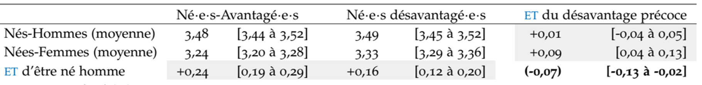

---
output:
  pdf_document: default
  html_document: default
---

# (PART) En pratique {-}


# Proposition d'étapes

1. **Formuler l'objectif**
    - Est-ce un objectif prédictif ou explicatif ?
    - Si démarche explicative, s'agit-il plutot d'une analyse d'interaction ou de modification d'effet?
2. **Stratégies et méthodes** 
    - Poser les hypothèses sur un DAG ou schéma conceptuel
    - Identifier le ou les estimand(s), c'est-à-dire l'effet ou le paramètre que l'on va chercher à estimer pour répondre à l'objectif, par exemple : 
        + effet conjoint de X et V sur Y, sur l'échelle multiplicative = $\small OR_{X=1,V=1}$
        + effet de X sur Y dans chaque strate de Y, sur l'échelle additive = $\small DR_{X=1|V=0}$ et $\small DR_{X=1|V=1}$
        + effet d'interaction sur l'échelle additive et multiplicative AI et MI 
    - Elaborer l'estimateur, notamment : 
        + quelles est(sont) l'exposition(s) d'intérêt ? 
        + quels sont les facteurs de confusion +/- les médiateurs si besoin ?
        + quels types de modèlisation va être utilisée ?
3. **Analyses descriptives** 
    - Description habituelle de la population
    - Décrire, dans un tableau croisé, 
        + le Y moyen ou la proportion de Y = 1
        + pour chaque catégorie de X et V
4. **Analyses exploratoires**
    - Analyses stratifiées : 
        + pour une analyse de modification d'effet, 
        + il est possible en exploratoire, d'estimer l'effet de X sur Y
        + de façon stratifiée sur V (on découpe la population)
        + les effets ne seront directement pas comparables
    - Régressions avec terme d'interaction
        + un modèle dans la population totale peut être utilisé
        + avec un terme d'interaction entre X et V
        + les différents paramètres peuvent être déduits des résultats du modèle
        + voir Chapitre \@ref(regression)
    - Marges/ Effets prédits
        + .
5. **Analyses confirmatoires**, voir Chapitre \@ref(conf)
    - G-computation
    - MSM
    - TMLE


# Exemple 1 - Y binaire


# Exemple 2 - Y quantitatif

### 1. Formuler les objectifs {-}

Dans cette étude @colineaux2023explaining, on s'est intéressé à :

- comment l'effet du sexe sur le taux de cholestérol LDL vers 45 ans varie en fonction de la défavorisation sociale précoce,
- comment l'effet de la défavorisation sociale précoce sur le taux de cholestérol LDL varie en fonction du sexe.

La démarche ici est explicative : on cherche à comprendre des mécanismes causaux.
 
A partir de la formulation des objectifs, on pourrait dire qu'on s'intéresse ici plutot à deux modifications d'effet. 
On va donc devoir à la fois agir sur le sexe $\small do(S)$ et sur la défavorisation sociale $\small do(D)$.
Donc la démarche, en fait, sera plutôt une analyse d'interaction $\small do(S,D)$

### 2. Stratégies et méthodes {-}

**Le DAG** (sans les médiateurs) était : 

> {width=50%}

**Les estimands** étaient définis sur l'échelle additive par : 

- La modification de l'effet du sexe en fonction par la défavorisation sociale précoce :
    + $\small (Y_{s=1|d=0} - Y_{s=0|d=0}) - (Y_{s=1|d=1} - Y_{s=0|d=1})$
    + ou $\small (Y_{s=1,d=0} - Y_{s=0,d=0}) - (Y_{s=1,d=1} - Y_{s=0,d=1})$
- La modification de l'effet de la défavorisation sociale précoce par la sexe 
    + $\small (Y_{d=1|s=0} - Y_{d=0|s=0}) - (Y_{d=1|s=1} - Y_{d=0|s=1})$
    + ou $\small (Y_{d=1,s=0} - Y_{d=0,s=0}) - (Y_{d=1,s=1} - Y_{d=0,s=1})$

Les deux formulations sont ici équivalentes car il n'y pas de facteurs de confusion, donc, par exemple, $\small Y_{d=1|s=0} = Y_{s=0|d=1} = Y_{d=1,s=0}$

**L'estimateur** :
Les effets ont été estimés par g-computation (*standardisation par régression*) @hernan2020causal. 
Des régressions linéaires ont été utilisées pour estimer les potential outcomes pour chaque scénario, désignées par Q(S, D) = E(Y|S, D), avec L les facteurs de confusion. 
A partir des fonctions Q(S, D) estimées, nous avons prédit la valeur de l’outcome Y pour chaque individu i
pour chaque scénario. Les valeurs moyennes de Y dans chaque scénario vont ensuite nous permettre d'estimer les estimands selon leurs définitions précisées ci-dessus.
Ces modèles Q(S, D) vont comprendre 2 variables : le sexe et la défavorisation sociale précoce (il n'y a pas ici de facteurs de confusion). 

### 3.Analyse descriptive {-}

Dans cette population, il y avait 51,4% d'hommes et 60,5% de personnes ayant été précocement défavorisées.

On peut commencer par décrire les moyennes de cholestérol dans chaque catégorie de sexe et de défavorisation sociale :

```{r ex_quant_desc, echo=FALSE, warning=FALSE, message=FALSE}
library(tidyverse)
library(kableExtra)

cbind(Sexe = c("Male", "Male", "Female", "Female"), 
      "Défavorisation" = c("Non", "Oui", "Non", "Oui"), 
      "Mean(Chol LDL)" = c("3.57","3.60","3.24","3.37")) %>%
  as.data.frame %>% 
      kbl() %>%
      kable_classic() 

```

### 4.Analyse exploratoire {-}

La sortie d'une modèle linéaire simple serait :

```{r ex_quant_expl, eval=FALSE, message=FALSE, warning=FALSE, echo=TRUE}

# Call:
# lm(formula = t8_ldl ~ as.factor(sex) + as.factor(soc_group) + 
#     as.factor(sex) * as.factor(soc_group), data = ba_1)
# 
# Residuals:
#     Min      1Q  Median      3Q     Max 
# -3.1996 -0.6427 -0.0688  0.5318  4.6312 
# 
# Coefficients:
#                                             Estimate Std. Error t value Pr(>|t|)    
# (Intercept)                                  3.24270    0.01594 203.475  < 2e-16 ***
# as.factor(sex)1                              0.32553    0.02227  14.616  < 2e-16 ***
# as.factor(soc_group)2.Défav                  0.12614    0.02052   6.148 8.02e-10 ***
# as.factor(sex)1:as.factor(soc_group)2.Défav -0.09473    0.02863  -3.308 0.000941 ***
# ---
# Signif. codes:  0 ‘***’ 0.001 ‘**’ 0.01 ‘*’ 0.05 ‘.’ 0.1 ‘ ’ 1
# 
# Residual standard error: 0.9194 on 17268 degrees of freedom
# Multiple R-squared:  0.0231,	Adjusted R-squared:  0.02293 
# F-statistic: 136.1 on 3 and 17268 DF,  p-value: < 2.2e-16

```


On peut en déduire (échelle additive) que : 

- L'effet du sexe (d'être homme plutot que femme) est : 
    + Quand on est favorisé : $\small DR(S|D=0) = +0.326$
    + Quand on est défavorisé : $\small DR(S|D=1) = 0.326 - 0.095 =$ +`r round(0.326 - 0.095,3)`
- L'effet de la défavorisation est : 
    + Quand on est une femme : $\small DR(D|S=0) = +0.126$
    + Quand on est une homme : $\small DR(D|S=1) = 0.126 - 0.095 =$ +`r round(0.126 - 0.095,3)`
- L'effet d'être un homme et défavorisé 
    + plutot que femme et favorisé est 
    + $\small DR(D,S) = 0.326 + 0.126 - 0.095 =$ +`r round(0.326 + 0.126 - 0.095,3)`
- **L'effet d'interaction/modification d'effet** est :  $\small AI = -0.095$

On pourrait aussi déduire :

  - $\small Y_{00} = 3.24$
  - $\small Y_{10} = 3.243 + 0.326 =$ `r round(3.243 + 0.326, 2)`
  - $\small Y_{01} = 3.243 + 0.126 =$ `r round(3.243 + 0.126, 2)`
  - $\small Y_{11} = 3.243 + 0.326 + 0.126 - 0.095 =$ `r round(3.243 + 0.326 + 0.126 - 0.095,2)`
  

### 5.Analyse confirmatoire {-}

Au final, on a réalisé cette analyse par g-computation (voir chapitre \@ref(conf)) sur des données imputées et boostrappées, et les résulats, présentées selon les recommandations de Knol et VanderWeele modifiées, étaient: 

 {width=100%}


# Exemple 3 - Y multinomial

# Exemple 4 - X quantitatif

