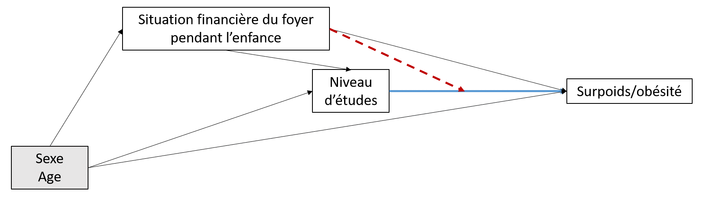

# Exemple 1 - Y binaire

## Formuler les objectifs

Dans cet exemple, on s'intéresse à :

-   Comment l'effet du niveau d'études (X) sur le surpoids/obésité à l'âge adulte (Y) varie en fonction de la défavorisation sociale précoce (D), mesurée par la situation financière du foyer pendant l'enfance.

La démarche ici est explicative : on cherche à comprendre des mécanismes causaux.

A partir de la formulation des objectifs, on pourrait dire qu'on s'intéresse ici plutot à une modifications d'effet: on analyse l'effet du scénario $\small do(X)$ dans chaque groupe de défavorisation sociale précoce (D). On ajustera sur les facteurs de confusion de la relation X --\> Y

## Stratégies et méthodes

**Le DAG** (sans les médiateurs) était :

> {width="50%"}

X =\> Niveau d'études : 0 = élevé / 1 = faible (réf) Y =\> Situation financière pendant l'enfance : 0 = bonne / 1 = difficile (réf) Z =\> Surpoids/obésité : 0 = IMC \< 25kg/m² / 1 = IMC ≥ 25kg/m²

**Les estimands** étaient définis sur l'échelle multiplicative par :

-   La modification de l'effet du niveau d'études sur le surpoids/obésité en fonction par la défavorisation sociale précoce :
    -   $\small (Y_{x=1|d=1} / Y_{x=0|d=1}) / (Y_{x=1|d=0} / Y_{x=0|d=0})$
    -   Ce qui est équivalent à $\small (Y_{x=1|d=1} * Y_{x=0|d=0}) / (Y_{x=1|d=0} * Y_{x=0|d=1})$

**L'estimateur** : Les effets ont été estimés par g-computation (*standardisation par régression*) @hernan2020causal. Des régressions linéaires ont été utilisées pour estimer les *potential outcomes* pour chaque scénario. A partir des fonctions estimées, nous avons prédit la valeur de l'outcome Y pour chaque individu i pour chaque scénario. Les valeurs moyennes de Y dans chaque scénario vont ensuite nous permettre d'estimer les *estimands* selon leurs définitions précisées ci-dessus.Ces modèles vont comprendre 4 variables : le niveau d'études et la défavorisation sociale précoce, ainsi que deux facteurs de confusion, le sexe et l'âge.

## Analyse descriptive

Dans cette population (N=23 495), il y avait 61.1% d'individus avec un niveau d'études faible et 31.1% de personnes ayant été précocement défavorisées.

On peut commencer par décrire les proportions de personnes en surpoids/obésité dans chaque catégorie de niveau d'études et de défavorisation sociale :

```{r ex_quant_desc, echo=FALSE, warning=FALSE, message=FALSE}
library(tidyverse)
library(kableExtra)

cbind("Niveau d'études" = c("Elevé", "Elevé", "Faible", "Faible"), 
      "Défavorisation" = c("Non", "Oui", "Non", "Oui"), 
      "% surpoids/obésité" = c("38.4","45.2","50.2","54.6")) %>%
  as.data.frame %>% 
      kbl() %>%
      kable_classic() 

```

## Analyse exploratoire

La sortie d'un modèle logistique simple serait :

```{r ex_quant_expl, eval=FALSE, message=FALSE, warning=FALSE, echo=TRUE}

# Call:
# glm(formula = overw_obesity ~ EDUCATION_2CL.f * CHILDHOOD_ECONOMY_2CL.f + SEX.f + 
#    AGE, family = binomial(link = "logit"))
# 
# Coefficients:
#                                                     Estimate Std. Error t value   Pr(>|t|)    
# (Intercept)                                       -1.3731389  0.0621930 -22.079  < 2e-16 ***
# EDUCATION_2CL.fHigh                               -0.1752537  0.0537373  -3.261  0.00111 ** 
# CHILDHOOD_ECONOMY_2CL.fGood                       -0.0190075  0.0361206  -0.526  0.59873    
# SEX.fMale                                          0.5882549  0.0270502  21.747  < 2e-16 ***
# AGE                                                0.0234627  0.0009856  23.807  < 2e-16 ***
# EDUCATION_2CL.fHigh:CHILDHOOD_ECONOMY_2CL.fGood   -0.1312722  0.0623235  -2.106  0.03518 *
# ---
# Signif. codes:  0 ‘***’ 0.001 ‘**’ 0.01 ‘*’ 0.05 ‘.’ 0.1 ‘ ’ 1
# 
```

On peut en déduire (échelle multiplicative) que :

-   L'effet du niveau d'études (élevé plutôt que faible) sur le risque de surpoids/obésité est :
    -   Quand on est défavorisé pendant l'enfance: $\small OR(X|D=0) = exp(-0.175) = 0.84$
    -   Quand on est favorisé pendant l'enfance: $\small OR(X|D=1) = exp(-0.175 - 0.131) = 0.74$
-   L'effet d'avoir un niveau d'étude élevé et d'être favorisé pendant l'enfance
    -   plutot qu'avoir un niveau d'étude faible et être défavorisé pendant l'enfance est
    -   $\small OR(X,S) = exp(-0.175 - 0.019 - 0.131) =0.72$
-   **La modification d'effet** est de:
    -   Sur l'échelle multiplicative: $\small MI = exp(-0.131) = 0.88$ (interaction multiplicative \<1 donc négative)
    -   Sur l'échelle additive: $\small RERI = exp(-0.175-0.019-0.131) - exp(-0.175) – exp(-0.019) + 1 = -0.098$ (interaction additive négative)

## Analyse confirmatoire

Si l'on utilise le [package proposé par B Lepage](https://github.com/benoitlepage/MargIntTmle) pour réaliser cette analyse avec la g-computation, les résultats sont :

```{r ex_quant_conf, echo=FALSE, message=FALSE, warning=FALSE}

load("/home/lola.neufcourt/LN/data/out.table.2.RData")
library(knitr)
#library(kableExtra)
knitr::kable(out.table.2$out.table,
    #caption = "Interaction effects estimated by TMLE"
    ) %>%
  kable_classic()  %>%
  add_footnote(c(out.table.2$interaction.effects[1], out.table.2$interaction.effects[2], out.table.2$interaction.effects[3]),
               escape = TRUE)


```

Les résulats peuvent être intérprétés ainsi :

-   l'effet d'un niveau d'études élevé (par rapport à faible) sur le risque de surpoids/obésité est moins fort de 3% lorsqu'on est défavorisé précocement
-   ou encore, un niveau d'études élevé joue un rôle protecteur contre le surpoids/obésité moins important chez les personnes ayant grandi dans un foyer défavorisé
