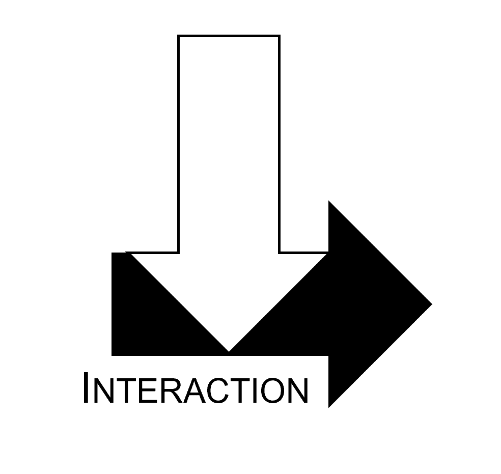
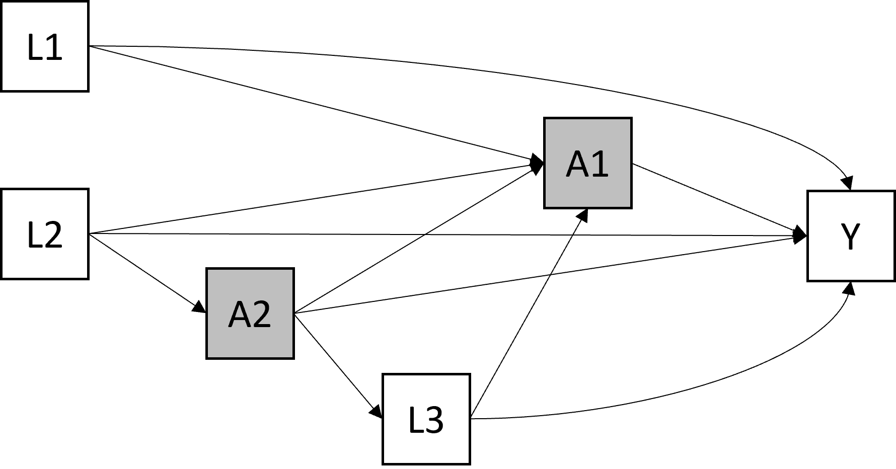

--- 
title: "Interactions et modifications d'effet <br> en Epidémiologie"
author: "CERPOP, INSERM, EQUITY Team"
date: "Last compiled on `r format(Sys.time(), '%d %B, %Y')`"
site: bookdown::bookdown_site
documentclass: book
bibliography: reference.bib
csl: vancouver.csl
description: |
  .
link-citations: yes
github-repo: rstudio/bookdown-demo
---

# Présentation

Ce document a été rédigé en tant que document de synthèse du travail du groupe "Interaction" de l'équipe EQUITY, CERPOP. 
Ce travail a consisté en une revue de la littérature et en une application détaillée des méthodes sur des analyses illustratives, dans un but d'auto-formation et pédagogique.

{width=0%}


<ins> Les participant.e.s du groupe de travail sont : </ins>

- Hélène COLINEAUX  
- Léna BONIN
- Camille JOANNES 
- Benoit LEPAGE 
- Lola NEUFCOURT 
- Ainhoa UGARTECHE


[Licence]:https://creativecommons.org/licenses/by-nc-sa/4.0/

{width=10%}


The online version of this book is licensed under the [Creative Commons Attribution-NonCommercial-ShareAlike 4.0 International License][Licence]. 


<!--chapter:end:index.Rmd-->


# Introduction

Comment telle prédisposition génétique et telle exposition environnementale *inter-agissent*-elles ? L'effet de tel traitement varie-t-il selon les circonstances ? Selon les caractéristiques du patient ? Telle intervention peut-elle être bénéfique pour un groupe social et délétère pour un autre ? 

De nombreuses questions épidémiologiques impliquent des mécanismes d'interactions ou de modifications d'effet. Pourtant, étudier ces mécanismes restent encore complexe aujourd’hui sur le plan méthodologique : quelle démarche adopter ? sur quelle échelle mesurer cette interaction ? comment interpréter les coefficients ? et cetera.

Dans ce document, nous proposons une synthèse de la littérature et une démarche progressive et appliquée pour explorer ces questions.

## Quand étudier les interactions ?

### *Prediction* versus *causalité*

La science des données cherche à répondre à 3 types d'objectifs @hernan2019second :

{width=100%}


Selon le type d'objectif, la démarche d'analyse et les enjeux méthodologiques ne vont pas être les mêmes. Si l'objectif est prédictif, la démarche va être centrée sur la *prédiction de l'outcome*, à partir de covariables sélectionnées afin d'optimiser la précision de l'estimation, tout en prenant en compte leur disponibilité en pratique et la parcimonie du modèle. 

Dans une démarche explicative, ou *étiologique*, au contraire, la démarche va être centré sur l'*estimation d'un effet causal*, en prenant en compte les covariables en fonction de leur rôle vis-à-vis de l'effet d’intérêt (facteurs de confusion, colliders, médiateurs...). 

En épidémiologie, à l'exception des cas où l'on souhaite développer un test ou score diagnostic ou pronostic, les objectifs sont le plus souvent explicatifs. On cherche en effet, la plupart du temps, à identifier des liens de cause à effet, afin de pouvoir agir sur les causes pour modifier les effets.

Finalement, pour répondre à la question "quand doit-on prendre en compte les interactions ?", il est d'abord nécessaire d'identifier dans quel type de démarche l'on s’inscrit :

- **Démarche prédictive** : on ajoutera alors les interactions dans le modèle de prédiction, pour le rendre plus *flexible*, si cela améliore la précision de l'estimation @vanderweele_tutorial_2014.
- **Démarche explicative/étiologique** : on étudiera les interactions ou modifications d'effet, si cela répond directement à l'objectif. Par exemple :
  + Si l'objectif est du type "l'effet de X sur Y varie-t-il en fonction de V ?", on prendra en compte l'interactions entre X et V.
  + Les objectifs qui nécessitent la prise en compte de l'interaction peuvent aussi être du type : "Quel est l'effet conjoint de X et V sur Y ?" ou "Quel part de l'effet de X sur Y disparaît quand V est modifié ?", etc.
  + Par contre, si l'objectif est simplement d'estimer l'effet de X sur Y, ou l'effet médié par M, la prise en compte des interactions entre X et des covariables (facteurs de confusion ou médiateurs) n'est pas indispensable. C'est l'effet "moyen" qui sera estimé. Des termes d’interactions peuvent cependant être ajoutés (mais non interprétés), si cela améliore la précision de l'estimation (enjeu d'optimisation du modèle).


### Types d'objectifs

Dans ce document, nous nous intéresserons principalement aux interactions et modifications d'effet dans une démarche étiologique/ explicative. 

Les objectifs pouvant nécessiter l’étude de l’interaction/modification d’effet sont @vanderweele_tutorial_2014 : 

-	**Cibler des sous-groupes**. Par exemple, identifier des sous-groupes pour lesquels l’intervention aura le plus d’effet afin de pouvoir cibler l’intervention en cas de ressources limitées, ou s’assurer que l’intervention est bénéfice pour tous les groupes et pas délétères pour certains groupes.
-	**Explorer les mécanismes d’un effet**. Par exemple, en cas d’intervention qui n’a d’effet qu’en présence ou absence d’une caractéristiques particulière (définition mécanistique de l’interaction) ou seulement conjointement à une autre intervention. 
-	**Etudier l’effet d’une intervention pour éliminer une partie de l’effet d’une exposition non modifiable**. Par exemple, quelle part de l’effet du niveau d’éducation des parents sur la mortalité disparaîtrait si on intervenait sur le tabagisme à l’adolescence ?

## Les points les plus importants 

La première étape importante consiste à **définir précisément l'objectif** : 

- L'objectif est-il de type descriptif, prédictif ou explicatif ? 
- Si l'on est dans une démarche explicative, d'inférence causale, est-ce que la mesure d'un effet d’interaction est nécessaire pour y répondre ? (identifier précisément l'effet que l'on cherche à estimer, ou *estimand*).


Ensuite, de **nombreuses questions** se posent pour réaliser une analyse d'interaction, auxquelles nous tentons de répondre dans ce document : 

- S'agit-il d'une interaction ou une modification d'effet ? 
- Sur quelle échelle la mesure-t-on ? Un effet d'interaction peut en effet être défini sur une échelle multiplicative ou additive, et les résultats entre ces échelles peuvent être contradictoires.
- Comment estimer cette interaction ? Quels paramètres présenter et comment les interpréter ?
- Comment la représenter graphiquement ?


<!--chapter:end:01-intro.Rmd-->

# (PART) Synthèse de la littérature {-}


# Notations

## Variables et probabilités

On note : 

- un outcome :  $\small Y$, 
- deux expositions : $\small X$ et $\small V$

La probabilité de l’outcome Y dans chaque strate définie par les 2 expositions est notée :

- $\small p_{xv} = P(Y = 1|X = x,V = v)$


> <ins> Exemple  </ins>
On a deux exposition $\small X$, le tabagisme actif à 20 ans, et $\small V$, le fait d'avoir vécu un évènement traumatique pendant l'enfance. L'outcome $\small Y$ est binaire et représente le fait d'avoir au moins une pathologie chronique à 60 ans $\small Y=1$ ou aucune $\small Y=0$.
>
> On décrit (données complètement fictives) :
>
>{width=40%}
>
> Interprétation : La probabilité d'avoir au moins une pathologie chronique à 60 ans quand on n'a pas vécu d'événement traumatique pendant l'enfance et pas fumé à 20 ans est de 10%, tandis qu'elle est de 90% quand on a vécu un événement traumatique et fumé.


## Mesures d'effets

L'effet d'une variable $\small X$ sur $\small Y$ peut être mesuré sur deux échelles : additive (différence de risque/probabilité) ou multiplicative (rapport de risque/probabilité).

### Concernant les différences de risques (DR, effets additifs) {-}

On a donc :

-	L'effet d'un X binaire sur Y est : $\small DR(X) = P(Y = 1|do(X = 1)) - P(Y = 1|do(X = 0))$ 
    + qu'on peut estimer, si les conditions d'identifiabilité sont réunies, par $\small  P(Y = 1|X = 1) - P(Y = 1|X = 0) = p_1-p_0$
-	L'effet conjoint de X et V est : $\small DR(X,V) = p_{11}-p_{00}$ 
- L'effet de X sur Y dans chaque strate de V est : $\small DR(X|V=0) = p_{10}-p_{00}$ et $\small DR(X|V=1) = p_{11}-p_{01}$

> <ins>Exemple</ins>
Différences de risques pour l'exemple 1
>
>{width=30%}
>
-	$\small DR(X \cap V) = p_{11}-p_{00} = 0,9 - 0,1 = +0,8$
-	$\small DR (X | V=0) = p_{10}-p_{00} = 0,4 - 0,1 = +0,3$
-	$\small DR (X | V=1) = p_{11}-p_{01} = 0,9 - 0,2 = +0,7$
>
> Le fait d'être doublement exposé par rapport à pas du tout augmente le risque de +80%. Parmi les personnes n'ayant pas vécu d'événement traumatique, le fait de fumer à 20 augmente le risque de +30%, alors que parmi les personnes ayant vécu un événement traumatique, il est augmenté de +70%.


### Concernant, les rapports de risque (effets multiplicatifs) {-}

on peut notamment utiliser les **risques relatifs** (RR). On  donc :

-	L'effet d'un X binaire sur Y est : $\small RR(X) = P(Y = 1| do(X = 1)) / P(Y = 1|do(X = 0))$ 
    + qu'on peut estimer, si les conditions d'identifiabilité sont réunies, par $\small P(Y = 1| do(X = 1)) / P(Y = 1|do(X = 0))= p_1 / p_0$
-	L'effet conjoint de X et V est : $\small RR(X,V) = p_{11}/p_{00}$ 
- L'effet de X sur Y dans chaque strate de V est : $\small RR(X|V=0) = p_{10}/p_{00}$ et $\small RR(X|V=1) =p_{11}/p_{01}$


> <ins> Exemple </ins> 
Risques relatifs pour l'exemple 1
>
>{width=30%}
>
-	$\small RR(X \cap V) = 0,9/0,1 = \times 9$
-	$\small RR(X | V=0) = 0,4/0,1 = \times 4$
-	$\small RR(X | V=1) = 0,9/0,2 = \times 4,5$
>
> Le risque quand on est doublement exposé par rapport à pas du tout est multiplié par 9. Parmi les personnes n'ayant pas vécu d'événement traumatique, le fait de fumer à 20 multiplie le risque par 4, alors que parmi les personnes ayant vécu un événement traumatique, il est multiplié par 4,5.


# Interaction vs modification d'effets

Dans le champ des analyses d'interaction, deux termes peuvent être rencontrés : "interaction" et "modification d'effet". Quel est la différence entre ces deux termes ?

## Modification d'effets

La question de la modification d'effet consiste à d’identifier si l’effet du traitement ou de l’exposition est différent dans différents groupes de patients ayant des caractéristiques différentes (estimer l’effet d’une exposition séparément en fonction d’une autre variable) @corraini_effect_2017. 

Si l'on compare avec un essai d'intervention, c'est comme s'il y avait 1 seule intervention mais que l’analyse est stratifiée sur V. On analyse donc l'effet du scénario $\small do(X)$ dans chaque groupe de $\small V$. 

En observationnel, l'effet causal qui nous intéresse est donc celui de $\small X$ mais pas celui de $\small V$.
On ajustera sur les facteurs de confusion de $\small X \rightarrow Y$. 

On ne fait pas d'hypothèse sur les mécanismes de la modification d'effet, qui peut être causale, de façon directe ou indirecte, ou pas du tout (par proxy ou cause commune) @vanderweele_four_2007.


> Exemples d’objectifs : identifier des groupes pour lesquels le traitement ne serait pas utile, ou si l’effet du traitement est homogène/hétérogène en fonction de l’âge, du sexe, etc. 


On a une modification de l'effet de X par V si l'effet de X est différent dans chaque strate définie par V:

-	en additif : $\small DR(X | V=0) ≠ DR(X | V=1)$ 
	 - soit	$\small p_{10}-p_{00} ≠ p_{11}-p_{01}$  
-	en multiplicatif : $\small RR(X | V=0) ≠ RR(X | V=1)$ 
	 - soit $\small  p_{10}/p_{00} ≠ p_{11}/p_{01}1$  
	
> <ins>Exemple</ins>
Modification d'effet dans l'exemple 1
>
> En additif : 
>
- effet quand V=0 : $\small DR (X | V=0) = 0,4 - 0,1 = +0,3$
- effet quand V=1 : $\small DR (X | V=1) = 0,9 - 0,2 = +0,7$
- donc $\small DR (X | V=0) ≠ DR (X | V=1)$
>
> En multiplicatif : 
>
- effet quand V=0 : $\small RR(X | V=0) = 0,4/0,1 = \times 4$
- effet quand V=1 : $\small RR(X | V=1) = 0,9/0,2 = \times 4,5$
- donc $\small RR(X | V=0) ≠ RR(X | V=1)$ 
>
> Ici l'effet du tabagisme est différent selon que les personnes ont vécu un événement traumatique ou non, sur l'échelle additive et multiplicative. On peut donc dire que le fait d'avoir vécu un événement traumatique modifie l'effet du tabac. Attention, on fait l'hypothèse de l'absence de facteurs de confusion entre le tabagisme et l'outcome, ce qui est en réalité peu probable.


## Interaction

Quand on s’intéresse à l’interaction, on s’intéresse plutôt à l’effet conjoints de 2 expositions (ou plus) sur un outcome. Il y a une interaction synergique si l'effet conjoint est supérieur à l'effet de la somme des individuels. Il y a une interaction antagoniste lorsque l'effet conjoint est inférieur à la somme des effets individuels @corraini_effect_2017. 

Si l'on compare avec un essai d'intervention, c'est comme s'il y a plusieurs interventions selon le nombre de combinaison. On analyse donc l'effet du scénario $\small do(X, V)$. Ici l'effet causal d'interêt est vraiment l'effet conjoint des deux variables. 

Dans un schéma observationnel, l'effet causal qui nous intéresse est donc celui de $\small X*V$. On ajustera sur les facteurs de confusion de $\small X.V \rightarrow Y$.
On fait l'hypothèse que les mécanismes de l'effet conjoint de X et V sont causaux.

On a une interaction si :

-	en additif : $\small DR(X \cap V) ≠ DR(X| V=0) + DR(V| X=0)$
	 + $\small p_{11}-p_{00} ≠ (p_{10}-p_{00})+(p_{01}-p_{00})$
	 + $\small p_{11} ≠ p_{10} + p_{01} - p_{00}$
- en multiplicatif	$\small 	RR(X \cap V) ≠ RR(X| V=0) + RR(V| X=0)$
	 + $\small p_{11}/p_{00}  ≠ (p_{10}/p_{00})+(p_{01}/p_{00})$
	 + $\small p_{11} ≠ (p_{10} + p_{01}) / p_{00}$ 


> <ins>Exemple</ins>
Interaction dans l'exemple 1
>
> En additif : 
>
- effet joint : $\small DR(X \cap V) = 0,9 - 0,1 = +0.8$ 
- somme des effets individuel : $\small DR(X| V=0) + DR(V| X=0) = +0,3 +0,1 = +0,4$
- donc $\small DR(X \cap V) ≠ DR(X| V=0) + DR(V| X=0)$
>
> En multiplicatif : 
>
- effet joint : $\small RR(X \cap V) = 0,9/0,1 = \times 9$
- produit des effets individuel : $\small RR(X | V=0) \times RR(V | X=0) = 4 \times 2 = \times 8$
- donc $\small DR(X \cap V) ≠ DR(X| V=0) \times DR(V| X=0)$
>
> Ici l'effet joint des 2 expositions est supérieur à la somme ou au produit des effets individuels, il y a donc une interaction synergique entre les deux expositions.


## Synthèse

Mathématiquement, les formulations sont équivalentes :

-	échelle additive: $\small p_{10} -p_{00} ≠ p_{11}- p_{01} ⇔ p_{11}≠(p_{10}+p_{01})- p_{00}$
-	échelle multiplicative : $\small p_{10} /p_{00} ≠ p_{11}/ p_{01} ⇔ p_{11}≠(p_{10} \times p_{01})/p_{00}$

La différence se joue plutôt sur :

- la façon dont la question est posée (effet de X selon V ou effet conjoint de X et V), 
- sur les hypothèses causales formulées (scénarii $\small do(X)$ ou $\small do(X,V)$) 
- et donc sur les sets de facteurs de confusion à considérer (seulement sur $\small X \rightarrow Y$ ou $\small X.V \rightarrow Y$).


Il existe des cas où l'identification d'une interaction ou d'une modification d'effet ne conduira pas à la même démarche et donc au même résultat @vanderweele_distinction_2009. Prenons le DAG suivant : 

> {width=30%}

Dans ce cas, il n'y a pas d’interaction entre A1 et A2, car si on intervient sur les 2 ($\small do(A1, A2)$), il n'y a plus de chemin entre A2 et Y. Il peut par contre y avoir une modification de l'effet $\small A1 \rightarrow Y$ par A2 ($\small do(A1)$). Dans ce cas, pour estimer cet effet, L1 et L2 seront considérés comme des facteurs de confusion, mais pas L3.


<!--chapter:end:02-definitions.Rmd-->


# La question des échelles

## Mesures des interactions

### Echelle additive {-}

Une façon simple de mesurer l'interaction est de mesurer à quel point l'effet conjoint de deux facteurs est différents de la somme de leurs effets individuels @vanderweele_tutorial_2014 :

- $\small AI = DR(X\cap V) - (DR(X|V=0) + DR(V|X=0))$
- $\small AI = (p_{11} - p_{00}) - [(p_{10} - p_{00}) + (p_{01} - p_{00})]$
- soit $\small AI =p_{11} - p_{10} - p_{01} + p_{00}$

> <ins>Exemple</ins>
Mesure de l'interaction dans l'exemple 1
>
- $\small DR(X\cap V) - (DR(X|V=0) + DR(V|X=0)) = 0.8 - (0,3 + 0,1)  = +0,4$
- soit $\small p_{11} - p_{10} - p_{01} + p_{00} = 0,9 - 0,4 - 0,2 + 0,1 = +0,4$
- ou $\small (p_{11} - p_{01}) - (p_{10} - p_{00}) = (0,9 - 0,2) - (0,4 - 0,1) = 0,7 - 0,3 = +0,4$
- ou $\small (p_{11} - p_{10}) - (p_{01} - p_{00}) = (0,9 - 0,4) - (0,2 - 0,1) = 0,5 - 0,1 = +0,4$
>
> soit :
>
> {width=65%}


### Echelle multiplicative {-}

En cas d'outcome binaire, c'est souvent le RR ou l'OR qui est utilisé pour mesurer les effets. La mesure de l'interaction sur une échelle multiplicative serait donc  @vanderweele_tutorial_2014 :

- $\small MI = \frac{RR_{11}}{RR_{10} \times RR_{01}}$
- soit $\small MI = \frac{p_{11} / p_{00}}{(p_{10} / p_{00}) \times (p_{01} / p_{00})}$
- soit $\small MI = \frac{p_{11} \times p_{00}}{p_{10} \times p_{01}}$


> <ins>Exemple</ins>
Mesure de l'nteraction dans l'exemple 1
>
-	$\small \frac{RR(X\cap V)}{RR(X| V=0)*RR(V|X=0)} = 9/(4 \times 2) = \times 1,1$
- soit $\small\frac{p_{11} / p_{00}}{(p_{10} + p_{01}) / p_{00}} = \frac{0,9 / 0,1}{(0,4 \times 0,2) / 0,1} = \times 1,1$
- ou $\small \frac{p_{11} / p_{01}}{p_{10} / p_{00}} = \frac{0,9 / 0,2}{0,4 / 0,1} = \times 4,5 / \times 4 = \times 1,1$
- ou $\small \frac{p_{11} / p_{10}}{p_{01} / p_{00}} = \frac{0,9 / 0,4}{0,2 / 0,1} = \times 2,25 - \times 2 = \times 1,1$

> ou :
>
> {width=65%}

## Lien entre les deux échelles

### Un apparent paradoxe {-}

Mesurer l'interaction sur une seule échelle peut être trompeur @mathur2018r. On peut fréquemment observer une interaction positive dans une échelle (par exemple $\small p11 - p10 - p01 + p00 > 0$) et négative dans l'autre (par exemple $\small p11.p00 / p10.p01 <1$).

> <ins>Exemple</ins>
>
> Dans cet exemple (on a juste modifié la probabilité $p_{11}$, on observe une interaction additive positive (l'effet de X augmente de +20% quand V=1 par rapport à V=0) mais une interaction multiplicative négative (l'effet de X est multiplié par 0,9 - donc diminue - quand V=1 par rapport à V=0).
>
> {width=90%}

Il a même été démontré que si on n'observe pas d'interaction sur une échelle, alors on en observera obligatoirement sur l'autre échelle... @vanderweele_tutorial_2014. 

> <ins>Exemple</ins>
> 
> Dans cet exemple, il n'y a pas d'interaction multiplicative (effet de X identique quelque soit V), mais sur l'echelle additive, on observe une interaction positive. 
>
> {width=90%}
>
> et dans cet autre exemple, il n'y a pas d'interaction additive (effet de X identique quelque soit V), mais sur l'echelle multiplicative, on observe une interaction négative. 
>
> {width=90%}


### Le continuum {-}

Dans un article de 2019 @vanderweele_interaction_2019, Vanderweele décrit le continuum existant entre les 2 échelles. 

Par exemple, avec deux expositions ayant un effet positif (qui augmentent le risque) sur l'outcome en l'absence de l'autre exposition, lorsque l'effet joint est très important, l'interaction est positive sur les 2 échelles. Mais lorsque la taille de l'effet joint diminue, l'interaction multiplicative devient négative alors que l'interaction additive reste positive. Puis, lorsque la taille de l'effet joint diminue encore, l'interaction devient négative sur les deux échelles.

> {width=100%}
> {width=100%}


### Interaction pure et qualitative {-}

Dans ce continuum, deux cas particuliers d'interaction peuvent être retrouvées :

-	**Interaction pure** de X en fonction de V, si X n’a un effet que dans une strate de V. Par exemple, $\small p_{10} = p_{00}$ et $\small p_{11} ≠ p_{01}$

> Par exemple ici, V a un effet si X=0 mais pas si X=1 :
>
> {width=90%}


-	**Interaction qualitative** de X1 en fonction de X2, , si l’effet de X1 dans une strate de X2 va dans la direction opposée de l’autre strate de X2 

> Par exemple ici, V a un effet positif si X=0 mais négatif si X=1 :
>
> {width=90%}


## Synthèse
Quelle échelle choisir pour mesurer un effet d'interaction ?

Même si en pratique l’échelle multiplicative est plus utilisée en raison de l’utilisation des modèles logistiques @knol_recommendations_2012, il semble y avoir un consensus pour privilégier l’échelle additive, plus appropriée pour évaluer l’utilité en santé publique @vanderweele_tutorial_2014 @knol_recommendations_2012.  

> Si on reprend l'exemple ci dessous :
>
> {width=90%}
>
> X représente un traitement dont on ne dispose que de 100 doses et Y un outcome de santé favorable (guérison). 
> Il faut choisir si on donne 100 doses au groupe V = 0 ou au groupe V = 1. 
>
> Si on donne 100 doses au groupe V = 0, 30 personnes seront guéries grace au traitement (30 personnes de plus que l'évolution naturelle, X=0) contre 50 personnes si on les donne au groupe V = 1. 
> Donc il est préférable d'allouer les doses au groupe V=1. 
>
> Pourtant si on avait réfléchi à partir de l'échelle multiplicative, on aurait choisi le groupe V=0 car l'effet du traitement est de RR=4 dans le groupe V = 0 et RR=3,5 dans le groupe v = 1...

On peut donc conclure à un effet multiplicatif plus fort d'un traitement dans un groupe alors qu'en terme d'utilité (nombre de personnes favorablement impactées), l'échelle additive nous conduirait à choisir l'autre groupe...

Idéalement, les interactions devraient cependant être reportées sur les 2 échelles @knol_recommendations_2012 @vanderweele_tutorial_2014.

# Types de paramètres 

Plusieurs paramètres peuvent être utilisés pour décrire une interaction, sur l'échelle additive ou multiplicative. 

## Avec les différences de risques (DR)

On a déjà défini un paramètre d'interaction sur l'échelle additive (AI) à partir des différences d'effets @vanderweele_tutorial_2014 :

- $\small AI = DR(X\cap V) - (DR(X|V=0) + DR(V|X=0))$
- $\small AI = (p_{11} - p_{00}) - [(p_{10} - p_{00}) + (p_{01} - p_{00})]$
- soit $\small AI =p_{11} - p_{10} - p_{01} + p_{00}$

## Avec les risques relatifs (RR)

On a aussi défini un paramètre d'interaction sur l'échelle multiplicative (MI) à partir des risques relatifs @vanderweele_tutorial_2014 :

- $\small MI = \frac{RR_{11}}{RR_{10} \times RR_{01}}$
- soit $\small MI = \frac{p_{11} / p_{00}}{(p_{10} / p_{00}) \times (p_{01} / p_{00})}$
- soit $\small MI = \frac{p_{11} \times p_{00}}{p_{10} \times p_{01}}$

## Avec les Odds Ration (OR) 

Souvent en épidémiologie, lorsque l'outcome Y est binaire, les effets sont mesurés par des odds ratio estimé à partir de modèle de régression logistique.

Un paramètre d'interaction sur l'echelle multiplicative (MI_{OR}) peut être estimé à partir de ces OR @vanderweele_tutorial_2014 :

- $\small MI_{OR} = \frac{OR_{11}}{OR_{10} \times OR_{01}}$ 

En général, la mesure $\small MI_{OR}$ et $\small MI_{RR}$ seront proches si l'outcome est rare @vanderweele_tutorial_2014. 

## Excès de risque à partir des RR (RERI) 

Lorsque seulement les risques relatifs sont donnés mais que l'on souhaite évaluer l'interaction sur l'échelle additive, "l'excès de risque du à l'interaction" (RERI) ou "interaction contrast ratio" (ICR), peut être estimé à partir des risques relatifs @vanderweele_tutorial_2014 : 

- $\small RERI = RR_{11} - RR_{10} - RR_{01} + 1$

Il faut noter que, bien que le RERI donne la direction direction (positive, négative ou nulle) de l'interaction additive, nous ne pouvons pas utiliser le RERI pour évaluer l'ampleur de l'interaction additive, à moins de connaître au moins $\small p_{00}$.

Si l'on a seulement l'OR et que l'outcome est rare, les OR peuvent approximé les RR, on a donc :

- $\small RERI_{OR} = OR_{11} - OR_{10} - OR_{01} + 1 \approx RERI_{RR}$

## Autres 

D'autres paramètres ont aussi été proposé @vanderweele_tutorial_2014, tels que : 

### Le "Synergie index" (SI) {-} 

Il s'agit d'un paramètre explorant l'interaction additive :

- $\small S = \frac{RR_{11} - 1}{(RR_{10} - 1) + (RR_{01}-1)}$.

Il mesure à quel point le rapport de risque joint dépasse 1, et si cette mesure est supérieure à la somme de "à quel point" les rapports de risque de chaque exposition dépasse 1. 

Si le dénominateur est positif: 

- si S > 1, alors $\small RERI_{RR}$ > 0 
- si S < 1, alors $\small RERI_{RR}$ < 0 

L'interprétation de l'indice de synergie devient difficile dans les cas où l'effet de l'une des expositions est négatif et que le dénominateur de S est donc inférieur à 1.


### Proportion attribuable (AP)


Il s'agit aussi d'un paramètre explorant l'interaction additive :

- $\small AP = \frac{RR_{11} - RR_{10} - RR_{01} + 1}{RR_{11}}$.

Ce paramètre mesure la proportion du risque dans le groupe doublement exposé qui est due à l'interaction. 

L'AP est en lien avec le $\small RERI_{RR}$ :

- AP > 0 si et seulement si $\small RERI_{RR}$ > 0 
- AP < 0 si et seulement si $\small RERI_{RR}$ < 0. 

En fait $\small AP = \frac{RERI_{RR}}{RR_{11}-1}$.


<!--chapter:end:03-echelles.Rmd-->

# (PART) Estimations, Interprétations, Présentations {-}

# Simulations

Pour la description des différents types d'estimation, on a simulé des données selon le DAG suivant (toutes les variables sont binaires):

> {width=50%}


Le code ayant permis de simuler les données est le suivant :

<script type="text/javascript">

// toggle visibility of R source blocks in R Markdown output
function toggle_R() {
  var x = document.getElementsByClassName('r');
  if (x.length == 0) return;
  function toggle_vis(o) {
    var d = o.style.display;
    o.style.display = (d == 'block' || d == '') ? 'none':'block';
  }

  for (i = 0; i < x.length; i++) {
    var y = x[i];
    if (y.tagName.toLowerCase() === 'pre') toggle_vis(y);
  }

    var elem = document.getElementById("myButton1");
    if (elem.value === "Hide Code") elem.value = "Show Code";
    else elem.value = "Hide Code";
}

document.write('<input onclick="toggle_R();" type="button" value="Hide Code" id="myButton1" style="position: static; top: 1%; left: 2%; z-index: 200"></input>')

</script>


```{r simul, results ='hide'}
  rm(list=ls())

  param.causal.model <- function(p_L1 = 0.50, 
                                 p_L2 = 0.20, 
                                 p_L3 = 0.70,       # baseline confounders
                                 b_A1 = 0.10, 
                                 b_L1_A1 = 0.15, 
                                 b_L2_A1 = 0.25, # modèle de A1
                                 b_A2 = 0.15, 
                                 b_L1_A2 = 0.20, 
                                 b_L3_A2 = 0.20, # modèle de A2
                                 b_Y = 0.10,      # modèle de Y
                                 b_L1_Y = 0.02,
                                 b_L2_Y = 0.02,
                                 b_L3_Y = -0.02,
                                 b_A1_Y = 0.3,
                                 b_A2_Y = 0.1,
                                 b_A1A2_Y = 0.4 ) { # <- effet d'interaction Delta)

  # coefficients pour simuler l'exposition
  # exposition A1  # vérif
  try(if(b_A1 + b_L1_A1 + b_L1_A1 > 1) 
    stop("la somme des coefficient du modèle A1 dépasse 100%"))
  
  # exposition A2  # vérif
  try(if(b_A2 + b_L1_A2 + b_L3_A2 > 1) 
    stop("la somme des coefficients du modèle A2 dépasse 100%"))
  
  # coefficients pour simuler l'outcome, vérif
  try(if(b_Y + b_L1_Y + b_L2_Y + b_L3_Y + b_A1_Y + b_A2_Y + b_A1A2_Y > 1) 
    stop("la somme des coefficients du modèle Y dépasse 100%"))
  try(if(b_Y + b_L1_Y + b_L2_Y + b_L3_Y + b_A1_Y + b_A2_Y + b_A1A2_Y < 0) 
    stop("la somme des coefficients du modèle Y est inférieure à 0%"))
  
  coef <- list(c(p_L1 = p_L1, p_L2 = p_L2, p_L3 = p_L3),
               c(b_A1 = b_A1, b_L1_A1 = b_L1_A1, b_L2_A1 = b_L2_A1),
               c(b_A2 = b_A2, b_L1_A2 = b_L1_A2, b_L3_A2 = b_L3_A2),
               c(b_Y = b_Y, b_L1_Y = b_L1_Y, b_L2_Y = b_L2_Y, b_L3_Y = b_L3_Y,
                 b_A1_Y = b_A1_Y, b_A2_Y = b_A2_Y, b_A1A2_Y = b_A1A2_Y))
  return(coef)
}

generate.data <- function(N, b =  param.causal.model()) {
  
  L1 <- rbinom(N, size = 1, prob = b[[1]]["p_L1"]) 
  L2 <- rbinom(N, size = 1, prob = b[[1]]["p_L2"])
  L3 <- rbinom(N, size = 1, prob = b[[1]]["p_L3"])
  A1 <- rbinom(N, size = 1, prob = b[[2]]["b_A1"] + 
                 (b[[2]]["b_L1_A1"] * L1) + (b[[2]]["b_L2_A1"] * L2))
  A2 <- rbinom(N, size = 1, prob = b[[3]]["b_A2"] + 
                 (b[[3]]["b_L1_A2"] * L1) + (b[[3]]["b_L3_A2"] * L3))
  Y <- rbinom(N, size = 1, prob = (b[[4]]["b_Y"] + 
                                     (b[[4]]["b_L1_Y"] * L1) + 
                                     (b[[4]]["b_L2_Y"] * L2) +
                                     (b[[4]]["b_L3_Y"] * L3) +  
                                     (b[[4]]["b_A1_Y"] * A1) + 
                                     (b[[4]]["b_A2_Y"] * A2) + 
                                     (b[[4]]["b_A1A2_Y"] * A1 * A2)) )
  data.sim <- data.frame(L1, L2, L3, A1, A2, Y)
  return(data.sim)
}

#### On simule une base de données
  set.seed(12345)
  # b =  param.causal.model(b_A1A2_Y = -0.45)
  b = param.causal.model()
  df <- generate.data(N = 10000, b = b)
  summary(df)
  prop.table(table(df$Y, df$A1, df$A2, deparse.level = 2))


```


Au final, les probabilités de l'outcome P(Y=1), dans chaque catégorie sont : 


```{r pop, echo=FALSE, warning=FALSE, message=FALSE}
library(kableExtra)
library(finalfit)
library(dplyr)
#explanatory = c("age.factor*sex.factor", "obstruct.factor", "perfor.factor")
explanatory = c("A1")
dependent = "Y"
df %>%
  group_by(!!! syms("A2")) %>% 
  group_modify(~ summary_factorlist(.x, dependent, explanatory, digits = c(2,2,2,2,2))) %>%
  ff_stratify_helper(df) -> t

t %>%  
  select(-4) %>% 
   kable(row.names=FALSE,
       booktabs = T,
       linesep = "",
       align=c("l", "r", "l", "r", "r")) -> t9

  kable_styling(t9, font_size = 9, 
                latex_options = "hold_position") 


```

# A partir de modèles de régression

Dans une première étape exploratoire, on peut simplement utiliser les modèles de régression habituels.


## Régression logistique

Lorsque l'on étudie un outcome binaire, on utilise souvent les modèles de régression logistique.  


```{r reg_log_sum, echo = FALSE, warning=FALSE, message=FALSE}

df_f <- df %>%  mutate(Y = factor(Y))


summary(glm(data = df_f,
        Y ~ as.factor(A1)+
                as.factor(A2)+
                as.factor(A1)*as.factor(A2)+ 
                as.factor(L1)+
                as.factor(L2)+ 
                as.factor(L3), family = binomial))

```
Le coefficient `as.factor(A1)1` correspond à l'effet de A1 dans la catégorie de référence de A2, soit $\small OR = exp(1.756) =$ `r round(exp(1.756),3)`.

Le coefficient `as.factor(A1)1:as.factor(A2)1` correspond à la différence d'effet de A1 quand on passe dans l'autre catégorie de A2. L'effet de A1 dans la catégorie A2=1 est donc $\small OR = exp(1.756+1.786) =$ `r round(exp(1.756+1.786),3)`.

L'interaction multiplicative peut donc être estimée par $\small IM = exp(1.786) =$ `r round(exp(1.786),3)`, soit $\small OR(A1|A2=0) - OR(A1|A2=1)$. Ici l'interaction est significative. 

On aurait aussi pu décrire cette interaction à partir de l'effet d'A2 dans chaque strate de A1.

On peut explorer l'interaction sur l'échelle additive en estimant le RERI par $\small RERI \approx OR_{11} - OR_{10} - OR_{01} + 1 =$ `r round(exp(1.786+1.786) - exp(1.786) - exp(0.753) + 1,3)`, soit $\small OR(A1|A2=0) - OR(A1|A2=1)$. Ici l'interaction est significative. 


En résumé (le package `finalfit` permet de sortir les résultats proprement) : 

```{r reg_log, echo = TRUE, warning=FALSE, message=FALSE}

explanatory = c("as.factor(A1)",
                "as.factor(A2)",
                "as.factor(A1)*as.factor(A2)", 
                "as.factor(L1)",
                "as.factor(L2)", 
                "as.factor(L3)")
dependent = "Y"

df_f %>%
  finalfit(dependent, explanatory)-> t

cbind(names = c("A1|A2=0", "A2|A1=0", "Interaction"), 
      OR = t[c(12,14,13),6]) %>%
  as.data.frame %>% 
      kbl() %>%
      kable_classic() 

```


Attention, les modèles de régressions logistiques sont biaisés car les données sont générées à partir de modèles additifs.

## Régression lineaire

Même si l'outcome binaire, on peut en théorie utiliser un modèle de régression linéaire et explorer les effets sur une échelle additive. Si l'outcome est quantitatif, on utilise aussi, en général, les modèles de régression linéaire.  


```{r reg_lm_sum, echo = FALSE, warning=FALSE, message=FALSE}

summary(lm(data = df,
        Y ~ as.factor(A1)+
                as.factor(A2)+
                as.factor(A1)*as.factor(A2)+ 
                as.factor(L1)+
                as.factor(L2)+ 
                as.factor(L3)))

```


<span style="color: red;">partie à compléter </span>

```{r reg_lm, echo=FALSE, warning=FALSE, message=FALSE}

explanatory = c("as.factor(A1)",
                "as.factor(A2)",
                "as.factor(A1)*as.factor(A2)", 
                "as.factor(L1)",
                "as.factor(L2)", 
                "as.factor(L3)")
dependent = "Y"
df %>%
  finalfit(dependent, explanatory)-> t

cbind(names = c("A1|A2=0", "A2|A1=0", "Interaction"), OR = t[c(12,14,13),6]) %>%
  as.data.frame %>% 
      kbl() %>%
      kable_classic() 

```


# Analyses confirmatoires

<script type="text/javascript">

// toggle visibility of R source blocks in R Markdown output
function toggle_R() {
  var x = document.getElementsByClassName('r');
  if (x.length == 0) return;
  function toggle_vis(o) {
    var d = o.style.display;
    o.style.display = (d == 'block' || d == '') ? 'none':'block';
  }

  for (i = 0; i < x.length; i++) {
    var y = x[i];
    if (y.tagName.toLowerCase() === 'pre') toggle_vis(y);
  }

    var elem = document.getElementById("myButton1");
    if (elem.value === "Hide Code") elem.value = "Show Code";
    else elem.value = "Hide Code";
}

document.write('<input onclick="toggle_R();" type="button" value="Hide Code" id="myButton1" style="position: static; top: 1%; left: 2%; z-index: 200"></input>')

</script>

## Estimation par G-computation

Il s'agit d'une "G-methods" aussi appelée "standardisation" par Hernàn.

```{r gcomp, results ='hide', cache=TRUE}


## 1.a) on crée 4 tables correspondant aux 4 interventions contrefactuelles
    df.A1_0.A2_0 <- df.A1_1.A2_0 <- df.A1_0.A2_1 <- df.A1_1.A2_1 <- df
    
    df.A1_0.A2_0$A1 <- df.A1_0.A2_0$A2 <- rep(0, nrow(df))
    df.A1_1.A2_0$A1 <- rep(1, nrow(df))
    df.A1_1.A2_0$A2 <- rep(0, nrow(df))
    
    df.A1_0.A2_1$A1 <- rep(0, nrow(df))
    df.A1_0.A2_1$A2 <- rep(1, nrow(df))
    
    df.A1_1.A2_1$A1 <- df.A1_1.A2_1$A2 <- rep(1, nrow(df))

## 1.b) on modélise le critère de jugement
    # model.Y <- glm(Y ~ L1 + L2 + L3 + A1 + A2 + A1:A2, data = df, family = "binomial") 
    # modèle logistique biaisé (il y a des interactions avec les baseline)
    model.Y <- glm(Y ~ L1 + L2 + L3 + A1 + A2 + A1:A2, data = df,
                   family = "gaussian") # modèle non biaisé
    # en pratique la régression logistique n'est pas tellement biaisée, 
    # mais peut être car il n'y a pas la place de mettre beaucoup de confusion
    # par rapport aux effets importants de A1 et A2 ? (10 fois plus grands)

## 1.c) on prédit le critère de jugement sous les interventions contrefactuelles
    Y.A1_0.A2_0 <- predict(model.Y, newdata = df.A1_0.A2_0, type = "response")
    Y.A1_1.A2_0 <- predict(model.Y, newdata = df.A1_1.A2_0, type = "response")
    Y.A1_0.A2_1 <- predict(model.Y, newdata = df.A1_0.A2_1, type = "response")
    Y.A1_1.A2_1 <- predict(model.Y, newdata = df.A1_1.A2_1, type = "response")

## 1.d) on va enregistrer l'ensemble des résultats pertinents dans une table de longueur k1 x k2
    int.r <- matrix(NA, 
                    ncol = 26, 
                    nrow = nlevels(as.factor(df$A1)) * nlevels(as.factor(df$A2)))
    int.r <- as.data.frame(int.r)
    names(int.r) <- c("A1","A2","p","p.lo","p.up",
                      "RD.A1","RD.A1.lo","RD.A1.up","RD.A2","RD.A2.lo","RD.A2.up",
                      "RR.A1","RR.A1.lo","RR.A1.up","RR.A2","RR.A2.lo","RR.A2.up",
                      "a.INT", "a.INT.lo", "a.INT.up","RERI","RERI.lo","RERI.up",
                      "m.INT", "m.INT.lo", "m.INT.up" )
    int.r[,c("A1","A2")] <- expand.grid(c(0,1), c(0,1))

# marginal effects in the k1 x k2 table
    # A1 = 0 et A2 = 0
    int.r$p[int.r$A1 == 0 & int.r$A2 == 0] <- mean(Y.A1_0.A2_0)
    # A1 = 1 et A2 = 0
    int.r$p[int.r$A1 == 1 & int.r$A2 == 0] <- mean(Y.A1_1.A2_0)
    # A1 = 0 et A2 = 1
    int.r$p[int.r$A1 == 0 & int.r$A2 == 1] <- mean(Y.A1_0.A2_1)
    # A1 = 1 et A2 = 1
    int.r$p[int.r$A1 == 1 & int.r$A2 == 1] <- mean(Y.A1_1.A2_1)

# risk difference
    # RD.A1.A2is0
    int.r$RD.A1[int.r$A1 == 1 & int.r$A2 == 0] <- mean(Y.A1_1.A2_0) - mean(Y.A1_0.A2_0)
    # RD.A1.A2is1
    int.r$RD.A1[int.r$A1 == 1 & int.r$A2 == 1] <- mean(Y.A1_1.A2_1) - mean(Y.A1_0.A2_1)
    # RD.A2.A1is0
    int.r$RD.A2[int.r$A1 == 0 & int.r$A2 == 1] <- mean(Y.A1_0.A2_1) - mean(Y.A1_0.A2_0)
    # RD.A2.A1is1
    int.r$RD.A2[int.r$A1 == 1 & int.r$A2 == 1] <- mean(Y.A1_1.A2_1) - mean(Y.A1_1.A2_0)

# relative risk
    # RR.A1.A2is0
    int.r$RR.A1[int.r$A1 == 1 & int.r$A2 == 0] <- mean(Y.A1_1.A2_0) / mean(Y.A1_0.A2_0)
    # RR.A1.A2is1
    int.r$RR.A1[int.r$A1 == 1 & int.r$A2 == 1] <- mean(Y.A1_1.A2_1) / mean(Y.A1_0.A2_1)
    # RR.A2.A1is0
    int.r$RR.A2[int.r$A1 == 0 & int.r$A2 == 1] <- mean(Y.A1_0.A2_1) / mean(Y.A1_0.A2_0)
    # RR.A2.A1is1
    int.r$RR.A2[int.r$A1 == 1 & int.r$A2 == 1] <- mean(Y.A1_1.A2_1) / mean(Y.A1_1.A2_0)

# additive interaction
    int.r$a.INT[int.r$A1 == 1 & int.r$A2 == 1] <- mean(Y.A1_1.A2_1) - 
                                                  mean(Y.A1_1.A2_0) - 
                                                  mean(Y.A1_0.A2_1) + 
      mean(Y.A1_0.A2_0)
    # RERI
    int.r$RERI[int.r$A1 == 1 & int.r$A2 == 1] <- (mean(Y.A1_1.A2_1) - 
                                                    mean(Y.A1_1.A2_0) - 
                                                    mean(Y.A1_0.A2_1) + 
                                                    mean(Y.A1_0.A2_0)) / 
                                                    mean(Y.A1_0.A2_0)
    # multiplicative interaction
    int.r$m.INT[int.r$A1 == 1 & int.r$A2 == 1] <- (mean(Y.A1_1.A2_1) * 
                                                     mean(Y.A1_0.A2_0)) / 
                                                      (mean(Y.A1_1.A2_0) * 
                                                         mean(Y.A1_0.A2_1))
 
                                                    
## 1.e) Intervalles de confiance par bootstrap
    set.seed(5678)
    B <- 2000
    bootstrap.est <- data.frame(matrix(NA, nrow = B, ncol = 15))
    colnames(bootstrap.est) <- c("p.A1is0.A2is0", "p.A1is1.A2is0", "p.A1is0.A2is1", "p.A1is1.A2is1", 
                                 "RD.A1.A2is0", "RD.A1.A2is1", "RD.A2.A1is0", "RD.A2.A1is1",
                                 "lnRR.A1.A2is0", "lnRR.A1.A2is1", "lnRR.A2.A1is0", "lnRR.A2.A1is1",
                                 "INT.a", "lnRERI", "lnINT.m")

    for (b in 1:B){
      # sample the indices 1 to n with replacement
      bootIndices <- sample(1:nrow(df), replace=T)
      bootData <- df[bootIndices,]
      
      if ( round(b/100, 0) == b/100 ) print(paste0("bootstrap number ",b))
      
      # model (unbiased in this case)
      model.Y <- glm(Y ~ L1 + L2 + L3 + A1 + A2 + A1:A2, 
                     data = bootData,                    # use BootData here +++
                     family = "gaussian") 
      
      # conterfactual data sets
      boot.A1_0.A2_0 <- boot.A1_1.A2_0 <- boot.A1_0.A2_1 <- boot.A1_1.A2_1 <- bootData
      boot.A1_0.A2_0$A1 <- boot.A1_0.A2_0$A2 <- rep(0, nrow(df))
      boot.A1_1.A2_0$A1 <- rep(1, nrow(df))
      boot.A1_1.A2_0$A2 <- rep(0, nrow(df))
      boot.A1_0.A2_1$A1 <- rep(0, nrow(df))
      boot.A1_0.A2_1$A2 <- rep(1, nrow(df))
      boot.A1_1.A2_1$A1 <- boot.A1_1.A2_1$A2 <- rep(1, nrow(df))
      
      # predict potential outcomes under counterfactual scenarios
      Y.A1_0.A2_0 <- predict(model.Y, newdata = boot.A1_0.A2_0, type = "response")
      Y.A1_1.A2_0 <- predict(model.Y, newdata = boot.A1_1.A2_0, type = "response")
      Y.A1_0.A2_1 <- predict(model.Y, newdata = boot.A1_0.A2_1, type = "response")
      Y.A1_1.A2_1 <- predict(model.Y, newdata = boot.A1_1.A2_1, type = "response")
  
      # save results in the bootstrap table
      bootstrap.est[b,"p.A1is0.A2is0"] <- mean(Y.A1_0.A2_0)
      bootstrap.est[b,"p.A1is1.A2is0"] <- mean(Y.A1_1.A2_0)
      bootstrap.est[b,"p.A1is0.A2is1"] <- mean(Y.A1_0.A2_1)
      bootstrap.est[b,"p.A1is1.A2is1"] <- mean(Y.A1_1.A2_1)
      
      bootstrap.est[b,"RD.A1.A2is0"] <- mean(Y.A1_1.A2_0) - mean(Y.A1_0.A2_0)
      bootstrap.est[b,"RD.A1.A2is1"] <- mean(Y.A1_1.A2_1) - mean(Y.A1_0.A2_1)
      bootstrap.est[b,"RD.A2.A1is0"] <- mean(Y.A1_0.A2_1) - mean(Y.A1_0.A2_0)
      bootstrap.est[b,"RD.A2.A1is1"] <- mean(Y.A1_1.A2_1) - mean(Y.A1_1.A2_0)
      
      bootstrap.est[b,"lnRR.A1.A2is0"] <- log(mean(Y.A1_1.A2_0) / mean(Y.A1_0.A2_0))
      bootstrap.est[b,"lnRR.A1.A2is1"] <- log(mean(Y.A1_1.A2_1) / mean(Y.A1_0.A2_1))
      bootstrap.est[b,"lnRR.A2.A1is0"] <- log(mean(Y.A1_0.A2_1) / mean(Y.A1_0.A2_0))
      bootstrap.est[b,"lnRR.A2.A1is1"] <- log(mean(Y.A1_1.A2_1) / mean(Y.A1_1.A2_0))
  
      bootstrap.est[b,"INT.a"] <- mean(Y.A1_1.A2_1) - 
        mean(Y.A1_1.A2_0) - mean(Y.A1_0.A2_1) + mean(Y.A1_0.A2_0)
      bootstrap.est[b,"lnRERI"] <- log((mean(Y.A1_1.A2_1) - 
        mean(Y.A1_1.A2_0) - mean(Y.A1_0.A2_1) + mean(Y.A1_0.A2_0)) / mean(Y.A1_0.A2_0))
      bootstrap.est[b,"lnINT.m"] <- log( (mean(Y.A1_1.A2_1) * 
        mean(Y.A1_0.A2_0)) / (mean(Y.A1_1.A2_0) * mean(Y.A1_0.A2_1)))
    }

    # head(bootstrap.est)
    # summary(bootstrap.est)
    # par(mfrow = c(4,4))
    # for(c in 1:ncol(bootstrap.est)) {
    #   hist(bootstrap.est[,c], freq = FALSE, main = names(bootstrap.est)[c])
    #   lines(density(bootstrap.est[,c]), col = 2, lwd = 3)
    #   curve(1/sqrt(var(bootstrap.est[,c]) * 2 * pi) * 
    #           exp(-1/2 * ((x-mean(bootstrap.est[,c])) / sd(bootstrap.est[,c]))^2),
    #         col = 1, lwd = 2, lty = 2, add = TRUE)
    # par(mfrow = c(1,1))
    # ok, on a des belles lois normales dans les distributions bootstrap, tout va bien !
    # pour les IC95%, je peux utiliser la déviation standard des distributions
    # pour des distributions plus asymétriques, on utiliserait plutôt les percentiles 2.5% et 97.5%
    # }

# marginal effects in the k1 x k2 table
    # A1 = 0 et A2 = 0
    int.r$p.lo[int.r$A1 == 0 & int.r$A2 == 0] <- int.r$p[int.r$A1 == 0 & int.r$A2 == 0] - 
      qnorm(0.975) * sd(bootstrap.est$p.A1is0.A2is0)
    int.r$p.up[int.r$A1 == 0 & int.r$A2 == 0] <- int.r$p[int.r$A1 == 0 & int.r$A2 == 0] + 
      qnorm(0.975) * sd(bootstrap.est$p.A1is0.A2is0)
    # A1 = 1 et A2 = 0
    int.r$p.lo[int.r$A1 == 1 & int.r$A2 == 0] <- int.r$p[int.r$A1 == 1 & int.r$A2 == 0] - 
      qnorm(0.975) * sd(bootstrap.est$p.A1is1.A2is0)
    int.r$p.up[int.r$A1 == 1 & int.r$A2 == 0] <- int.r$p[int.r$A1 == 1 & int.r$A2 == 0] + 
      qnorm(0.975) * sd(bootstrap.est$p.A1is1.A2is0)
    # A1 = 0 et A2 = 1
    int.r$p.lo[int.r$A1 == 0 & int.r$A2 == 1] <- int.r$p[int.r$A1 == 0 & int.r$A2 == 1] - 
      qnorm(0.975) * sd(bootstrap.est$p.A1is0.A2is1)
    int.r$p.up[int.r$A1 == 0 & int.r$A2 == 1] <- int.r$p[int.r$A1 == 0 & int.r$A2 == 1] + 
      qnorm(0.975) * sd(bootstrap.est$p.A1is0.A2is1)
    # A1 = 1 et A2 = 1
    int.r$p.lo[int.r$A1 == 1 & int.r$A2 == 1] <- int.r$p[int.r$A1 == 1 & int.r$A2 == 1] - 
      qnorm(0.975) * sd(bootstrap.est$p.A1is1.A2is1)
    int.r$p.up[int.r$A1 == 1 & int.r$A2 == 1] <- int.r$p[int.r$A1 == 1 & int.r$A2 == 1] + 
      qnorm(0.975) * sd(bootstrap.est$p.A1is1.A2is1)

# risk difference
    # RD.A1.A2is0
    int.r$RD.A1.lo[int.r$A1 == 1 & int.r$A2 == 0] <- int.r$RD.A1[int.r$A1 == 1 & int.r$A2 == 0] - 
      qnorm(0.975) * sd(bootstrap.est$RD.A1.A2is0)
    int.r$RD.A1.up[int.r$A1 == 1 & int.r$A2 == 0] <- int.r$RD.A1[int.r$A1 == 1 & int.r$A2 == 0] + 
      qnorm(0.975) * sd(bootstrap.est$RD.A1.A2is0)
    # RD.A1.A2is1
    int.r$RD.A1.lo[int.r$A1 == 1 & int.r$A2 == 1] <- int.r$RD.A1[int.r$A1 == 1 & int.r$A2 == 1] - 
      qnorm(0.975) * sd(bootstrap.est$RD.A1.A2is1)
    int.r$RD.A1.up[int.r$A1 == 1 & int.r$A2 == 1] <- int.r$RD.A1[int.r$A1 == 1 & int.r$A2 == 1] + 
      qnorm(0.975) * sd(bootstrap.est$RD.A1.A2is1)
    # RD.A2.A1is0
    int.r$RD.A2.lo[int.r$A1 == 0 & int.r$A2 == 1] <- int.r$RD.A2[int.r$A1 == 0 & int.r$A2 == 1] - 
      qnorm(0.975) * sd(bootstrap.est$RD.A2.A1is0)
    int.r$RD.A2.up[int.r$A1 == 0 & int.r$A2 == 1] <- int.r$RD.A2[int.r$A1 == 0 & int.r$A2 == 1] + 
      qnorm(0.975) * sd(bootstrap.est$RD.A2.A1is0)
    # RD.A2.A1is1
    int.r$RD.A2.lo[int.r$A1 == 1 & int.r$A2 == 1] <- int.r$RD.A2[int.r$A1 == 1 & int.r$A2 == 1] - 
      qnorm(0.975) * sd(bootstrap.est$RD.A2.A1is1)
    int.r$RD.A2.up[int.r$A1 == 1 & int.r$A2 == 1] <- int.r$RD.A2[int.r$A1 == 1 & int.r$A2 == 1] + 
      qnorm(0.975) * sd(bootstrap.est$RD.A2.A1is1)

# relative risk
    # RR.A1.A2is0
    int.r$RR.A1.lo[int.r$A1 == 1 & int.r$A2 == 0] <- exp(log(int.r$RR.A1[int.r$A1 == 1 & int.r$A2 == 0]) - 
                                                           qnorm(0.975) * sd(bootstrap.est$lnRR.A1.A2is0))
    int.r$RR.A1.up[int.r$A1 == 1 & int.r$A2 == 0] <- exp(log(int.r$RR.A1[int.r$A1 == 1 & int.r$A2 == 0]) + 
                                                           qnorm(0.975) * sd(bootstrap.est$lnRR.A1.A2is0))
    # RR.A1.A2is1
    int.r$RR.A1.lo[int.r$A1 == 1 & int.r$A2 == 1] <- exp(log(int.r$RR.A1[int.r$A1 == 1 & int.r$A2 == 1]) - 
                                                           qnorm(0.975) * sd(bootstrap.est$lnRR.A1.A2is1))
    int.r$RR.A1.up[int.r$A1 == 1 & int.r$A2 == 1] <- exp(log(int.r$RR.A1[int.r$A1 == 1 & int.r$A2 == 1]) + 
                                                           qnorm(0.975) * sd(bootstrap.est$lnRR.A1.A2is1))
    # RR.A2.A1is0
    int.r$RR.A2.lo[int.r$A1 == 0 & int.r$A2 == 1] <- exp(log(int.r$RR.A2[int.r$A1 == 0 & int.r$A2 == 1]) - 
                                                           qnorm(0.975) * sd(bootstrap.est$lnRR.A2.A1is0))
    int.r$RR.A2.up[int.r$A1 == 0 & int.r$A2 == 1] <- exp(log(int.r$RR.A2[int.r$A1 == 0 & int.r$A2 == 1]) + 
                                                           qnorm(0.975) * sd(bootstrap.est$lnRR.A2.A1is0))
    # RR.A2.A1is1
    int.r$RR.A2.lo[int.r$A1 == 1 & int.r$A2 == 1] <- exp(log(int.r$RR.A2[int.r$A1 == 1 & int.r$A2 == 1]) - 
                                                           qnorm(0.975) * sd(bootstrap.est$lnRR.A2.A1is1))
    int.r$RR.A2.up[int.r$A1 == 1 & int.r$A2 == 1] <- exp(log(int.r$RR.A2[int.r$A1 == 1 & int.r$A2 == 1]) + 
                                                           qnorm(0.975) * sd(bootstrap.est$lnRR.A2.A1is1))

# additive interaction
    int.r$a.INT.lo[int.r$A1 == 1 & int.r$A2 == 1] <- int.r$a.INT[int.r$A1 == 1 & int.r$A2 == 1] - 
      qnorm(0.975) * sd(bootstrap.est$INT.a)
    int.r$a.INT.up[int.r$A1 == 1 & int.r$A2 == 1] <- int.r$a.INT[int.r$A1 == 1 & int.r$A2 == 1] + 
      qnorm(0.975) * sd(bootstrap.est$INT.a)
    # RERI
    int.r$RERI.lo[int.r$A1 == 1 & int.r$A2 == 1] <- exp(log(int.r$RERI[int.r$A1 == 1 & int.r$A2 == 1]) - 
                                                          qnorm(0.975) * sd(bootstrap.est$lnRERI))
    int.r$RERI.up[int.r$A1 == 1 & int.r$A2 == 1] <- exp(log(int.r$RERI[int.r$A1 == 1 & int.r$A2 == 1]) + 
                                                          qnorm(0.975) * sd(bootstrap.est$lnRERI))
    # multiplicative interaction
    int.r$m.INT.lo[int.r$A1 == 1 & int.r$A2 == 1] <- exp(log(int.r$m.INT[int.r$A1 == 1 & int.r$A2 == 1]) -
                                                           qnorm(0.975) * sd(bootstrap.est$lnINT.m))
    int.r$m.INT.up[int.r$A1 == 1 & int.r$A2 == 1] <- exp(log(int.r$m.INT[int.r$A1 == 1 & int.r$A2 == 1]) +
                                                           qnorm(0.975) * sd(bootstrap.est$lnINT.m))
```

Au final, on a :

```{r t_gcomp, echo=FALSE, warning=FALSE, message=FALSE}


## 1.d) tableau des effets marginaux
    out.table <- data.frame(c1 = rep("",4), c2 = rep("",4), c3 = rep("",4), c4 = rep("",4))
    names(out.table) <- c("A2=0", "A2=1", "RD.A2|A1", "RR.A2|A1")
    rownames(out.table) <- c("A1=0", "A1=1", "RD.A1|A2", "RR.A1|A2")
# p
    out.table["A1=0","A2=0"] <- paste0("$p_{00}$=",round(int.r$p[which(int.r$A1==0 & int.r$A2==0)], digits = 3),
                                       " [",
                                       round(int.r$p.lo[which(int.r$A1==0 & int.r$A2==0)], digits = 3),
                                       ",",
                                       round(int.r$p.up[which(int.r$A1==0 & int.r$A2==0)], digits = 3),
                                       "]")
    out.table["A1=0","A2=1"] <- paste0("$p_{01}$=",round(int.r$p[which(int.r$A1==0 & int.r$A2==1)], digits = 3),
                                       " [",
                                       round(int.r$p.lo[which(int.r$A1==0 & int.r$A2==1)], digits = 3),
                                       ",",
                                       round(int.r$p.up[which(int.r$A1==0 & int.r$A2==1)], digits = 3),
                                       "]")
    out.table["A1=1","A2=0"] <- paste0("$p_{10}$=",round(int.r$p[which(int.r$A1==1 & int.r$A2==0)], digits = 3),
                                       " [",
                                       round(int.r$p.lo[which(int.r$A1==1 & int.r$A2==0)], digits = 3),
                                       ",",
                                       round(int.r$p.up[which(int.r$A1==1 & int.r$A2==0)], digits = 3),
                                       "]")     
    out.table["A1=1","A2=1"] <- paste0("$p_{11}$=",round(int.r$p[which(int.r$A1==1 & int.r$A2==1)], digits = 3),
                                       " [",
                                       round(int.r$p.lo[which(int.r$A1==1 & int.r$A2==1)], digits = 3),
                                       ",",
                                       round(int.r$p.up[which(int.r$A1==1 & int.r$A2==1)], digits = 3),
                                       "]")    
# RD
    out.table["A1=0","RD.A2|A1"] <- paste0(round(int.r$RD.A2[which(int.r$A1==0 & int.r$A2==1)], digits = 3),
                                           " [",
                                           round(int.r$RD.A2.lo[which(int.r$A1==0 & int.r$A2==1)], digits = 3),
                                           ",",
                                           round(int.r$RD.A2.up[which(int.r$A1==0 & int.r$A2==1)], digits = 3),
                                           "]")
    out.table["A1=1","RD.A2|A1"] <- paste0(round(int.r$RD.A2[which(int.r$A1==1 & int.r$A2==1)], digits = 3),
                                           " [",
                                           round(int.r$RD.A2.lo[which(int.r$A1==1 & int.r$A2==1)], digits = 3),
                                           ",",
                                           round(int.r$RD.A2.up[which(int.r$A1==1 & int.r$A2==1)], digits = 3),
                                           "]")   
    out.table["RD.A1|A2","A2=0"] <- paste0(round(int.r$RD.A1[which(int.r$A1==1 & int.r$A2==0)],digits = 3),
                                           " [",
                                           round(int.r$RD.A1.lo[which(int.r$A1==1 & int.r$A2==0)],digits = 3),
                                           ",",
                                           round(int.r$RD.A1.up[which(int.r$A1==1 & int.r$A2==0)],digits = 3),
                                           "]") 
    out.table["RD.A1|A2","A2=1"] <- paste0(round(int.r$RD.A1[which(int.r$A1==1 & int.r$A2==1)],digits = 3),
                                           " [",
                                           round(int.r$RD.A1.lo[which(int.r$A1==1 & int.r$A2==1)],digits = 3),
                                           ",",
                                           round(int.r$RD.A1.up[which(int.r$A1==1 & int.r$A2==1)],digits = 3),
                                           "]") 

# RR
    out.table["A1=0","RR.A2|A1"] <- paste0(round(int.r$RR.A2[which(int.r$A1==0 & int.r$A2==1)], digits = 2),
                                           " [",
                                           round(int.r$RR.A2.lo[which(int.r$A1==0 & int.r$A2==1)], digits = 2),
                                           ",",
                                           round(int.r$RR.A2.up[which(int.r$A1==0 & int.r$A2==1)], digits = 2),
                                           "]")
    out.table["A1=1","RR.A2|A1"] <- paste0(round(int.r$RR.A2[which(int.r$A1==1 & int.r$A2==1)], digits = 2),
                                           " [",
                                           round(int.r$RR.A2.lo[which(int.r$A1==1 & int.r$A2==1)], digits = 2),
                                           ",",
                                           round(int.r$RR.A2.up[which(int.r$A1==1 & int.r$A2==1)], digits = 2),
                                           "]")   
    out.table["RR.A1|A2","A2=0"] <- paste0(round(int.r$RR.A1[which(int.r$A1==1 & int.r$A2==0)],digits = 2),
                                           " [",
                                           round(int.r$RR.A1.lo[which(int.r$A1==1 & int.r$A2==0)],digits = 2),
                                           ",",
                                           round(int.r$RR.A1.up[which(int.r$A1==1 & int.r$A2==0)],digits = 2),
                                           "]") 
    out.table["RR.A1|A2","A2=1"] <- paste0(round(int.r$RR.A1[which(int.r$A1==1 & int.r$A2==1)],digits = 2),
                                           " [",
                                           round(int.r$RR.A1.lo[which(int.r$A1==1 & int.r$A2==1)],digits = 2),
                                           ",",
                                           round(int.r$RR.A1.up[which(int.r$A1==1 & int.r$A2==1)],digits = 2),
                                           "]") 
    interaction.effects <- c(paste0("additive Interaction = ", 
                                   round(int.r$a.INT[which(int.r$A1==1 & int.r$A2==1)], digits = 3), 
                                   " [", 
                                   round(int.r$a.INT.lo[which(int.r$A1==1 & int.r$A2==1)], digits = 3), 
                                   ";", 
                                   round(int.r$a.INT.up[which(int.r$A1==1 & int.r$A2==1)], digits = 3),
                                   "]"),
                              paste0("RERI = ",
                                     round(int.r$RERI[which(int.r$A1==1 & int.r$A2==1)], digits = 2),
                                     " [",
                                     round(int.r$RERI.lo[which(int.r$A1==1 & int.r$A2==1)], digits = 2),
                                     ";",
                                     round(int.r$RERI.up[which(int.r$A1==1 & int.r$A2==1)], digits = 2),
                                     "]"),
                              paste0("multiplicative Interaction = ",
                                     round(int.r$m.INT[which(int.r$A1==1 & int.r$A2==1)], digits = 2),
                                     " [",
                                     round(int.r$m.INT.lo[which(int.r$A1==1 & int.r$A2==1)], digits = 2),
                                     ";",
                                     round(int.r$m.INT.up[which(int.r$A1==1 & int.r$A2==1)], digits = 2),
                                     "]"))

    library(kableExtra)
    kbl(out.table) %>%
      kable_classic() %>%
      footnote(general = interaction.effects)
      
```

## Estimation par Modèle Structurel Marginal


```{r msm, results ='hide', cache=TRUE}

# On récupère les Y prédit précédents, que l'on fusionne
    Y <- c(Y.A1_0.A2_0, Y.A1_1.A2_0, Y.A1_0.A2_1, Y.A1_1.A2_1)
    length(Y)
    # on aura une base de données de 40000 lignes
    
# On récupère les valeurs d'exposition qui ont servi dans les scénarios contrefactuels
    # (garder le même ordre que pour les Y.A1.A2)
    X <- rbind(subset(df.A1_0.A2_0, select = c("A1", "A2")),
               subset(df.A1_1.A2_0, select = c("A1", "A2")),
               subset(df.A1_0.A2_1, select = c("A1", "A2")),
               subset(df.A1_1.A2_1, select = c("A1", "A2")))
   #  dim(X)

## Modèle structurel marginal
    msm.RD <- glm(Y ~ A1 + A2 + A1:A2, 
                  data = data.frame(Y,X), 
                  family = "gaussian") # ne pas ajuster sur les facteurs de confusion
    msm.RD

## tableau des effets marignaux
    results.MSM <- matrix(NA, ncol = 4, nrow = 4)
    colnames(results.MSM) <- c("A2 = 0", "A2 = 1",
                               "RD within strata of A1",
                               "RR within strata of A1")
    rownames(results.MSM) <- c("A1 = 0", "A1 = 1",
                               "RD within strata of A2",
                               "RR within strata of A2")

# 4 risques marginaux
    results.MSM["A1 = 0","A2 = 0"] <- msm.RD$coefficients["(Intercept)"]
    results.MSM["A1 = 0","A2 = 1"] <- msm.RD$coefficients["(Intercept)"] + 
      msm.RD$coefficients["A2"]
    results.MSM["A1 = 1","A2 = 0"] <- msm.RD$coefficients["(Intercept)"] + 
      msm.RD$coefficients["A1"]
    results.MSM["A1 = 1","A2 = 1"] <- msm.RD$coefficients["(Intercept)"] + 
      msm.RD$coefficients["A2"] + msm.RD$coefficients["A1"] + msm.RD$coefficients["A1:A2"]

# within strata of A2
    results.MSM["RR within strata of A2", "A2 = 0"] <- results.MSM["A1 = 1","A2 = 0"] / 
      results.MSM["A1 = 0","A2 = 0"]
    results.MSM["RD within strata of A2", "A2 = 0"] <- results.MSM["A1 = 1","A2 = 0"] - 
      results.MSM["A1 = 0","A2 = 0"]
    results.MSM["RR within strata of A2", "A2 = 1"] <- results.MSM["A1 = 1","A2 = 1"] / 
      results.MSM["A1 = 0","A2 = 1"]
    results.MSM["RD within strata of A2", "A2 = 1"] <- results.MSM["A1 = 1","A2 = 1"] - 
      results.MSM["A1 = 0","A2 = 1"]

# within strata of A1
    results.MSM["A1 = 0", "RR within strata of A1"] <- results.MSM["A1 = 0","A2 = 1"] / 
      results.MSM["A1 = 0","A2 = 0"]
    results.MSM["A1 = 0", "RD within strata of A1"] <- results.MSM["A1 = 0","A2 = 1"] - 
      results.MSM["A1 = 0","A2 = 0"]
    results.MSM["A1 = 1", "RR within strata of A1"] <- results.MSM["A1 = 1","A2 = 1"] /
      results.MSM["A1 = 1","A2 = 0"]
    results.MSM["A1 = 1", "RD within strata of A1"] <- results.MSM["A1 = 1","A2 = 1"] - 
      results.MSM["A1 = 1","A2 = 0"]

    results.MSM <- round(results.MSM,3)
    RD.interaction <- msm.RD$coefficients["A1:A2"]
    RR.interaction <- (results.MSM["A1 = 1","A2 = 1"] *
                         results.MSM["A1 = 0","A2 = 0"]) / 
                      ( results.MSM["A1 = 0","A2 = 1"] *
                          results.MSM["A1 = 1","A2 = 0"] )

```

Au final, on a (sans les IC):

```{r t_msm, echo=FALSE, warning=FALSE, message=FALSE}
 

interaction.effects <- c(paste0("additive Interaction = ", 
                                   round(RD.interaction, digits = 3)),
                              paste0("multiplicative Interaction = ",
                                     round(RR.interaction, digits = 2)))

   kbl(results.MSM) %>%
      kable_classic() %>%
      footnote(general = interaction.effects)
    

```


## Estimation avec TMLE

```{r tmle, results ='hide', cache=TRUE, warning=FALSE, message=FALSE}
## 3- int.ltmleMSM()          pour estimer les différentes quantités d'intérêt, 
###                           par gcomputation, IPTW ou tmle

int.ltmleMSM <- function(data = data,
                         Q_formulas = Q_formulas,
                         g_formulas = g_formulas,
                         Anodes = Anodes,
                         Lnodes = Lnodes,
                         Ynodes = Ynodes,
                         final.Ynodes = final.Ynodes,
                         SL.library = list(Q="SL.glm",
                                           g="SL.glm"),
                         gcomp = gcomp, 
                         iptw.only = iptw.only,
                         survivalOutcome = FALSE,
                         variance.method = "ic",
                         B = 2000, 
                         boot.seed = 12345) {
  # regime=
  # binary array: n x numAnodes x numRegimes of counterfactual treatment or a list of 'rule' functions
  regimes.MSM <- array(NA, dim = c(nrow(data), 2, 4)) # 2 variables d'exposition (A1, A2), 4 régimes d'exposition (0,0) (1,0) (0,1) (1,1)
  regimes.MSM[,,1] <- matrix(c(0,0), ncol = 2, nrow = nrow(data), byrow = TRUE) # exposé ni à A1, ni à A2
  regimes.MSM[,,2] <- matrix(c(1,0), ncol = 2, nrow = nrow(data), byrow = TRUE) # exposé à A1 uniquement
  regimes.MSM[,,3] <- matrix(c(0,1), ncol = 2, nrow = nrow(data), byrow = TRUE) # exposé à A2 uniquement
  regimes.MSM[,,4] <- matrix(c(1,1), ncol = 2, nrow = nrow(data), byrow = TRUE) # exposé à A1 et à A2

  # summary.measures = valeurs des coefficients du MSM associés à chaque régime
  # array: num.regimes x num.summary.measures x num.final.Ynodes - 
  # measures summarizing the regimes that will be used on the right hand side of working.msm 
  # (baseline covariates may also be used in the right hand side of working.msm and do not need to be included in summary.measures)
  summary.measures.reg <- array(NA, dim = c(4, 3, 1))
  summary.measures.reg[,,1] <- matrix(c(0, 0, 0, # aucun effet ni de A1, ni de A2
                                        1, 0, 0, # effet de A1 isolé
                                        0, 1, 0, # effet de A2 isolé
                                        1, 1, 1), # effet de A1 + A2 + A1:A2 
                                      ncol = 3, nrow = 4, byrow = TRUE)
  colnames(summary.measures.reg) <- c("A1", "A2", "A1:A2")
  
  if(gcomp == TRUE) {
    # test length SL.library$Q
    SL.library$Q <- ifelse(length(SL.library$Q) > 1, "SL.glm", SL.library$Q)
    
    # simplify SL.library$g because g functions are useless with g-computation
    SL.library$g <- "SL.mean"
    
    iptw.only <- FALSE
  }
  
  
  ltmle_MSM <- ltmleMSM(data = data, 
                        Anodes = Anodes,
                        Lnodes = Lnodes,
                        Ynodes = Ynodes, 
                        Qform = Q_formulas, 
                        gform = g_formulas,
                        #deterministic.g.function = det.g,
                        regimes = regimes.MSM, # à la place de abar
                        working.msm= "Y ~ A1 + A2 + A1:A2", 
                        summary.measures = summary.measures.reg,
                        final.Ynodes = final.Ynodes,
                        msm.weights = NULL, 
                        SL.library = SL.library,
                        gcomp = gcomp,
                        iptw.only = iptw.only,
                        survivalOutcome = survivalOutcome,
                        estimate.time = FALSE, 
                        variance.method = variance.method) 
  
  bootstrap.res <- data.frame("beta.Intercept" = rep(NA, B),
                              "beta.A1" = rep(NA, B),
                              "beta.A2" = rep(NA, B),
                              "beta.A1A2" = rep(NA, B))
  
  if(gcomp == TRUE) {
    set.seed <- boot.seed

    for (b in 1:B){
      # sample the indices 1 to n with replacement
      bootIndices <- sample(1:nrow(data), replace=T)
      bootData <- data[bootIndices,]
      
      if ( round(b/100, 0) == b/100 ) print(paste0("bootstrap number ",b))
      
      boot_ltmle_MSM <- ltmleMSM(data = bootData, 
                                 Anodes = Anodes,
                                 Lnodes = Lnodes,
                                 Ynodes = Ynodes, 
                                 Qform = Q_formulas, 
                                 gform = g_formulas,
                                 #deterministic.g.function = det.g,
                                 regimes = regimes.MSM, # à la place de abar
                                 working.msm= "Y ~ A1 + A2 + A1:A2", 
                                 summary.measures = summary.measures.reg,
                                 final.Ynodes = final.Ynodes,
                                 msm.weights = NULL, 
                                 SL.library = SL.library,
                                 gcomp = gcomp,
                                 iptw.only = iptw.only,
                                 survivalOutcome = survivalOutcome,
                                 estimate.time = FALSE, 
                                 variance.method = variance.method) 
        
      bootstrap.res$beta.Intercept[b] <- boot_ltmle_MSM$beta["(Intercept)"]
      bootstrap.res$beta.A1[b] <- boot_ltmle_MSM$beta["A1"]
      bootstrap.res$beta.A2[b] <- boot_ltmle_MSM$beta["A2"]
      bootstrap.res$beta.A1A2[b] <- boot_ltmle_MSM$beta["A1:A2"]
    }
  }
  
  return(list(ltmle_MSM = ltmle_MSM, 
              bootstrap.res = bootstrap.res))
}


### 4- summary.int()    pour enregistrer l'ensemble des estimations

summary.int <- function(data = data,
                        ltmle_MSM = ltmle_MSM, 
                        estimator = c("gcomp", "iptw", "tmle")) {
  
  if(estimator == "gcomp") {
    try(if(ltmle_MSM$ltmle_MSM$gcomp == FALSE)
      stop("The ltmle function did not use the gcomp estimator, but the iptw +/- tmle estimator"))
    
    beta <- ltmle_MSM$ltmle_MSM$beta
  }
  
  if(estimator == "iptw") {
    try(if(ltmle_MSM$ltmle_MSM$gcomp == TRUE)
      stop("The ltmle function used the gcomp estimator, iptw is not available"))
    
    beta <- ltmle_MSM$ltmle_MSM$beta.iptw
    IC <- ltmle_MSM$ltmle_MSM$IC.iptw
  }
    
  if(estimator == "tmle") {
    try(if(ltmle_MSM$ltmle_MSM$gcomp == TRUE) stop("The ltmle function used the gcomp estimator, tmle is not available"))
    
    beta <- ltmle_MSM$ltmle_MSM$beta
    IC <- ltmle_MSM$ltmle_MSM$IC
  }
    
  # on va enregitrer l'ensemble des résultats pertinent dans une table de longueur k1 x k2
  int.r <- matrix(NA, 
                  ncol = 34, 
                  nrow = nlevels(as.factor(data$A1)) * nlevels(as.factor(data$A2)))
  int.r <- as.data.frame(int.r)
  names(int.r) <- c("A1","A2","p","sd.p","p.lo","p.up",
                    "RD.A1","sd.RD.A1","RD.A1.lo","RD.A1.up",
                    "RD.A2","sd.RD.A2","RD.A2.lo","RD.A2.up",
                    "RR.A1","sd.lnRR.A1","RR.A1.lo","RR.A1.up",
                    "RR.A2","sd.lnRR.A2","RR.A2.lo","RR.A2.up",
                    "a.INT", "sd.a.INT", "a.INT.lo", "a.INT.up","RERI","sd.lnRERI","RERI.lo","RERI.up",
                    "m.INT", "sd.ln.m.INT", "m.INT.lo", "m.INT.up" )
  int.r[,c("A1","A2")] <- expand.grid(c(0,1), c(0,1))
  
  # on peut retrouver les IC95% par delta method
  # A1 = 0 et A2 = 0
  int.r$p[int.r$A1 == 0 & int.r$A2 == 0] <- plogis(beta["(Intercept)"])
  
  # A1 = 1 et A2 = 0
  int.r$p[int.r$A1 == 1 & int.r$A2 == 0] <- plogis(beta["(Intercept)"] + 
                                                     beta["A1"])

  # A1 = 0 et A2 = 1
  int.r$p[int.r$A1 == 0 & int.r$A2 == 1] <- plogis(beta["(Intercept)"] + 
                                                     beta["A2"])
  
  # A1 = 1 et A2 = 1
  int.r$p[int.r$A1 == 1 & int.r$A2 == 1] <- plogis(beta["(Intercept)"] + 
                                                     beta["A1"] + 
                                                     beta["A2"] +
                                                     beta["A1:A2"])
  
  # RD.A1.A2is0
  int.r$RD.A1[int.r$A1 == 1 & int.r$A2 == 0] <- int.r$p[int.r$A1 == 1 & int.r$A2 == 0] - int.r$p[int.r$A1 == 0 & int.r$A2 == 0]

  # RD.A1.A2is1
  int.r$RD.A1[int.r$A1 == 1 & int.r$A2 == 1] <- int.r$p[int.r$A1 == 1 & int.r$A2 == 1] - int.r$p[int.r$A1 == 0 & int.r$A2 == 1]
  
  # RD.A2.A1is0
  int.r$RD.A2[int.r$A1 == 0 & int.r$A2 == 1] <- int.r$p[int.r$A1 == 0 & int.r$A2 == 1] - int.r$p[int.r$A1 == 0 & int.r$A2 == 0]
  
  # RD.A2.A1is1
  int.r$RD.A2[int.r$A1 == 1 & int.r$A2 == 1] <- int.r$p[int.r$A1 == 1 & int.r$A2 == 1] - int.r$p[int.r$A1 == 1 & int.r$A2 == 0]
  
  # RR.A1.A2is0
  int.r$RR.A1[int.r$A1 == 1 & int.r$A2 == 0] <- exp(log(int.r$p[int.r$A1 == 1 & int.r$A2 == 0]) - log(int.r$p[int.r$A1 == 0 & int.r$A2 == 0]))
  
  # RR.A1.A2is1
  int.r$RR.A1[int.r$A1 == 1 & int.r$A2 == 1] <- exp(log(int.r$p[int.r$A1 == 1 & int.r$A2 == 1]) - log(int.r$p[int.r$A1 == 0 & int.r$A2 == 1]))
  
  # RR.A2.A1is0
  int.r$RR.A2[int.r$A1 == 0 & int.r$A2 == 1] <- exp(log(int.r$p[int.r$A1 == 0 & int.r$A2 == 1]) - log(int.r$p[int.r$A1 == 0 & int.r$A2 == 0]))
  
  # RR.A2.A1is1
  int.r$RR.A2[int.r$A1 == 1 & int.r$A2 == 1] <- exp(log(int.r$p[int.r$A1 == 1 & int.r$A2 == 1]) - log(int.r$p[int.r$A1 == 1 & int.r$A2 == 0]))

  # additive interaction
  int.r$a.INT[int.r$A1 == 1 & int.r$A2 == 1] <- int.r$p[int.r$A1 == 1 & int.r$A2 == 1] - int.r$p[int.r$A1 == 1 & int.r$A2 == 0] - 
    int.r$p[int.r$A1 == 0 & int.r$A2 == 1] + int.r$p[int.r$A1 == 0 & int.r$A2 == 0]
  
  # RERI
  int.r$RERI[int.r$A1 == 1 & int.r$A2 == 1] <- exp(log(int.r$p[int.r$A1 == 1 & int.r$A2 == 1] - int.r$p[int.r$A1 == 1 & int.r$A2 == 0] - 
                                                         int.r$p[int.r$A1 == 0 & int.r$A2 == 1] + int.r$p[int.r$A1 == 0 & int.r$A2 == 0]) - 
                                                     log(int.r$p[int.r$A1 == 0 & int.r$A2 == 0]))

  # multiplicative interaction
  int.r$m.INT[int.r$A1 == 1 & int.r$A2 == 1] <- exp(log(int.r$p[int.r$A1 == 1 & int.r$A2 == 1]) - log(int.r$p[int.r$A1 == 1 & int.r$A2 == 0]) - 
                                                      log(int.r$p[int.r$A1 == 0 & int.r$A2 == 1]) + log(int.r$p[int.r$A1 == 0 & int.r$A2 == 0]))

  ## IC95%
  if(estimator == "iptw" | estimator == "tmle") {
    # A1 = 0 et A2 = 0
    grad <- c(int.r$p[int.r$A1 == 0 & int.r$A2 == 0] * (1 - int.r$p[int.r$A1 == 0 & int.r$A2 == 0]),0,0,0)
    v <- t(grad) %*% var(IC) %*% grad
    int.r$sd.p[int.r$A1 == 0 & int.r$A2 == 0] <- sqrt(v / nrow(data))
    
    int.r$p.lo[int.r$A1 == 0 & int.r$A2 == 0] <- int.r$p[int.r$A1 == 0 & int.r$A2 == 0] - 
      qnorm(0.975) * int.r$sd.p[int.r$A1 == 0 & int.r$A2 == 0]
    int.r$p.up[int.r$A1 == 0 & int.r$A2 == 0] <- int.r$p[int.r$A1 == 0 & int.r$A2 == 0] + 
      qnorm(0.975) * int.r$sd.p[int.r$A1 == 0 & int.r$A2 == 0]
    
    # A1 = 1 et A2 = 0
    grad <- c(int.r$p[int.r$A1 == 1 & int.r$A2 == 0] * (1 - int.r$p[int.r$A1 == 1 & int.r$A2 == 0]),
              int.r$p[int.r$A1 == 1 & int.r$A2 == 0] * (1 - int.r$p[int.r$A1 == 1 & int.r$A2 == 0]),0,0)
    v <- t(grad) %*% var(IC) %*% grad
    int.r$sd.p[int.r$A1 == 1 & int.r$A2 == 0] <- sqrt(v / nrow(data))
    
    int.r$p.lo[int.r$A1 == 1 & int.r$A2 == 0] <- int.r$p[int.r$A1 == 1 & int.r$A2 == 0] - 
      qnorm(0.975) * int.r$sd.p[int.r$A1 == 1 & int.r$A2 == 0]
    int.r$p.up[int.r$A1 == 1 & int.r$A2 == 0] <- int.r$p[int.r$A1 == 1 & int.r$A2 == 0] + 
      qnorm(0.975) * int.r$sd.p[int.r$A1 == 1 & int.r$A2 == 0]
    
    # A1 = 0 et A2 = 1
    grad <- c(int.r$p[int.r$A1 == 0 & int.r$A2 == 1] * (1 - int.r$p[int.r$A1 == 0 & int.r$A2 == 1]), 0,
              int.r$p[int.r$A1 == 0 & int.r$A2 == 1] * (1 - int.r$p[int.r$A1 == 0 & int.r$A2 == 1]), 0)
    v <- t(grad) %*% var(IC) %*% grad
    int.r$sd.p[int.r$A1 == 0 & int.r$A2 == 1] <- sqrt(v / nrow(data))
    
    int.r$p.lo[int.r$A1 == 0 & int.r$A2 == 1] <- int.r$p[int.r$A1 == 0 & int.r$A2 == 1] - 
      qnorm(0.975) * int.r$sd.p[int.r$A1 == 0 & int.r$A2 == 1]
    int.r$p.up[int.r$A1 == 0 & int.r$A2 == 1] <- int.r$p[int.r$A1 == 0 & int.r$A2 == 1] + 
      qnorm(0.975) * int.r$sd.p[int.r$A1 == 0 & int.r$A2 == 1]
    
    # A1 = 1 et A2 = 1
    grad <- rep(int.r$p[int.r$A1 == 1 & int.r$A2 == 1] * (1 - int.r$p[int.r$A1 == 1 & int.r$A2 == 1]), 4)
    v <- t(grad) %*% var(IC) %*% grad
    int.r$sd.p[int.r$A1 == 1 & int.r$A2 == 1] <- sqrt(v / nrow(data))  
    
    int.r$p.lo[int.r$A1 == 1 & int.r$A2 == 1] <- int.r$p[int.r$A1 == 1 & int.r$A2 == 1] - 
      qnorm(0.975) * int.r$sd.p[int.r$A1 == 1 & int.r$A2 == 1]
    int.r$p.up[int.r$A1 == 1 & int.r$A2 == 1] <- int.r$p[int.r$A1 == 1 & int.r$A2 == 1] + 
      qnorm(0.975) * int.r$sd.p[int.r$A1 == 1 & int.r$A2 == 1]
    
    # RD.A1.A2is0
    grad <- c(int.r$p[int.r$A1 == 1 & int.r$A2 == 0] * (1 - int.r$p[int.r$A1 == 1 & int.r$A2 == 0]) - 
                int.r$p[int.r$A1 == 0 & int.r$A2 == 0] * (1 - int.r$p[int.r$A1 == 0 & int.r$A2 == 0]),
              int.r$p[int.r$A1 == 1 & int.r$A2 == 0] * (1 - int.r$p[int.r$A1 == 1 & int.r$A2 == 0]), 0, 0)
    v <- t(grad) %*% var(IC) %*% grad
    int.r$sd.RD.A1[int.r$A1 == 1 & int.r$A2 == 0] <- sqrt(v / nrow(data)) 
    
    int.r$RD.A1.lo[int.r$A1 == 1 & int.r$A2 == 0] <- int.r$RD.A1[int.r$A1 == 1 & int.r$A2 == 0] - 
      qnorm(0.975) * int.r$sd.RD.A1[int.r$A1 == 1 & int.r$A2 == 0]
    int.r$RD.A1.up[int.r$A1 == 1 & int.r$A2 == 0] <- int.r$RD.A1[int.r$A1 == 1 & int.r$A2 == 0] + 
      qnorm(0.975) * int.r$sd.RD.A1[int.r$A1 == 1 & int.r$A2 == 0]
    
    # RD.A1.A2is1
    grad <- c(int.r$p[int.r$A1 == 1 & int.r$A2 == 1] * (1 - int.r$p[int.r$A1 == 1 & int.r$A2 == 1]) - 
                int.r$p[int.r$A1 == 0 & int.r$A2 == 1] * (1 - int.r$p[int.r$A1 == 0 & int.r$A2 == 1]),
              int.r$p[int.r$A1 == 1 & int.r$A2 == 1] * (1 - int.r$p[int.r$A1 == 1 & int.r$A2 == 1]),
              int.r$p[int.r$A1 == 1 & int.r$A2 == 1] * (1 - int.r$p[int.r$A1 == 1 & int.r$A2 == 1]) - 
                int.r$p[int.r$A1 == 0 & int.r$A2 == 1] * (1 - int.r$p[int.r$A1 == 0 & int.r$A2 == 1]),
              int.r$p[int.r$A1 == 1 & int.r$A2 == 1] * (1 - int.r$p[int.r$A1 == 1 & int.r$A2 == 1]) )
    v <- t(grad) %*% var(IC) %*% grad
    int.r$sd.RD.A1[int.r$A1 == 1 & int.r$A2 == 1] <- sqrt(v / nrow(data)) 
    
    int.r$RD.A1.lo[int.r$A1 == 1 & int.r$A2 == 1] <- int.r$RD.A1[int.r$A1 == 1 & int.r$A2 == 1] - 
      qnorm(0.975) * int.r$sd.RD.A1[int.r$A1 == 1 & int.r$A2 == 1]
    int.r$RD.A1.up[int.r$A1 == 1 & int.r$A2 == 1] <- int.r$RD.A1[int.r$A1 == 1 & int.r$A2 == 1] + 
      qnorm(0.975) * int.r$sd.RD.A1[int.r$A1 == 1 & int.r$A2 == 1]
    
    # RD.A2.A1is0
    grad <- c(int.r$p[int.r$A1 == 0 & int.r$A2 == 1] * (1 - int.r$p[int.r$A1 == 0 & int.r$A2 == 1]) - 
                int.r$p[int.r$A1 == 0 & int.r$A2 == 0] * (1 - int.r$p[int.r$A1 == 0 & int.r$A2 == 0]), 0,
              int.r$p[int.r$A1 == 0 & int.r$A2 == 1] * (1 - int.r$p[int.r$A1 == 0 & int.r$A2 == 1]), 0 )
    v <- t(grad) %*% var(IC) %*% grad
    int.r$sd.RD.A2[int.r$A1 == 0 & int.r$A2 == 1] <- sqrt(v / nrow(data)) 
    
    int.r$RD.A2.lo[int.r$A1 == 0 & int.r$A2 == 1] <- int.r$RD.A2[int.r$A1 == 0 & int.r$A2 == 1] - 
      qnorm(0.975) * int.r$sd.RD.A2[int.r$A1 == 0 & int.r$A2 == 1]
    int.r$RD.A2.up[int.r$A1 == 0 & int.r$A2 == 1] <- int.r$RD.A2[int.r$A1 == 0 & int.r$A2 == 1] + 
      qnorm(0.975) * int.r$sd.RD.A2[int.r$A1 == 0 & int.r$A2 == 1]
    
    # RD.A2.A1is1
    grad <- c(int.r$p[int.r$A1 == 1 & int.r$A2 == 1] * (1 - int.r$p[int.r$A1 == 1 & int.r$A2 == 1]) - 
                int.r$p[int.r$A1 == 1 & int.r$A2 == 0] * (1 - int.r$p[int.r$A1 == 1 & int.r$A2 == 0]), 
              int.r$p[int.r$A1 == 1 & int.r$A2 == 1] * (1 - int.r$p[int.r$A1 == 1 & int.r$A2 == 1]) - 
                int.r$p[int.r$A1 == 1 & int.r$A2 == 0] * (1 - int.r$p[int.r$A1 == 1 & int.r$A2 == 0]),
              int.r$p[int.r$A1 == 1 & int.r$A2 == 1] * (1 - int.r$p[int.r$A1 == 1 & int.r$A2 == 1]), 
              int.r$p[int.r$A1 == 1 & int.r$A2 == 1] * (1 - int.r$p[int.r$A1 == 1 & int.r$A2 == 1]))
    v <- t(grad) %*% var(IC) %*% grad
    int.r$sd.RD.A2[int.r$A1 == 1 & int.r$A2 == 1] <- sqrt(v / nrow(data)) 
    
    int.r$RD.A2.lo[int.r$A1 == 1 & int.r$A2 == 1] <- int.r$RD.A2[int.r$A1 == 1 & int.r$A2 == 1] - 
      qnorm(0.975) * int.r$sd.RD.A2[int.r$A1 == 1 & int.r$A2 == 1]
    int.r$RD.A2.up[int.r$A1 == 1 & int.r$A2 == 1] <- int.r$RD.A2[int.r$A1 == 1 & int.r$A2 == 1] + 
      qnorm(0.975) * int.r$sd.RD.A2[int.r$A1 == 1 & int.r$A2 == 1]
    
    # RR.A1.A2is0
    grad <- c(int.r$p[int.r$A1 == 0 & int.r$A2 == 0] - int.r$p[int.r$A1 == 1 & int.r$A2 == 0],
              1 - int.r$p[int.r$A1 == 1 & int.r$A2 == 0], 0, 0)
    v <- t(grad) %*% var(IC) %*% grad
    int.r$sd.lnRR.A1[int.r$A1 == 1 & int.r$A2 == 0] <- sqrt(v / nrow(data)) 
    
    int.r$RR.A1.lo[int.r$A1 == 1 & int.r$A2 == 0] <- exp(log(int.r$RR.A1[int.r$A1 == 1 & int.r$A2 == 0]) - 
                                                           qnorm(0.975) * int.r$sd.lnRR.A1[int.r$A1 == 1 & int.r$A2 == 0])
    int.r$RR.A1.up[int.r$A1 == 1 & int.r$A2 == 0] <- exp(log(int.r$RR.A1[int.r$A1 == 1 & int.r$A2 == 0]) + 
                                                           qnorm(0.975) * int.r$sd.lnRR.A1[int.r$A1 == 1 & int.r$A2 == 0])
    
    # RR.A1.A2is1
    grad <- c(int.r$p[int.r$A1 == 0 & int.r$A2 == 1] - int.r$p[int.r$A1 == 1 & int.r$A2 == 1],
              1 - int.r$p[int.r$A1 == 1 & int.r$A2 == 1],
              int.r$p[int.r$A1 == 0 & int.r$A2 == 1] - int.r$p[int.r$A1 == 1 & int.r$A2 == 1],
              1 - int.r$p[int.r$A1 == 1 & int.r$A2 == 1] )
    v <- t(grad) %*% var(IC) %*% grad
    int.r$sd.lnRR.A1[int.r$A1 == 1 & int.r$A2 == 1] <- sqrt(v / nrow(data)) 
    
    int.r$RR.A1.lo[int.r$A1 == 1 & int.r$A2 == 1] <- exp(log(int.r$RR.A1[int.r$A1 == 1 & int.r$A2 == 1] - 
                                                               qnorm(0.975) * int.r$sd.lnRR.A1[int.r$A1 == 1 & int.r$A2 == 1]))
    int.r$RR.A1.up[int.r$A1 == 1 & int.r$A2 == 1] <- exp(log(int.r$RR.A1[int.r$A1 == 1 & int.r$A2 == 1] + 
                                                               qnorm(0.975) * int.r$sd.lnRR.A1[int.r$A1 == 1 & int.r$A2 == 1]))
    
    # RR.A2.A1is0
    grad <- c(int.r$p[int.r$A1 == 0 & int.r$A2 == 0] - int.r$p[int.r$A1 == 0 & int.r$A2 == 1], 0,
              1 - int.r$p[int.r$A1 == 0 & int.r$A2 == 1], 0 )
    v <- t(grad) %*% var(IC) %*% grad
    int.r$sd.lnRR.A2[int.r$A1 == 0 & int.r$A2 == 1] <- sqrt(v / nrow(data)) 
    
    int.r$RR.A2.lo[int.r$A1 == 0 & int.r$A2 == 1] <- exp(log(int.r$RR.A2[int.r$A1 == 0 & int.r$A2 == 1]) - 
                                                           qnorm(0.975) * int.r$sd.lnRR.A2[int.r$A1 == 0 & int.r$A2 == 1])
    int.r$RR.A2.up[int.r$A1 == 0 & int.r$A2 == 1] <- exp(log(int.r$RR.A2[int.r$A1 == 0 & int.r$A2 == 1]) + 
                                                           qnorm(0.975) * int.r$sd.lnRR.A2[int.r$A1 == 0 & int.r$A2 == 1])
    
    # RR.A2.A1is1
    grad <- c(int.r$p[int.r$A1 == 1 & int.r$A2 == 0] - int.r$p[int.r$A1 == 1 & int.r$A2 == 1], 
              int.r$p[int.r$A1 == 1 & int.r$A2 == 0] - int.r$p[int.r$A1 == 1 & int.r$A2 == 1], 
              1 - int.r$p[int.r$A1 == 1 & int.r$A2 == 1], 
              1 - int.r$p[int.r$A1 == 1 & int.r$A2 == 1])
    v <- t(grad) %*% var(IC) %*% grad
    int.r$sd.lnRR.A2[int.r$A1 == 1 & int.r$A2 == 1] <- sqrt(v / nrow(data)) 
    
    int.r$RR.A2.lo[int.r$A1 == 1 & int.r$A2 == 1] <- exp(log(int.r$RR.A2[int.r$A1 == 1 & int.r$A2 == 1]) - 
                                                           qnorm(0.975) * int.r$sd.lnRR.A2[int.r$A1 == 1 & int.r$A2 == 1])
    int.r$RR.A2.up[int.r$A1 == 1 & int.r$A2 == 1] <- exp(log(int.r$RR.A2[int.r$A1 == 1 & int.r$A2 == 1]) + 
                                                           qnorm(0.975) * int.r$sd.lnRR.A2[int.r$A1 == 1 & int.r$A2 == 1])
    
    # additive interaction
    grad <- c(int.r$p[int.r$A1 == 1 & int.r$A2 == 1] * (1 - int.r$p[int.r$A1 == 1 & int.r$A2 == 1]) - 
                int.r$p[int.r$A1 == 1 & int.r$A2 == 0] * (1 - int.r$p[int.r$A1 == 1 & int.r$A2 == 0]) - 
                int.r$p[int.r$A1 == 0 & int.r$A2 == 1] * (1 - int.r$p[int.r$A1 == 0 & int.r$A2 == 1]) + 
                int.r$p[int.r$A1 == 0 & int.r$A2 == 0] * (1 - int.r$p[int.r$A1 == 0 & int.r$A2 == 0]), 
              int.r$p[int.r$A1 == 1 & int.r$A2 == 1] * (1 - int.r$p[int.r$A1 == 1 & int.r$A2 == 1]) - 
                int.r$p[int.r$A1 == 1 & int.r$A2 == 0] * (1 - int.r$p[int.r$A1 == 1 & int.r$A2 == 0]),
              int.r$p[int.r$A1 == 1 & int.r$A2 == 1] * (1 - int.r$p[int.r$A1 == 1 & int.r$A2 == 1]) - 
                int.r$p[int.r$A1 == 0 & int.r$A2 == 1] * (1 - int.r$p[int.r$A1 == 0 & int.r$A2 == 1]),
              int.r$p[int.r$A1 == 1 & int.r$A2 == 1] * (1 - int.r$p[int.r$A1 == 1 & int.r$A2 == 1]) )
    v <- t(grad) %*% var(IC) %*% grad
    int.r$sd.a.INT[int.r$A1 == 1 & int.r$A2 == 1] <- sqrt(v / nrow(data)) 
    
    int.r$a.INT.lo[int.r$A1 == 1 & int.r$A2 == 1] <- int.r$a.INT[int.r$A1 == 1 & int.r$A2 == 1] - 
      qnorm(0.975) * int.r$sd.a.INT[int.r$A1 == 1 & int.r$A2 == 1]
    int.r$a.INT.up[int.r$A1 == 1 & int.r$A2 == 1] <- int.r$a.INT[int.r$A1 == 1 & int.r$A2 == 1] + 
      qnorm(0.975) * int.r$sd.a.INT[int.r$A1 == 1 & int.r$A2 == 1]
    
    # RERI
    grad <- c((int.r$p[int.r$A1 == 1 & int.r$A2 == 1] * (1 - int.r$p[int.r$A1 == 1 & int.r$A2 == 1]) - 
                 int.r$p[int.r$A1 == 1 & int.r$A2 == 0] * (1 - int.r$p[int.r$A1 == 1 & int.r$A2 == 0]) - 
                 int.r$p[int.r$A1 == 0 & int.r$A2 == 1] * (1 - int.r$p[int.r$A1 == 0 & int.r$A2 == 1]) + 
                 int.r$p[int.r$A1 == 0 & int.r$A2 == 0] * (1 - int.r$p[int.r$A1 == 0 & int.r$A2 == 0])) /
                (int.r$p[int.r$A1 == 1 & int.r$A2 == 1] - int.r$p[int.r$A1 == 1 & int.r$A2 == 0] - 
                   int.r$p[int.r$A1 == 0 & int.r$A2 == 1] + int.r$p[int.r$A1 == 0 & int.r$A2 == 0]) - 
                (1 - int.r$p[int.r$A1 == 0 & int.r$A2 == 0]), 
              (int.r$p[int.r$A1 == 1 & int.r$A2 == 1] * (1 - int.r$p[int.r$A1 == 1 & int.r$A2 == 1]) - 
                 int.r$p[int.r$A1 == 1 & int.r$A2 == 0] * (1 - int.r$p[int.r$A1 == 1 & int.r$A2 == 0])) /
                (int.r$p[int.r$A1 == 1 & int.r$A2 == 1] - int.r$p[int.r$A1 == 1 & int.r$A2 == 0] - 
                   int.r$p[int.r$A1 == 0 & int.r$A2 == 1] + int.r$p[int.r$A1 == 0 & int.r$A2 == 0]),
              (int.r$p[int.r$A1 == 1 & int.r$A2 == 1] * (1 - int.r$p[int.r$A1 == 1 & int.r$A2 == 1]) - 
                 int.r$p[int.r$A1 == 0 & int.r$A2 == 1] * (1 - int.r$p[int.r$A1 == 0 & int.r$A2 == 1])) /
                (int.r$p[int.r$A1 == 1 & int.r$A2 == 1] - int.r$p[int.r$A1 == 1 & int.r$A2 == 0] - 
                   int.r$p[int.r$A1 == 0 & int.r$A2 == 1] + int.r$p[int.r$A1 == 0 & int.r$A2 == 0]),
              (int.r$p[int.r$A1 == 1 & int.r$A2 == 1] * (1 - int.r$p[int.r$A1 == 1 & int.r$A2 == 1])) /
                (int.r$p[int.r$A1 == 1 & int.r$A2 == 1] - int.r$p[int.r$A1 == 1 & int.r$A2 == 0] - 
                   int.r$p[int.r$A1 == 0 & int.r$A2 == 1] + int.r$p[int.r$A1 == 0 & int.r$A2 == 0]) )
    v <- t(grad) %*% var(IC) %*% grad
    int.r$sd.lnRERI[int.r$A1 == 1 & int.r$A2 == 1] <- sqrt(v / nrow(data)) 
    
    int.r$RERI.lo[int.r$A1 == 1 & int.r$A2 == 1] <- exp(log(int.r$RERI[int.r$A1 == 1 & int.r$A2 == 1]) - 
                                                          qnorm(0.975) * int.r$sd.lnRERI[int.r$A1 == 1 & int.r$A2 == 1])
    int.r$RERI.up[int.r$A1 == 1 & int.r$A2 == 1] <- exp(log(int.r$RERI[int.r$A1 == 1 & int.r$A2 == 1]) + 
                                                          qnorm(0.975) * int.r$sd.lnRERI[int.r$A1 == 1 & int.r$A2 == 1])
    
    # multiplicative interaction
    grad <- c(int.r$p[int.r$A1 == 1 & int.r$A2 == 0] + int.r$p[int.r$A1 == 0 & int.r$A2 == 1] - 
                int.r$p[int.r$A1 == 1 & int.r$A2 == 1] - int.r$p[int.r$A1 == 0 & int.r$A2 == 0], 
              int.r$p[int.r$A1 == 1 & int.r$A2 == 0] - int.r$p[int.r$A1 == 1 & int.r$A2 == 1],
              int.r$p[int.r$A1 == 0 & int.r$A2 == 1] - int.r$p[int.r$A1 == 1 & int.r$A2 == 1],
              1 - int.r$p[int.r$A1 == 1 & int.r$A2 == 1])
    v <- t(grad) %*% var(IC) %*% grad
    int.r$sd.ln.m.INT[int.r$A1 == 1 & int.r$A2 == 1] <- sqrt(v / nrow(data)) 
    
    int.r$m.INT.lo[int.r$A1 == 1 & int.r$A2 == 1] <- exp(log(int.r$m.INT[int.r$A1 == 1 & int.r$A2 == 1]) - 
                                                           qnorm(0.975) * int.r$sd.ln.m.INT[int.r$A1 == 1 & int.r$A2 == 1])
    int.r$m.INT.up[int.r$A1 == 1 & int.r$A2 == 1] <- exp(log(int.r$m.INT[int.r$A1 == 1 & int.r$A2 == 1]) + 
                                                           qnorm(0.975) * int.r$sd.ln.m.INT[int.r$A1 == 1 & int.r$A2 == 1])
    
    bootstrap.res <- ltmle_MSM$bootstrap.res
  }
  
  if(estimator == "gcomp") {
    ltmle_MSM$bootstrap.res$p.A1_0.A2_0 <- plogis(ltmle_MSM$bootstrap.res$beta.Intercept)
    ltmle_MSM$bootstrap.res$p.A1_1.A2_0 <- plogis(ltmle_MSM$bootstrap.res$beta.Intercept + 
                                              ltmle_MSM$bootstrap.res$beta.A1)
    ltmle_MSM$bootstrap.res$p.A1_0.A2_1 <- plogis(ltmle_MSM$bootstrap.res$beta.Intercept + 
                                              ltmle_MSM$bootstrap.res$beta.A2)
    ltmle_MSM$bootstrap.res$p.A1_1.A2_1 <- plogis(ltmle_MSM$bootstrap.res$beta.Intercept + 
                                              ltmle_MSM$bootstrap.res$beta.A1 + 
                                              ltmle_MSM$bootstrap.res$beta.A2 + 
                                              ltmle_MSM$bootstrap.res$beta.A1A2)
    
    ltmle_MSM$bootstrap.res$RD.A1.A2_0 <- ltmle_MSM$bootstrap.res$p.A1_1.A2_0 - ltmle_MSM$bootstrap.res$p.A1_0.A2_0
    ltmle_MSM$bootstrap.res$RD.A1.A2_1 <- ltmle_MSM$bootstrap.res$p.A1_1.A2_1 - ltmle_MSM$bootstrap.res$p.A1_0.A2_1
    ltmle_MSM$bootstrap.res$RD.A2.A1_0 <- ltmle_MSM$bootstrap.res$p.A1_0.A2_1 - ltmle_MSM$bootstrap.res$p.A1_0.A2_0
    ltmle_MSM$bootstrap.res$RD.A2.A1_1 <- ltmle_MSM$bootstrap.res$p.A1_1.A2_1 - ltmle_MSM$bootstrap.res$p.A1_1.A2_0
    
    ltmle_MSM$bootstrap.res$lnRR.A1.A2_0 <- log(ltmle_MSM$bootstrap.res$p.A1_1.A2_0 / ltmle_MSM$bootstrap.res$p.A1_0.A2_0)
    ltmle_MSM$bootstrap.res$lnRR.A1.A2_1 <- log(ltmle_MSM$bootstrap.res$p.A1_1.A2_1 / ltmle_MSM$bootstrap.res$p.A1_0.A2_1)
    ltmle_MSM$bootstrap.res$lnRR.A2.A1_0 <- log(ltmle_MSM$bootstrap.res$p.A1_0.A2_1 / ltmle_MSM$bootstrap.res$p.A1_0.A2_0)
    ltmle_MSM$bootstrap.res$lnRR.A2.A1_1 <- log(ltmle_MSM$bootstrap.res$p.A1_1.A2_1 / ltmle_MSM$bootstrap.res$p.A1_1.A2_0)
    
    ltmle_MSM$bootstrap.res$a.INT <- ltmle_MSM$bootstrap.res$p.A1_1.A2_1 - 
                                        ltmle_MSM$bootstrap.res$p.A1_1.A2_0 -
                                        ltmle_MSM$bootstrap.res$p.A1_0.A2_1 +
                                        ltmle_MSM$bootstrap.res$p.A1_0.A2_0
    
    ltmle_MSM$bootstrap.res$lnRERI <- log((ltmle_MSM$bootstrap.res$p.A1_1.A2_1 - 
                                             ltmle_MSM$bootstrap.res$p.A1_1.A2_0 -
                                             ltmle_MSM$bootstrap.res$p.A1_0.A2_1 +
                                             ltmle_MSM$bootstrap.res$p.A1_0.A2_0) / ltmle_MSM$bootstrap.res$p.A1_0.A2_0)
    
    ltmle_MSM$bootstrap.res$ln.m.INT <- log((ltmle_MSM$bootstrap.res$p.A1_1.A2_1 * ltmle_MSM$bootstrap.res$p.A1_0.A2_0) /
                                              (ltmle_MSM$bootstrap.res$p.A1_1.A2_0 * ltmle_MSM$bootstrap.res$p.A1_0.A2_1))
    
    # A1 = 0 et A2 = 0
    int.r$sd.p[int.r$A1 == 0 & int.r$A2 == 0] <- sd(ltmle_MSM$bootstrap.res$p.A1_0.A2_0)
    int.r$p.lo[int.r$A1 == 0 & int.r$A2 == 0] <- int.r$p[int.r$A1 == 0 & int.r$A2 == 0] - 
      qnorm(0.975) * int.r$sd.p[int.r$A1 == 0 & int.r$A2 == 0]
    int.r$p.up[int.r$A1 == 0 & int.r$A2 == 0] <- int.r$p[int.r$A1 == 0 & int.r$A2 == 0] + 
      qnorm(0.975) * int.r$sd.p[int.r$A1 == 0 & int.r$A2 == 0]
    
    # A1 = 1 et A2 = 0
    int.r$sd.p[int.r$A1 == 1 & int.r$A2 == 0] <- sd(ltmle_MSM$bootstrap.res$p.A1_1.A2_0)
    int.r$p.lo[int.r$A1 == 1 & int.r$A2 == 0] <- int.r$p[int.r$A1 == 1 & int.r$A2 == 0] - 
      qnorm(0.975) * int.r$sd.p[int.r$A1 == 1 & int.r$A2 == 0]
    int.r$p.up[int.r$A1 == 1 & int.r$A2 == 0] <- int.r$p[int.r$A1 == 1 & int.r$A2 == 0] + 
      qnorm(0.975) * int.r$sd.p[int.r$A1 == 1 & int.r$A2 == 0]
    
    # A1 = 0 et A2 = 1
    int.r$sd.p[int.r$A1 == 0 & int.r$A2 == 1] <- sd(ltmle_MSM$bootstrap.res$p.A1_0.A2_1)
    int.r$p.lo[int.r$A1 == 0 & int.r$A2 == 1] <- int.r$p[int.r$A1 == 0 & int.r$A2 == 1] - 
      qnorm(0.975) * int.r$sd.p[int.r$A1 == 0 & int.r$A2 == 1]
    int.r$p.up[int.r$A1 == 0 & int.r$A2 == 1] <- int.r$p[int.r$A1 == 0 & int.r$A2 == 1] + 
      qnorm(0.975) * int.r$sd.p[int.r$A1 == 0 & int.r$A2 == 1]
    
    # A1 = 1 et A2 = 1
    int.r$sd.p[int.r$A1 == 1 & int.r$A2 == 1] <- sd(ltmle_MSM$bootstrap.res$p.A1_1.A2_1)
    int.r$p.lo[int.r$A1 == 1 & int.r$A2 == 1] <- int.r$p[int.r$A1 == 1 & int.r$A2 == 1] - 
      qnorm(0.975) * int.r$sd.p[int.r$A1 == 1 & int.r$A2 == 1]
    int.r$p.up[int.r$A1 == 1 & int.r$A2 == 1] <- int.r$p[int.r$A1 == 1 & int.r$A2 == 1] + 
      qnorm(0.975) * int.r$sd.p[int.r$A1 == 1 & int.r$A2 == 1]
    
    # RD.A1.A2is0
    int.r$sd.RD.A1[int.r$A1 == 1 & int.r$A2 == 0] <- sd(ltmle_MSM$bootstrap.res$RD.A1.A2_0)
    int.r$RD.A1.lo[int.r$A1 == 1 & int.r$A2 == 0] <- int.r$RD.A1[int.r$A1 == 1 & int.r$A2 == 0] - 
      qnorm(0.975) * int.r$sd.RD.A1[int.r$A1 == 1 & int.r$A2 == 0]
    int.r$RD.A1.up[int.r$A1 == 1 & int.r$A2 == 0] <- int.r$RD.A1[int.r$A1 == 1 & int.r$A2 == 0] + 
      qnorm(0.975) * int.r$sd.RD.A1[int.r$A1 == 1 & int.r$A2 == 0]
    
    # RD.A1.A2is1
    int.r$sd.RD.A1[int.r$A1 == 1 & int.r$A2 == 1] <- sd(ltmle_MSM$bootstrap.res$RD.A1.A2_1)
    int.r$RD.A1.lo[int.r$A1 == 1 & int.r$A2 == 1] <- int.r$RD.A1[int.r$A1 == 1 & int.r$A2 == 1] - 
      qnorm(0.975) * int.r$sd.RD.A1[int.r$A1 == 1 & int.r$A2 == 1]
    int.r$RD.A1.up[int.r$A1 == 1 & int.r$A2 == 1] <- int.r$RD.A1[int.r$A1 == 1 & int.r$A2 == 1] + 
      qnorm(0.975) * int.r$sd.RD.A1[int.r$A1 == 1 & int.r$A2 == 1]
    
    # RD.A2.A1is0
    int.r$sd.RD.A2[int.r$A1 == 0 & int.r$A2 == 1] <- sd(ltmle_MSM$bootstrap.res$RD.A2.A1_0)
    int.r$RD.A2.lo[int.r$A1 == 0 & int.r$A2 == 1] <- int.r$RD.A2[int.r$A1 == 0 & int.r$A2 == 1] - 
      qnorm(0.975) * int.r$sd.RD.A2[int.r$A1 == 0 & int.r$A2 == 1]
    int.r$RD.A2.up[int.r$A1 == 0 & int.r$A2 == 1] <- int.r$RD.A2[int.r$A1 == 0 & int.r$A2 == 1] + 
      qnorm(0.975) * int.r$sd.RD.A2[int.r$A1 == 0 & int.r$A2 == 1]
    
    # RD.A2.A1is1
    int.r$sd.RD.A2[int.r$A1 == 1 & int.r$A2 == 1] <- sd(ltmle_MSM$bootstrap.res$RD.A2.A1_1)
    int.r$RD.A2.lo[int.r$A1 == 1 & int.r$A2 == 1] <- int.r$RD.A2[int.r$A1 == 1 & int.r$A2 == 1] - 
      qnorm(0.975) * int.r$sd.RD.A2[int.r$A1 == 1 & int.r$A2 == 1]
    int.r$RD.A2.up[int.r$A1 == 1 & int.r$A2 == 1] <- int.r$RD.A2[int.r$A1 == 1 & int.r$A2 == 1] + 
      qnorm(0.975) * int.r$sd.RD.A2[int.r$A1 == 1 & int.r$A2 == 1]
    
    # RR.A1.A2is0
    int.r$sd.lnRR.A1[int.r$A1 == 1 & int.r$A2 == 0] <- sd(ltmle_MSM$bootstrap.res$lnRR.A1.A2_0)
    int.r$RR.A1.lo[int.r$A1 == 1 & int.r$A2 == 0] <- exp(log(int.r$RR.A1[int.r$A1 == 1 & int.r$A2 == 0]) - 
                                                           qnorm(0.975) * int.r$sd.lnRR.A1[int.r$A1 == 1 & int.r$A2 == 0])
    int.r$RR.A1.up[int.r$A1 == 1 & int.r$A2 == 0] <- exp(log(int.r$RR.A1[int.r$A1 == 1 & int.r$A2 == 0]) + 
                                                           qnorm(0.975) * int.r$sd.lnRR.A1[int.r$A1 == 1 & int.r$A2 == 0])
    
    # RR.A1.A2is1
    int.r$sd.lnRR.A1[int.r$A1 == 1 & int.r$A2 == 1] <- sd(ltmle_MSM$bootstrap.res$lnRR.A1.A2_1)
    int.r$RR.A1.lo[int.r$A1 == 1 & int.r$A2 == 1] <- exp(log(int.r$RR.A1[int.r$A1 == 1 & int.r$A2 == 1] - 
                                                               qnorm(0.975) * int.r$sd.lnRR.A1[int.r$A1 == 1 & int.r$A2 == 1]))
    int.r$RR.A1.up[int.r$A1 == 1 & int.r$A2 == 1] <- exp(log(int.r$RR.A1[int.r$A1 == 1 & int.r$A2 == 1] + 
                                                               qnorm(0.975) * int.r$sd.lnRR.A1[int.r$A1 == 1 & int.r$A2 == 1]))
    
    # RR.A2.A1is0
    int.r$sd.lnRR.A2[int.r$A1 == 0 & int.r$A2 == 1] <- sd(ltmle_MSM$bootstrap.res$lnRR.A2.A1_0)
    int.r$RR.A2.lo[int.r$A1 == 0 & int.r$A2 == 1] <- exp(log(int.r$RR.A2[int.r$A1 == 0 & int.r$A2 == 1]) - 
                                                           qnorm(0.975) * int.r$sd.lnRR.A2[int.r$A1 == 0 & int.r$A2 == 1])
    int.r$RR.A2.up[int.r$A1 == 0 & int.r$A2 == 1] <- exp(log(int.r$RR.A2[int.r$A1 == 0 & int.r$A2 == 1]) + 
                                                           qnorm(0.975) * int.r$sd.lnRR.A2[int.r$A1 == 0 & int.r$A2 == 1])
    
    # RR.A2.A1is1
    int.r$sd.lnRR.A2[int.r$A1 == 1 & int.r$A2 == 1] <- sd(ltmle_MSM$bootstrap.res$lnRR.A2.A1_1)
    int.r$RR.A2.lo[int.r$A1 == 1 & int.r$A2 == 1] <- exp(log(int.r$RR.A2[int.r$A1 == 1 & int.r$A2 == 1]) - 
                                                           qnorm(0.975) * int.r$sd.lnRR.A2[int.r$A1 == 1 & int.r$A2 == 1])
    int.r$RR.A2.up[int.r$A1 == 1 & int.r$A2 == 1] <- exp(log(int.r$RR.A2[int.r$A1 == 1 & int.r$A2 == 1]) + 
                                                           qnorm(0.975) * int.r$sd.lnRR.A2[int.r$A1 == 1 & int.r$A2 == 1])
    
    # additive interaction
    int.r$sd.a.INT[int.r$A1 == 1 & int.r$A2 == 1] <- sd(ltmle_MSM$bootstrap.res$a.INT)
    int.r$a.INT.lo[int.r$A1 == 1 & int.r$A2 == 1] <- int.r$a.INT[int.r$A1 == 1 & int.r$A2 == 1] - 
      qnorm(0.975) * int.r$sd.a.INT[int.r$A1 == 1 & int.r$A2 == 1]
    int.r$a.INT.up[int.r$A1 == 1 & int.r$A2 == 1] <- int.r$a.INT[int.r$A1 == 1 & int.r$A2 == 1] + 
      qnorm(0.975) * int.r$sd.a.INT[int.r$A1 == 1 & int.r$A2 == 1]
    
    # RERI
    int.r$sd.lnRERI[int.r$A1 == 1 & int.r$A2 == 1] <- sd(ltmle_MSM$bootstrap.res$lnRERI)
    int.r$RERI.lo[int.r$A1 == 1 & int.r$A2 == 1] <- exp(log(int.r$RERI[int.r$A1 == 1 & int.r$A2 == 1]) - 
                                                          qnorm(0.975) * int.r$sd.lnRERI[int.r$A1 == 1 & int.r$A2 == 1])
    int.r$RERI.up[int.r$A1 == 1 & int.r$A2 == 1] <- exp(log(int.r$RERI[int.r$A1 == 1 & int.r$A2 == 1]) + 
                                                          qnorm(0.975) * int.r$sd.lnRERI[int.r$A1 == 1 & int.r$A2 == 1])
    
    # multiplicative interaction
    int.r$sd.ln.m.INT[int.r$A1 == 1 & int.r$A2 == 1] <- sd(ltmle_MSM$bootstrap.res$ln.m.INT) 
    int.r$m.INT.lo[int.r$A1 == 1 & int.r$A2 == 1] <- exp(log(int.r$m.INT[int.r$A1 == 1 & int.r$A2 == 1]) - 
                                                           qnorm(0.975) * int.r$sd.ln.m.INT[int.r$A1 == 1 & int.r$A2 == 1])
    int.r$m.INT.up[int.r$A1 == 1 & int.r$A2 == 1] <- exp(log(int.r$m.INT[int.r$A1 == 1 & int.r$A2 == 1]) + 
                                                           qnorm(0.975) * int.r$sd.ln.m.INT[int.r$A1 == 1 & int.r$A2 == 1])
    
    bootstrap.res <- ltmle_MSM$bootstrap.res
  }
  
  return(list(int.r = int.r, 
              bootstrap.res = bootstrap.res))
}
### Obtention du MSM par la fonction ltmle, estimation par gcomp, iptw ou tmle
# avec la fonction int.ltmleMSM()

# on définit les arguments de la fonction ltmleMSM du package ltmle
library(ltmle)
library(SuperLearner)

## arguments à renseigner
Q_formulas = c(Y="Q.kplus1 ~ L1 + L2 + L3 + A1 * A2") # useful to add A1 * A2 interaction here
g_formulas = c("A1 ~ L1 + L2",
               "A2 ~ L1 + L3")

SL.library = list(Q=list("SL.glm", c("SL.glm", "screen.corP"),
                         "SL.xgboost", "SL.rpartPrune", #"SL.randomForest",
                         "SL.step.interaction", c("SL.step.interaction","screen.corP"),
                         "SL.glmnet", "SL.stepAIC",
                         "SL.mean"),
                  g=list("SL.glm",  c("SL.glm", "screen.corP"),
                         "SL.xgboost", "SL.rpartPrune", #"SL.randomForest",
                         "SL.step.interaction", c("SL.step.interaction","screen.corP"),
                         "SL.glmnet", "SL.stepAIC",
                         "SL.mean"))

### estimation par IPTW et TMLE
  interaction.ltmle <- int.ltmleMSM(data = df,
                                  Q_formulas = Q_formulas,
                                  g_formulas = g_formulas,
                                  Anodes = c("A1", "A2"),
                                  Lnodes = c("L1", "L2", "L3"),
                                  Ynodes = c("Y"),
                                  final.Ynodes = "Y",
                                  SL.library = SL.library,
                                  gcomp = FALSE,            # si FALSE, fait tmle + IPTW
                                  iptw.only = FALSE,        
                                  # si (gcomp = FALSE et iptw.only = TRUE), fait uniquement iptw
                                  survivalOutcome = FALSE,
                                  variance.method = "ic")

### estimation par g-computation
  # par défaut, il fait une régression logistique à partir de la formule Q_formulas 
  # si on veut faire un régression linéaire pour le modèle additif, on peut créer une fonction de SuperLearner
  # à partir de la fonction SL.glm
  SL.glm.gaussian <- function (Y, X, newX, 
                               family = "gaussian",  
                               # tout est comme SL.glm, sauf cette famille "gaussian"
                               obsWeights, model = TRUE, ...) {
  if (is.matrix(X)) {
    X = as.data.frame(X)
  }
  fit.glm <- glm(Y ~ ., data = X, family = family, weights = obsWeights, 
                 model = model)
  if (is.matrix(newX)) {
    newX = as.data.frame(newX)
  }
  pred <- predict(fit.glm, newdata = newX, type = "response")
  fit <- list(object = fit.glm)
  class(fit) <- "SL.glm"
  out <- list(pred = pred, fit = fit)
  return(out)
}
environment(SL.glm.gaussian) <-asNamespace("SuperLearner")

interaction.gcomp <- int.ltmleMSM(data = df,
                                  Q_formulas = Q_formulas,
                                  g_formulas = g_formulas,
                                  Anodes = c("A1", "A2"),
                                  Lnodes = c("L1", "L2", "L3"),
                                  Ynodes = c("Y"),
                                  final.Ynodes = "Y",
                                  # SL.library = SL.library,
                                  SL.library = list(Q="SL.glm.gaussian", # 
                                                    g="SL.mean"),
                                  gcomp = TRUE,            # si FALSE, fait tmle + IPTW
                                  iptw.only = FALSE,       
                                  # si (gcomp = FALSE et iptw.only = TRUE), fait uniquement iptw
                                  survivalOutcome = FALSE,
                                  variance.method = "ic", 
                                  B = 1000, # nombre d'échantillons bootstrap
                                  boot.seed = 54321) # seed pour l'échantillonnage bootstrap


### 3) Calcul des paramètres utiles pour l'analyse de l'interaction
    # avec la fonction summary.int()
    
    ### récupération des résultats tmle
    summary.tmle <- summary.int(data = df,
                                ltmle_MSM = interaction.ltmle, 
                                estimator = c("tmle"))
    # summary.tmle$int.r
    
    ### récupération des résultats iptw
    summary.iptw <- summary.int(data = df,
                                ltmle_MSM = interaction.ltmle, 
                                estimator = c("iptw"))
    # summary.iptw$int.r
    
    ### récupération des résultats gcomputation
    summary.gcomp <- summary.int(data = df,
                                ltmle_MSM = interaction.gcomp, 
                                estimator = c("gcomp"))
    # summary.gcomp$int.r
    # head(summary.gcomp$bootstrap.res)
    # # vérifier la normalité des estimations bootstrap
    #     bootstrap.est <- subset(summary.gcomp$bootstrap.res, 
    #                             select =
    #                               c("p.A1_0.A2_0", 
    #                                 "p.A1_1.A2_0",
    #                                 "p.A1_0.A2_1",
    #                                 "p.A1_1.A2_1",
    #                                 "RD.A1.A2_0",
    #                                 "RD.A1.A2_1",
    #                                 "RD.A2.A1_0",
    #                                 "RD.A2.A1_1", 
    #                                 "lnRR.A1.A2_0",
    #                                 "lnRR.A1.A2_1",
    #                                 "lnRR.A2.A1_0",
    #                                 "lnRR.A2.A1_1",
    #                                 "a.INT",
    #                                 "lnRERI",
    #                                 "ln.m.INT"))
    # par(mfrow = c(4,4))
    # for(c in 1:ncol(bootstrap.est)) {
    #   hist(bootstrap.est[,c], freq = FALSE, main = names(bootstrap.est)[c])
    #   lines(density(bootstrap.est[,c]), col = 2, lwd = 3)
    #   curve(1/sqrt(var(bootstrap.est[,c]) * 2 * pi) *  exp(-1/2*((x-mean(bootstrap.est[,c]))/sd(bootstrap.est[,c]))^2),
    #         col = 1, lwd = 2, lty = 2, add = TRUE)
    # par(mfrow = c(1,1))
    # }


```


Au final, on a (présentation selon recommandation Knol et al. @knol_recommendations_2012):

```{r t_tab, echo=FALSE, warning=FALSE, message=FALSE}
### 4) Mise en forme sous forme de table, selon les recommandations Knol et al.
# avec la fonction out.int.table()
################################################################################
### 5- out.int.table()           pour obtenir une table présentant les résultats

out.int.table <- function(int.r = int.r) {
  ##  tableau des effets marginaux
  out.table <- data.frame(c1 = rep("",4), c2 = rep("",4), c3 = rep("",4), c4 = rep("",4))
  names(out.table) <- c("A2=0", "A2=1", "RD.A2|A1", "RR.A2|A1")
  rownames(out.table) <- c("A1=0", "A1=1", "RD.A1|A2", "RR.A1|A2")
  # p
  out.table["A1=0","A2=0"] <- paste0("$p_{00}$=",round(int.r$p[which(int.r$A1==0 & int.r$A2==0)],
                                                       digits = 3),
                                     " [",
                                     round(int.r$p.lo[which(int.r$A1==0 & int.r$A2==0)], 
                                           digits = 3),
                                     ",",
                                     round(int.r$p.up[which(int.r$A1==0 & int.r$A2==0)],
                                           digits = 3),
                                     "]")
  out.table["A1=0","A2=1"] <- paste0("$p_{01}$=",round(int.r$p[which(int.r$A1==0 & int.r$A2==1)],
                                                       digits = 3),
                                     " [",
                                     round(int.r$p.lo[which(int.r$A1==0 & int.r$A2==1)], 
                                           digits = 3),
                                     ",",
                                     round(int.r$p.up[which(int.r$A1==0 & int.r$A2==1)], 
                                           digits = 3),
                                     "]")
  out.table["A1=1","A2=0"] <- paste0("$p_{10}$=",round(int.r$p[which(int.r$A1==1 & int.r$A2==0)],
                                                       digits = 3),
                                     " [",
                                     round(int.r$p.lo[which(int.r$A1==1 & int.r$A2==0)], 
                                           digits = 3),
                                     ",",
                                     round(int.r$p.up[which(int.r$A1==1 & int.r$A2==0)], 
                                           digits = 3),
                                     "]")     
  out.table["A1=1","A2=1"] <- paste0("$p_{11}$=",round(int.r$p[which(int.r$A1==1 & int.r$A2==1)],
                                                       digits = 3),
                                     " [",
                                     round(int.r$p.lo[which(int.r$A1==1 & int.r$A2==1)], 
                                           digits = 3),
                                     ",",
                                     round(int.r$p.up[which(int.r$A1==1 & int.r$A2==1)], 
                                           digits = 3),
                                     "]")    
  # RD
  out.table["A1=0","RD.A2|A1"] <- paste0(round(int.r$RD.A2[which(int.r$A1==0 & int.r$A2==1)],
                                               digits = 3),
                                         " [",
                                         round(int.r$RD.A2.lo[which(int.r$A1==0 & int.r$A2==1)],
                                               digits = 3),
                                         ",",
                                         round(int.r$RD.A2.up[which(int.r$A1==0 & int.r$A2==1)],
                                               digits = 3),
                                         "]")
  out.table["A1=1","RD.A2|A1"] <- paste0(round(int.r$RD.A2[which(int.r$A1==1 & int.r$A2==1)],
                                               digits = 3),
                                         " [",
                                         round(int.r$RD.A2.lo[which(int.r$A1==1 & int.r$A2==1)],
                                               digits = 3),
                                         ",",
                                         round(int.r$RD.A2.up[which(int.r$A1==1 & int.r$A2==1)],
                                               digits = 3),
                                         "]")   
  out.table["RD.A1|A2","A2=0"] <- paste0(round(int.r$RD.A1[which(int.r$A1==1 & int.r$A2==0)],
                                               digits = 3),
                                         " [",
                                         round(int.r$RD.A1.lo[which(int.r$A1==1 & int.r$A2==0)],
                                               digits = 3),
                                         ",",
                                         round(int.r$RD.A1.up[which(int.r$A1==1 & int.r$A2==0)],
                                               digits = 3),
                                         "]") 
  out.table["RD.A1|A2","A2=1"] <- paste0(round(int.r$RD.A1[which(int.r$A1==1 & int.r$A2==1)],
                                               digits = 3),
                                         " [",
                                         round(int.r$RD.A1.lo[which(int.r$A1==1 & int.r$A2==1)],
                                               digits = 3),
                                         ",",
                                         round(int.r$RD.A1.up[which(int.r$A1==1 & int.r$A2==1)],
                                               digits = 3),
                                         "]") 
  
  # RR
  out.table["A1=0","RR.A2|A1"] <- paste0(round(int.r$RR.A2[which(int.r$A1==0 & int.r$A2==1)],
                                               digits = 2),
                                         " [",
                                         round(int.r$RR.A2.lo[which(int.r$A1==0 & int.r$A2==1)],
                                               digits = 2),
                                         ",",
                                         round(int.r$RR.A2.up[which(int.r$A1==0 & int.r$A2==1)],
                                               digits = 2),
                                         "]")
  out.table["A1=1","RR.A2|A1"] <- paste0(round(int.r$RR.A2[which(int.r$A1==1 & int.r$A2==1)],
                                               digits = 2),
                                         " [",
                                         round(int.r$RR.A2.lo[which(int.r$A1==1 & int.r$A2==1)],
                                               digits = 2),
                                         ",",
                                         round(int.r$RR.A2.up[which(int.r$A1==1 & int.r$A2==1)],
                                               digits = 2),
                                         "]")   
  out.table["RR.A1|A2","A2=0"] <- paste0(round(int.r$RR.A1[which(int.r$A1==1 & int.r$A2==0)],
                                               digits = 2),
                                         " [",
                                         round(int.r$RR.A1.lo[which(int.r$A1==1 & int.r$A2==0)],
                                               digits = 2),
                                         ",",
                                         round(int.r$RR.A1.up[which(int.r$A1==1 & int.r$A2==0)],
                                               digits = 2),
                                         "]") 
  out.table["RR.A1|A2","A2=1"] <- paste0(round(int.r$RR.A1[which(int.r$A1==1 & int.r$A2==1)],
                                               digits = 2),
                                         " [",
                                         round(int.r$RR.A1.lo[which(int.r$A1==1 & int.r$A2==1)],
                                               digits = 2),
                                         ",",
                                         round(int.r$RR.A1.up[which(int.r$A1==1 & int.r$A2==1)],
                                               digits = 2),
                                         "]") 
  interaction.effects <- c(paste0("additive Interaction = ", 
                                  round(int.r$a.INT[which(int.r$A1==1 & int.r$A2==1)],
                                        digits = 3), 
                                  " [", 
                                  round(int.r$a.INT.lo[which(int.r$A1==1 & int.r$A2==1)], 
                                        digits = 3), 
                                  ";", 
                                  round(int.r$a.INT.up[which(int.r$A1==1 & int.r$A2==1)], 
                                        digits = 3),
                                  "]"),
                           paste0("RERI = ",
                                  round(int.r$RERI[which(int.r$A1==1 & int.r$A2==1)], 
                                        digits = 2),
                                  " [",
                                  round(int.r$RERI.lo[which(int.r$A1==1 & int.r$A2==1)], 
                                        digits = 2),
                                  ";",
                                  round(int.r$RERI.up[which(int.r$A1==1 & int.r$A2==1)], 
                                        digits = 2),
                                  "]"),
                           paste0("multiplicative Interaction = ",
                                  round(int.r$m.INT[which(int.r$A1==1 & int.r$A2==1)], 
                                        digits = 2),
                                  " [",
                                  round(int.r$m.INT.lo[which(int.r$A1==1 & int.r$A2==1)], 
                                        digits = 2),
                                  ";",
                                  round(int.r$m.INT.up[which(int.r$A1==1 & int.r$A2==1)], 
                                        digits = 2),
                                  "]"))
  
  return(list(out.table = out.table, 
              interaction.effects = interaction.effects))
}
```


### TMLE

```{r t_tmle, echo=FALSE, warning=FALSE, message=FALSE}
### TMLE
table.tmle <- out.int.table(summary.tmle$int.r)
table.tmle
# library(kableExtra)
# kbl(table.tmle$out.table,
#     caption = "Interaction effects estimated by TMLE") %>%
#   kable_classic() %>%
#   footnote(general = table.tmle$interaction.effects)
```


### IPTW

```{r t_iptw, echo=FALSE, warning=FALSE, message=FALSE}

### IPTW
table.iptw <- out.int.table(summary.iptw$int.r)
table.iptw
# kbl(table.iptw$out.table,
#     caption = "Interaction effects estimated by IPTW") %>%
#   kable_classic() %>%
#   footnote(general = table.iptw$interaction.effects)

```


### G-computation

```{r t_ggcomp, echo=FALSE, warning=FALSE, message=FALSE}
### G-COMP
table.gcomp <- out.int.table(summary.gcomp$int.r)
table.gcomp
# kbl(table.gcomp$out.table,
#     caption = "Interaction effects estimated by G-computation") %>%
#   kable_classic() %>%
#   footnote(general = table.gcomp$interaction.effects)

```


<!--chapter:end:04-estimation.Rmd-->

# Représentations graphiques


<!--chapter:end:05-graphique.Rmd-->


# Présentation des résultats

Les recommandation de Knol et al. @knol_recommendations_2012 sont :

## Modification d’effet

-	Présenter les risques relatifs (RR), les OR ou les différences de risque (RD) avec les IC pour chaque strate de A1 et de A2 avec une seule catégorie de référence (éventuellement prise comme la strate présentant le plus faible risque de Y).
-	Présenter les RR, OR ou RD avec les IC pour A1 dans les strates de A2.
-	Présenter les mesures de la modification de l'effet sur des échelles additives (par exemple, RERI) et multiplicatives avec les IC.
-	Énumérez les facteurs de confusion pour lesquels la relation entre A1 et Y a été ajustée. 

## Interaction

-	Présenter les risques relatifs (RR), les OR ou les différences de risque (RD) avec les IC pour chaque strate de A1 et de A2 avec une seule catégorie de référence (éventuellement prise comme la strate présentant le plus faible risque de Y).
-	Présenter les RR, OR ou RD avec les IC de l'effet de A1 sur Y dans les strates de A2 et de A2 sur Y dans les strates de A1.
-	Présenter les mesures de la modification de l'effet sur des échelles additives (par exemple, RERI) et multiplicatives avec les IC.
-	Énumérez les facteurs de confusion pour lesquels la relation entre A1 et Y et la relation entre A2 et Y ont été ajustées.

## Proposition

- Présenter les effets marginaux ou les proportions dans chaque strate
- présenter les effets dans chaque strate dans une échelle multiplicative et additive


<!--chapter:end:06-presentation.Rmd-->

# (PART) En pratique {-}


# Proposition d'étapes

1. formuler l'objectif
    - predictif ou explicatif
    - interaction ou modification d'effet?
2. DAG, estimand, estimateur 
3. Description 
    - tableau croisé
4. Analyses exploratoires
    - régressions avec terme d'interaction
    - analyses stratifiées
    - marge
5. Analyses confirmatoire
    - g computation
    - MSM


# Exemple 1 - Y binaire


# Exemple 2 - Y quantitatif

**1. Objectifs**

Dans cette étude [ref], on s'est intéressé, de façon explicative, à l'effet de la défavorisation sociale précoce sur le taux de cholestérol LDL vers 45 ans; mais aussi à l'effet du sexe sur ce taux de cholestérol en fonction de la défavorisation sociale précoce. 

Ici on s'intéresse donc à deux modifications d'effet. 

**2. DAG, estimand, estimateur**

Le DAG (sans les médiateurs) était : 

<<<<<<< HEAD
> {width=30%}
=======
> {width=30%}
>>>>>>> e225b751959377b69a975cacad5b91fa4793254f

Les estimands étaient définis sur l'échelle additive par : 

- $\small (Y_{s=1|d=0} - Y_{s=0|d=0}) - (Y_{s=1|d=1} - Y_{s=0|d=1})$
- $\small (Y_{d=1|s=0} - Y_{d=0|s=0}) - (Y_{d=1|s=1} - Y_{d=0|s=1})$

Ils sont ici équivalents car il n'y pas de facteurs de confusion, donc, par exemple, $\small Y_{d=1|s=0} = Y_{s=0|d=1} = Y_{d=1,s=0}$

Les effets ont été estimés par g-computation (*standardisation*).


**3. Résultats**

# Exemple 3 - Y multinomial

# Exemple 4 - X quantitatif


<!--chapter:end:07-pratique.Rmd-->

# (PART) Conclusion {-}

# Synthèse générale 

La première étape importantes consiste à **définir précisément l'objectif**. Et, si l'on est dans une démarche explicative, d'inférence causale, il s'agit de définir si la mesure d'un effet d’interaction est nécessaire pour y répondre (identifier précisément l'effet que l'on cherche à estimer, ou *estimand*).

Le fait de choisir une **démarche d'analyse d'interaction ou de modification d'effet** repose sur : 

- la façon dont la question est posée (effet de X selon V ou effet conjoint de X et V), 
- sur les hypothèses causales formulées (scénarii $\small do(X)$ ou $\small do(X,V)$) 
- et donc sur les sets de facteurs de confusion à considérer (seulement sur $\small X \rightarrow Y$ ou $\small X.V \rightarrow Y$).

Concernant le **choix de l'échelle**, idéalement, les interactions devraient être reportées sur les 2 échelles @knol_recommendations_2012 @vanderweele_tutorial_2014. Cependant, l’échelle additive est plus appropriée pour évaluer l’utilité en santé publique @vanderweele_tutorial_2014 @knol_recommendations_2012.


Concernant les paramètres,


# Pour aller plus loin...

## Ajouter de la complexité

A1 et A2 sont rarement indépendants. Scénario plus probable :

<<<<<<< HEAD
> {width=50%}
=======
> {width=50%}
>>>>>>> e225b751959377b69a975cacad5b91fa4793254f


## Interaction avec confusion intermédiaire


## Interaction et médiation


@vanderweele_three-way_2013 

@vanderweele_unification_2014


<!--chapter:end:08-plusloin.Rmd-->

# Références

<!--chapter:end:09-ref.Rmd-->

