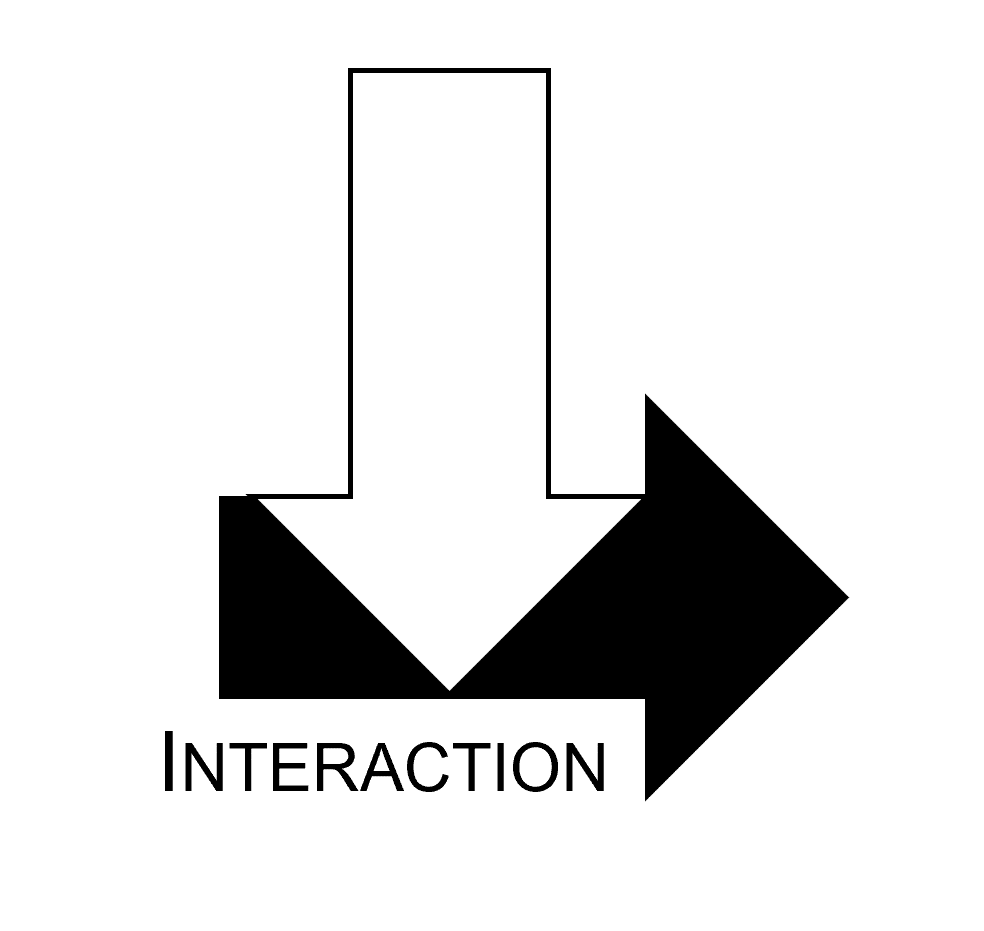

--- 
title: "Interactions et modifications d'effet   en Epidémiologie"
author: "CERPOP, INSERM, EQUITY Team"
date: "Last compiled on `r format(Sys.time(), '%d %B, %Y')`"
site: bookdown::bookdown_site
documentclass: book
bibliography: reference.bib
csl: vancouver.csl
description: |
  .
link-citations: yes
github-repo: rstudio/bookdown-demo
---

# Présentation

Document de synthèse du GT "Interaction" 

En cours de rédaction [work in progress]

{width=0%}

<ins> Participant.e.s </ins>

- Hélène COLINEAUX,  
- Léna BONIN, 
- Grégory GUERNEC, 
- Camille JOANNES, 
- Benoit LEPAGE, 
- Lola NEUFCOURT 
 

[Licence]:https://creativecommons.org/licenses/by-nc-sa/4.0/
{width=10%}

The online version of this book is licensed under the [Creative Commons Attribution-NonCommercial-ShareAlike 4.0 International License][Licence]. 

